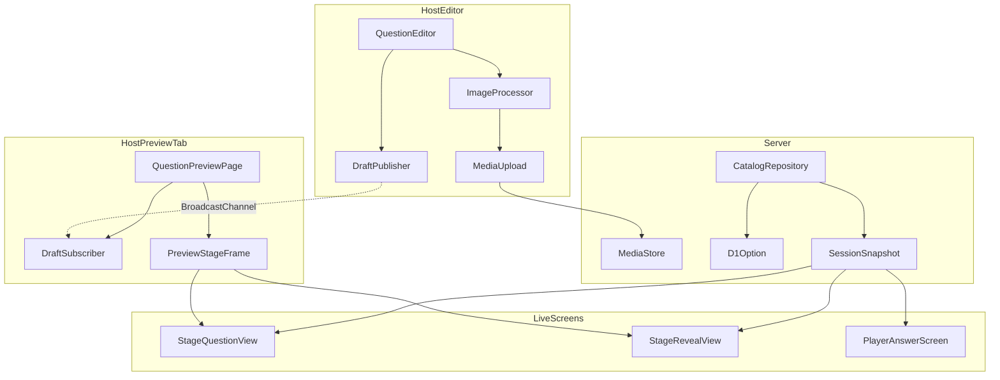
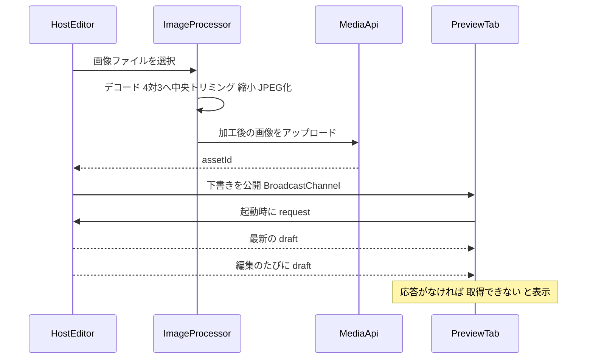
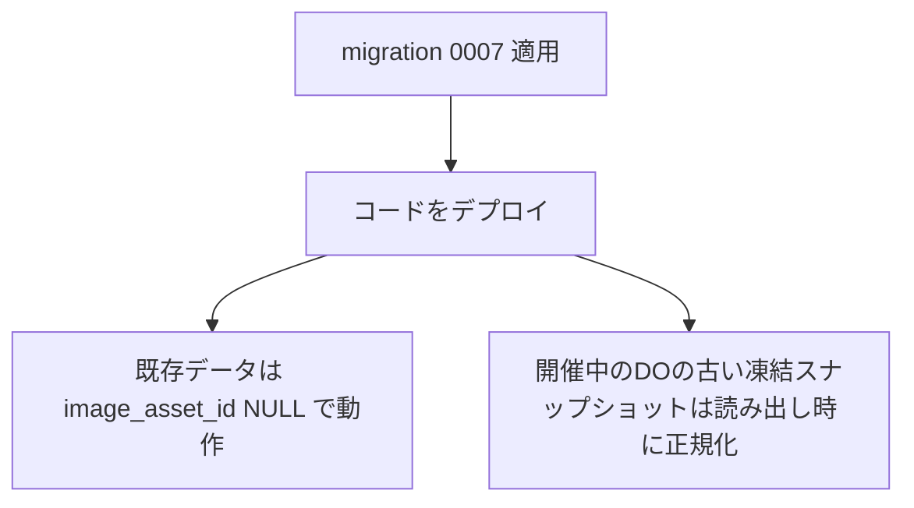

# Design Document

## Overview

本機能は、既存のライブクイズアプリの設問に「選択肢ごとの画像」を追加する。主催者は各選択肢に画像(任意)を添付でき、画像はアップロード時にブラウザ側で4:3へ中央トリミング・縮小される。投影画面は選択肢の数だけ画像を表示し、正解発表では正解の画像を強調する。主催者は、編集中の設問だけを、未保存の内容を含めて実際の投影画面と同じ見た目で新しいタブに確認できる。

**Purpose**: 文言だけでは伝わりにくい選択肢を視覚的に出題でき、事前に投影画面での収まりを確認できる。
**Users**: 主催者(設問の作成・プレビュー)、会場の参加者(投影画面の閲覧)。
**Impact**: `option` テーブルに画像列を追加し、選択肢の型・WebSocketの設問ペイロード・投影画面・主催者の設問エディタを拡張する。既存の設問画像、メディア配信、採点、フェーズ遷移は変更しない。

### Goals
- 選択肢への画像添付(テキストは必須、画像を併用)と、アップロード時の自動統一
- 画像付き設問を、2択・4択ともスクロールなしで投影画面に収める
- 設問単位のプレビュー(新しいタブ・未保存内容の反映・実投影画面と同じコンポーネント)
- 文言のみの既存設問・既存データ・開催中のスナップショットへの後方互換

### Non-Goals
- 参加者画面(スマホ)への画像表示とそのプレビュー(別途判断。Issue #36にコメントで残す)
- トリミング位置の手動調整、画像以外のメディア、結果共有ページへの表示
- 孤立したR2オブジェクトの回収(既存の設問画像と同じ挙動)
- イベント複製でのテーマ(ロゴ・背景画像)のR2コピー(別Issueで扱う)
- `StageSafeArea` の余白変更、サーバー側でのアスペクト比検証

## Boundary Commitments

### This Spec Owns
- `option.image_asset_id` の列と、選択肢画像の参照関係(各選択肢は画像を0または1枚持つ)
- 選択肢画像の自動統一(寸法・縮尺・形式)の仕様値と処理
- 画像付き設問の投影画面レイアウト(出題・正解発表)
- 設問単位プレビューの入口・下書きの受け渡しプロトコル

### Out of Boundary
- 設問画像・ロゴ・背景画像の仕様(変更しない)
- メディアの保存先・認可方式(再利用のみ)
- 採点・フェーズ遷移・ランキング・結果アーカイブ(設問画像を保持しないため影響なし)
- 参加者画面への画像表示(別途判断)
- 既存のテーマプレビュー(全設問の通し確認)の機能変更

### Allowed Dependencies
- 既存の `/api/events/:id/media` のアップロード・配信
- `ThemeProvider`、`StageSafeArea`、`QuestionView`、`RevealView`、`previewFrameConfig` などの既存の表示部品
- Hono/Zod/React/Tailwind、ブラウザの `createImageBitmap`・canvas・`BroadcastChannel`
- 依存方向: `shared`(型) → `server`(catalog/session) と `client`(host/stage/player)。clientはserverをimportしない

### Revalidation Triggers
- `OptionSnapshot`/`QuestionPublicView` の形状変更(投影・参加者・プレビューが再確認の対象)
- 画像の固定アスペクト比・上限寸法の変更(既存の保存済み画像の見え方に影響)
- メディア配信の認可方式の変更
- プレビューの下書きメッセージの形状変更

## Architecture

### Existing Architecture Analysis
- 選択肢は `option` テーブル(D1)→ `loadQuestionSnapshot` → DOの凍結スナップショット(JSON)→ `toPublicView` → WebSocket → 各画面、の一方向。型は `shared/domain-types.ts`(`OptionSnapshot`)と `shared/protocol.ts`(`QuestionPublicView`)で共有する
- 投影画面の `QuestionView`/`RevealView` は実画面(`stage-app.tsx`)とプレビュー(`theme-preview-walkthrough.tsx`)の双方が同じコンポーネントを使い、`StageSafeArea` も共有する。この構造を維持する
- プレビューは、実コンポーネントを1920×1080の基準サイズで描画して縮小表示する方式

### Architecture Pattern & Boundary Map



**Architecture Integration**:
- Selected pattern: 既存経路の拡張(列・型・表示部品へのフィールド追加)。新しいサーバーのエンドポイントは追加しない
- Domain boundaries: 画像の統一はclient(host)、保存と検証はserver(catalog/media)、表示はclient(stage)、プレビューはclient(host)が実stageコンポーネントを再利用する
- Existing patterns preserved: `Result<T,E>` によるエラー表現、境界でのZod検証、純粋ロジックの切り出し、`StageSafeArea` の共有
- New components rationale: 画像統一の純粋ロジック、フィットレイアウトの判定、プレビューの下書きチャンネルは、既存部品に収まらない新しい境界のため
- Steering compliance: kebab-caseのファイル名、テスト同居、相対import、`any` 不使用

### Technology Stack

| Layer | Choice / Version | Role in Feature | Notes |
|-------|------------------|-----------------|-------|
| Frontend | React 19 + Tailwind v4 | エディタ・投影・プレビュー | 既存 |
| Frontend (browser API) | `createImageBitmap`、Canvas、`BroadcastChannel` | 画像統一、下書き受け渡し | 新規依存パッケージなし |
| Backend | Hono 4 + Zod | 設問保存の入力検証 | 既存 |
| Data | Cloudflare D1(`option.image_asset_id`)、R2(既存) | 参照と画像実体 | マイグレーション0007 |
| Runtime | Durable Object(凍結スナップショット) | 開催中の設問保持 | 読み出し時に正規化 |

## File Structure Plan

### Directory Structure
```
src/
├── shared/
│   └── choice-image-spec.ts          # 固定アスペクト比・上限寸法・出力形式の定数と hasChoiceImages 判定(純粋)
├── client/
│   ├── host/
│   │   ├── choice-image-processor.ts # トリミング矩形計算(純粋)+ デコード・描画・エンコードの薄いラッパー
│   │   ├── question-preview-channel.ts # 下書き型・Zodスキーマ・BroadcastChannelの公開/購読
│   │   ├── question-preview-page.tsx # 設問単位プレビュー(別タブのフルページ)
│   │   └── preview-stage-frame.tsx   # 基準サイズ描画+縮小の枠(walkthroughから切り出して共有)
│   └── stage/
│       └── option-tile.tsx           # 画像付き選択肢1件の表示(画像+テキスト)
migrations/
└── 0007_option_image.sql             # option.image_asset_id を追加
```

### Modified Files
- `src/shared/domain-types.ts` — `OptionSnapshot` に `imageAssetId: AssetId | null`
- `src/shared/protocol.ts` — `QuestionPublicView.options` に `imageAssetId: AssetId | null`
- `src/shared/practice-question.ts` — 固定のテスト問題の選択肢に `imageAssetId: null`
- `src/server/catalog/repository.ts` — `QuestionOption`/`QuestionOptionInput` に画像、読み書き、`loadQuestionSnapshot`、検証(テキストは画像の有無にかかわらず必須)、`duplicateEvent` での画像の複製(R2コピーと参照の付け替え)
- `src/server/catalog/schema.ts` — `questionOptionInputSchema` に `imageAssetId` を追加(`label` は従来どおり必須)
- `src/server/session/live-store.ts` — 凍結スナップショット読み出し時に `imageAssetId` を `null` へ正規化
- `src/client/host/api-client.ts`、`question-validation.ts` — 型とクライアント側の先回り検証
- `src/client/host/question-editor.tsx` — 選択肢ごとの画像選択・プレビュー・削除、下書きの公開、プレビューを開くボタン
- `src/client/host/route.ts`、`host-app.tsx` — `question-preview` ルートの追加
- `src/client/host/theme-preview-walkthrough.tsx` — 枠の部分を `preview-stage-frame.tsx` へ切り出し、`PreviewQuestion` に選択肢画像のURLを追加
- `src/client/stage/question-view.tsx`、`reveal-view.tsx`、`stage-app.tsx` — フィットレイアウトと選択肢画像URLの解決
- `src/client/shared/option-breakdown.ts` — `imageAssetId` を行に含める

## System Flows



- 画像の加工に失敗した場合(デコード不可・形式不正)は、アップロードせず当該選択肢の画像を変更しない
- プレビューは `request` に対する `draft` を受けて描画し、一定時間(3秒)応答がなければ取得不可を表示する。誤った内容は表示しない

## Requirements Traceability

| Requirement | Summary | Components | Interfaces | Flows |
|-------------|---------|------------|------------|-------|
| 1.1-1.3, 1.5-1.8 | 選択肢画像の添付・差替・削除・併用 | QuestionEditor, CatalogRepository | QuestionOptionInput | 画像選択フロー |
| 1.2, 1.4 | 選択肢のテキストは必須(画像のみは不可) | question-validation, CatalogRepository, schema | validateQuestionForm, questionOptionInputSchema | — |
| 1.9 | 2択/4択の切替で残る画像を保持 | question-validation | resizeOptions | — |
| 2.1-2.3, 2.5, 2.6 | 自動統一・形式・失敗時 | ImageProcessor, choice-image-spec | processChoiceImage | 画像選択フロー |
| 2.4 | 加工後の画像を選択位置で確認 | QuestionEditor | — | 画像選択フロー |
| 2.7, 2.8 | サイズ上限・検証の共通化 | MediaApi(既存) | POST /api/events/:id/media | — |
| 3.1-3.9 | 投影画面での表示・収まり・混在・読込 | OptionTile, QuestionView, choice-image-spec | QuestionViewProps | — |
| 4.1-4.5 | 正解発表での画像・内訳・収まり | OptionTile, RevealView, option-breakdown | OptionBreakdownRow | — |
| 5.1-5.8 | 設問単位プレビュー | QuestionPreviewPage, question-preview-channel, PreviewStageFrame | PreviewDraftMessage | プレビュー受け渡しフロー |
| 5.9 | 既存テーマプレビューの維持 | ThemePreviewWalkthrough | — | — |
| 6.1-6.4 | 後方互換(イベント複製での画像の引き継ぎを含む) | migration 0007, live-store, CatalogRepository(duplicateEvent) | OptionSnapshot | — |
| 7.1-7.4 | 配信・アクセス制御 | MediaApi(既存) | GET /api/events/:id/media/:assetId | — |

## Components and Interfaces

| Component | Domain/Layer | Intent | Req Coverage | Key Dependencies (P0/P1) | Contracts |
|-----------|--------------|--------|--------------|--------------------------|-----------|
| choice-image-spec | shared | 画像仕様の定数と判定 | 2.1, 2.2, 3.4, 3.6 | — | Service |
| ImageProcessor | client/host | 選択画像を統一して返す | 2.1-2.3, 2.5, 2.6 | choice-image-spec (P0) | Service |
| QuestionEditor(拡張) | client/host | 選択肢画像の編集UIと下書き公開 | 1.1-1.9, 2.4, 5.1 | ImageProcessor (P0), HostApiClient (P0), DraftPublisher (P0) | State |
| question-preview-channel | client/host | 下書きの型と受け渡し | 5.2, 5.3, 5.8 | — | Event, State |
| QuestionPreviewPage | client/host | 設問単位プレビュー | 5.1-5.8 | PreviewStageFrame (P0), QuestionView (P0), RevealView (P0) | State |
| PreviewStageFrame | client/host | 基準サイズ描画+縮小 | 5.5, 5.6, 5.9 | ThemeProvider (P0) | — |
| OptionTile / QuestionView / RevealView | client/stage | フィットレイアウトでの表示 | 3.1-3.9, 4.1-4.5 | OptionTile (P0) | — |
| CatalogRepository(拡張) | server/catalog | 画像の読み書き・検証 | 1.4, 6.1, 6.2, 6.4 | D1 (P0) | Service |
| live-store(拡張) | server/session | 古いスナップショットの正規化 | 6.3, 6.4 | — | State |

### shared

#### choice-image-spec

| Field | Detail |
|-------|--------|
| Intent | 画像の固定アスペクト比・上限寸法・出力形式の定数と、設問が選択肢画像を持つかの判定を1か所に置く |
| Requirements | 2.1, 2.2, 3.4, 3.6 |

```typescript
export const CHOICE_IMAGE_ASPECT = { width: 4, height: 3 } as const;
export const CHOICE_IMAGE_MAX_LONG_EDGE_PX = 800;
export const CHOICE_IMAGE_OUTPUT_TYPE = "image/jpeg" as const;
export const CHOICE_IMAGE_OUTPUT_QUALITY = 0.85;

/** いずれかの選択肢が画像を持つときtrue。投影画面のフィットレイアウトへの切替条件 */
export function hasChoiceImages(options: readonly { readonly imageAssetId: AssetId | null }[]): boolean;
```
- Invariants: 比率・寸法はここだけで定義し、変更は「Revalidation Triggers」に該当する

### client/host

#### ImageProcessor

| Field | Detail |
|-------|--------|
| Intent | 選択された画像ファイルを、4:3・長辺800px以下・JPEGへ統一して返す |
| Requirements | 2.1, 2.2, 2.3, 2.5, 2.6 |

**Contracts**: Service [x]

```typescript
export interface CropRect { readonly sx: number; readonly sy: number; readonly sw: number; readonly sh: number }

/** 元画像寸法から、固定比率で中央トリミングする矩形を返す(純粋関数) */
export function computeCenterCrop(sourceWidth: number, sourceHeight: number): CropRect;

/** 縮小後の出力寸法を返す。拡大はしない(純粋関数) */
export function computeOutputSize(crop: CropRect): { readonly width: number; readonly height: number };

export type ProcessImageError =
  | { readonly code: "UNSUPPORTED_TYPE" }   // jpeg/png/webp以外
  | { readonly code: "DECODE_FAILED" }      // 読み込み・加工に失敗
  | { readonly code: "ENCODE_FAILED" };

export function processChoiceImage(file: File): Promise<Result<Blob, ProcessImageError>>;
```
- Preconditions: `file` はユーザーが選択したファイル
- Postconditions: 成功時のBlobは `CHOICE_IMAGE_OUTPUT_TYPE`、比率4:3、長辺が上限以下(元画像が小さい場合は拡大しない)。透過部分は白で塗りつぶす。EXIFの向きを反映する
- Invariants: 失敗時はアップロードを行わず、呼び出し側は当該選択肢の状態を変更しない

#### QuestionEditor(拡張)

**Contracts**: State [x]
- フォーム状態: `FormState.options` を `QuestionFormOption { label: string; isCorrect: boolean; imageAssetId: AssetId | null }` に拡張する。`resizeOptions` は `imageAssetId` を保持し、追加分は `null`
- 選択肢ごとに「画像を選択」「削除」を持ち、加工後の画像は `GET /api/events/:id/media/:assetId`(主催者セッション)でその場に表示する(2.4)
- 「プレビューを開く」は新しいタブ(`window.open`)でプレビューのルートを開く。プレビュー用の `sessionKey` は編集フォームを開くたびに採番する
- 下書きの公開: フォーム状態の変更のたびに `DraftPublisher` が `draft` を送る。フォームを閉じる・保存してフォームが閉じたときは `closed` を送る
- 保存時、テキストが空の選択肢があれば、フォームの検証が `optionLabel` として該当する選択肢の位置を示し、保存を行わない(1.4)

**Implementation Notes**
- Integration: 画像アップロードは既存の `uploadMedia` を使い、`processChoiceImage` の出力Blobを `File` に包んで渡す
- Validation: クライアントは `validateQuestionForm` で先回りし、最終判定はサーバー
- Risks: アップロード後に保存せず離脱すると孤立画像が残る(既存の設問画像と同じ)

#### question-preview-channel

| Field | Detail |
|-------|--------|
| Intent | 編集タブとプレビュータブの間で未保存の下書きを受け渡す |
| Requirements | 5.2, 5.3, 5.8 |

**Contracts**: Event [x] / State [x]

```typescript
export interface PreviewDraftOption {
  readonly label: string;
  readonly imageAssetId: AssetId | null;
  readonly isCorrect: boolean;
}
export interface PreviewDraft {
  readonly body: string;
  readonly explanation: string;
  readonly imageAssetId: AssetId | null;
  readonly options: readonly PreviewDraftOption[];
}

export type PreviewChannelMessage =
  | { readonly type: "request" }                       // プレビュー → 編集
  | { readonly type: "draft"; readonly draft: PreviewDraft }  // 編集 → プレビュー
  | { readonly type: "closed" };                       // 編集 → プレビュー

export const previewDraftSchema: z.ZodType<PreviewDraft>;
export const previewChannelMessageSchema: z.ZodType<PreviewChannelMessage>;

export function previewChannelName(eventId: EventId, sessionKey: string): string;
export function publishDrafts(eventId: EventId, sessionKey: string, getLatest: () => PreviewDraft): { push(draft: PreviewDraft): void; close(): void };
export function subscribeDrafts(eventId: EventId, sessionKey: string, handlers: { onDraft(d: PreviewDraft): void; onClosed(): void }): { requestDraft(): void; close(): void };
```
- Event contract: チャンネル名は `quizoom:question-preview:{eventId}:{sessionKey}`。受信メッセージはZodで検証し、不正なものは無視する
- Delivery: ベストエフォート(同一オリジン・同一ブラウザ)。順序はBroadcastChannelの保証に従う。`request` に対する応答は常に最新の下書き
- Idempotency: `draft` は全量置換のため再送しても安全

#### QuestionPreviewPage / PreviewStageFrame

- ルート: `/host/events/:eventId/question-preview/:sessionKey`。`HostRoute` に `{ view: "question-preview"; eventId; sessionKey }` を追加する
- 起動時に `getEvent` でイベントの外観(配色・ロゴ・背景)を取得し、`subscribeDrafts` で下書きを待つ。3秒応答がなければ「編集画面が見つかりません。設問編集画面を開いたままにしてください」を表示する(5.8)。`closed` 受信時も同様に表示し、直前の内容は消す
- 下書きを `PreviewQuestion`(仮のID・画像は主催者用メディアURL)へ変換し、`PreviewStageFrame`(1920×1080の基準サイズを縮小)内で `QuestionView`/`RevealView` を描画する。「出題」「正解発表」を切り替えるタブを持つ(5.4)
- 外観・コンポーネント・縦横比は実画面と同一(5.5, 5.6)。表示枠は `StageSafeArea` を含めて実画面と同じ構成にする
- 下書きは保存しない(5.7)。既存のテーマプレビューのルート・動作は変更しない(5.9)
- `PreviewStageFrame` は `theme-preview-walkthrough.tsx` の枠(`previewFrameConfig` と縮小ラッパー)を切り出したもので、既存のウォークスルーと新プレビューが共有する。ウォークスルーのスクロール枠(`overflow-y-auto`)は、プレビューでは「はみ出しを検知できるよう」`overflow-hidden` にして使う(下記エラー処理参照)

### client/stage

#### OptionTile / QuestionView / RevealView

| Field | Detail |
|-------|--------|
| Intent | 画像付き設問を、スクロールなしで画面に収まるフィットレイアウトで表示する |
| Requirements | 3.1-3.9, 4.1-4.5 |

**フィットレイアウトの方針**
- 適用条件: `hasChoiceImages(question.options)` が真のとき。偽のときは現行のレイアウトを変更しない(3.6, 4.5, 6.1)
- ルート要素: 縦flexで `overflow-hidden`、すべての子領域に `min-h-0`。スクロールを発生させない
- 行数の上限: 問題文だけでなく、選択肢のラベル(最大2行)と正解発表の説明文(最大2行)にも `line-clamp` を適用し、テキスト量によって領域が押し広げられないようにする。省略された文言は切り詰め表示となる(全文は主催者がプレビューで確認する)
- 領域配分: 問題番号・問題文(最大3行に制限)・設問画像(`flex-[2] min-h-0`、`object-contain`)・選択肢領域(`flex-[3] min-h-0`)・カウントダウン・回答状況。設問画像がない場合は、その配分を選択肢領域に回す
- 選択肢領域: 2択は2列、4択は4列の横1列。各タイルは `min-h-0 min-w-0` で、画像は `h-full w-full object-contain`。縮小は画像の表示サイズのみが変わり、レイアウトは崩れない(3.2-3.4)
- 混在: 画像のない選択肢はテキストのみのタイルとして同じ行に並ぶ(3.7)。画像の領域は読み込み前から比率で確保し(3.8)、読み込み失敗時は画像を非表示にしてテキストを表示する(3.9)

**OptionTile**
```typescript
export interface OptionTileProps {
  readonly label: string;
  readonly imageUrl: string | null;
  readonly variant: "question" | "reveal";
  readonly state?: { readonly isCorrect: boolean; readonly count: number; readonly pct: number };
}
```
- `variant: "reveal"` では、正解タイルに既存と同じ強調(緑の枠・「正解」表示)を行い、回答数・割合を画像の下に常時表示する(4.1-4.3)。正解でないタイルは減光する
- 画像の `alt` は空(装飾)。テキストが選択肢の名前を担い、画像とテキストは同じタイルとして対応づけられる(3.5)

**QuestionView/RevealView の変更**
- `QuestionViewProps` に `optionImageUrls: Readonly<Record<OptionId, string | null>>` を追加(未指定は全て `null`)。URLの解決は `stage-app.tsx` が `buildStageMediaUrl` で行う(既存の設問画像と同じ)
- `RevealViewProps` に同様に `optionImageUrls` を追加

### client/shared

#### option-breakdown

- `OptionBreakdownRow` に `imageAssetId: AssetId | null` を追加し、進行画面・投影画面の内訳行が選択肢画像を参照できるようにする。`label` の扱いは変更しない
- 参加者画面(`AnswerScreen`)は変更しない。選択肢のテキストが必須のため、画像を表示しなくてもボタンの文言で選択肢を判別できる

### server/catalog

#### CatalogRepository(拡張)

```typescript
export interface QuestionOption {
  readonly id: OptionId; readonly label: string; readonly isCorrect: boolean;
  readonly orderIndex: number; readonly imageAssetId: AssetId | null;
}
export interface QuestionOptionInput {
  readonly label: string; readonly isCorrect: boolean; readonly imageAssetId?: AssetId | null;
}
```
- 保存: `INSERT INTO option` に `image_asset_id` を追加。読み出し(`loadQuestions`)と `loadQuestionSnapshot` が `imageAssetId` を返す
- 検証: `label` が空の選択肢は、画像の有無にかかわらず従来どおり拒否する(1.2, 1.4)。画像の有無はこの判定に関与しない
- `schema.ts`: `label: z.string().min(1)` は変更せず、`imageAssetId: assetId().nullable().optional()` を追加する。空ラベルの拒否は既存のZod検証が担う
- 差し替え・削除: 設問の保存は選択肢を全削除して再挿入する既存方式のため、画像の差し替え・削除は新しい `imageAssetId` の値で表現される。保存後は参照されない画像は配信対象の設問に現れない(7.4)

#### イベント複製(`duplicateEvent`)での画像の複製

R2のキーは `{eventId}/{assetId}` のため、画像の `assetId` を新イベントへそのまま引き継ぐと、複製先では配信が404になる。現状は選択肢の `INSERT` が画像列を含まないため、選択肢画像は複製時に消える。複製先で画像が表示されるよう、以下を行う。

- 複製元の設問画像・選択肢画像の `assetId` を重複を除いて集め、各画像を R2 上で `{newEventId}/{newAssetId}` へコピーする(`newAssetId` は新規採番)
- 新イベントの `question.image_asset_id` と `option.image_asset_id` は、`newAssetId` に付け替えて挿入する(旧→新の対応表を使う)。同じ画像を複数箇所が参照していても、コピーは1回で済む
- 順序: R2コピーをすべて成功させてからD1のバッチを実行する。R2コピーが1件でも失敗したらD1へ書き込まず、複製全体を失敗(`Result` のエラー)として返す。失敗や中断で残ったR2オブジェクトは孤立画像として許容する(既存方針と同じ)
- 複製元のR2オブジェクトが存在しない場合(過去の欠損)は、その参照を `null` にして複製を継続する(複製全体は止めない)
- 範囲外: テーマの `logo_asset_id`/`background_asset_id` にも同じ不具合があるが、本仕様では変更しない。同じ複製の仕組みで直せるため、別Issueとして記録する

### server/session

#### live-store(拡張)
- 凍結スナップショットのJSONを読み出す際、各選択肢の `imageAssetId` が未定義なら `null` にする。書き込み側は新しい型でそのまま保存する(6.3, 6.4)
- `toPublicView` は `question.options` をそのまま渡しているため変更不要(`OptionSnapshot` の追加フィールドが自動的にペイロードへ載る)

## Data Models

### Physical Data Model

```sql
-- migrations/0007_option_image.sql
ALTER TABLE option ADD COLUMN image_asset_id TEXT;
```
- 既存行は `NULL`(画像なし)となり、データの欠損や移行処理は不要(6.2)
- `label` は `NOT NULL` のまま、変更しない(テキストは常に必須)
- 外部キー・インデックスは追加しない(設問画像の `question.image_asset_id` と同じ扱い)

### Data Contracts & Integration

**設問保存API(`PUT/POST` の既存エンドポイント)**

| 項目 | 変更 |
|------|------|
| `options[].label` | 変更なし(必須・1文字以上) |
| `options[].imageAssetId` | `string | null`(省略可、省略時は `null`) |
| エラー | 変更なし(空ラベルは既存の検証エラー) |

**WebSocketの設問ペイロード**: `QuestionPublicView.options[]` に `imageAssetId: AssetId | null` を追加(後方互換: 追加のみ)。

## Error Handling

### Error Strategy
- **ユーザー入力(エディタ)**: 非対応形式・加工失敗は選択肢の位置にインラインで表示し、画像は変更しない(2.5, 2.6)。5MB超過はサーバーが `PAYLOAD_TOO_LARGE` で拒否し、同じ位置に表示する(2.7)。テキストが空の選択肢は `optionLabel` として該当位置に表示する(1.4)
- **投影画面**: 画像の読み込み失敗は、当該タイルの画像のみを非表示にし、テキストを表示する。レイアウトは維持する(3.9)
- **プレビュー**: 下書きを取得できない・編集タブが閉じられた場合は理由を表示し、誤った内容を出さない(5.8)。`BroadcastChannel` 非対応時はボタンを無効にして理由を表示する
- **イベント複製**: 画像のR2コピーが1件でも失敗した場合は、D1へ書き込まずに複製を失敗として返す(部分的に画像が欠けた複製を作らない)。複製元に実体のない画像は参照を `null` にして継続する
- **収まりの検知(開発・確認用)**: プレビューの基準サイズ枠は `overflow-hidden` とするため、フィットレイアウトの不具合(溢れ)は枠外へのクリップとして目視で確認できる。自動検証は、jsdomにレイアウト計算がなく `scrollHeight` が常に0になるため、jsdomでは行わない。収まりは実ブラウザ(Playwright等)で基準サイズ(1920×1080)に描画して `scrollHeight <= clientHeight` と要素の境界が画面内に収まることを検査する(Testing Strategy参照)

### Monitoring
- 既存のログ方針に従う。新たな監視項目は追加しない

## Testing Strategy

### Unit Tests
- `computeCenterCrop`/`computeOutputSize`: 横長・縦長・正方形・基準より小さい画像で、比率4:3・上限以下・拡大なしとなること
- `hasChoiceImages`: 画像あり/なし/混在
- `validateQuestionForm`: 画像があってもテキストが空の選択肢は拒否、`resizeOptions` での画像保持
- `previewChannelMessageSchema`: 正しいメッセージの受理と不正なメッセージの拒否
- `buildOptionBreakdown`: `imageAssetId` の伝搬

### Integration Tests(実D1・実WebSocket。モックに頼らない)
- 設問を画像付き選択肢で保存し、取得・スナップショット・WebSocketの `QuestionPublicView` に `imageAssetId` が現れる
- 画像なしの既存形式の保存・出題・正解発表が従来どおり動く(6.1)
- `imageAssetId` を持たない凍結スナップショットのJSONを読み出して、`null` に正規化される(6.3, 6.4)
- 選択肢画像の配信が、主催者・参加者トークン・投影トークンで許可され、無認可は拒否される(7.1-7.3)
- 画像付きイベントの複製: 複製先の設問画像・選択肢画像が新イベントのキーでR2に存在し、複製先の `assetId` が複製元と異なり、複製先のメディア配信が200を返す。複製元の画像は変更されない(6.2, 6.4)
- 複製中にR2コピーが失敗した場合、複製先のイベントが作成されない。複製元に実体のない画像は `null` で複製される

### UI Tests(Vitest + Testing Library)
- `QuestionView`/`RevealView`: 画像付き2択・4択、設問画像併用、混在、読み込み失敗で、タイルの構成(画像の領域・テキスト・`line-clamp`・`overflow-hidden`の付与)と読み込み失敗時のフォールバックを検証する。**レイアウトの収まりそのものはjsdomでは検証しない**(下記の実ブラウザ検証で行う)

### 実ブラウザでのレイアウト検証(Playwright等)
- 基準サイズ(1920×1080)で `QuestionView`/`RevealView` を描画し、`scrollHeight <= clientHeight` と、主要要素(問題文・設問画像・選択肢・カウントダウン・回答状況)の境界が画面内に収まることを検査する
- 条件: 2択・4択、設問画像の有無、選択肢画像の混在、長い問題文・長い選択肢ラベル・長い説明文、正解発表(内訳つき)
- `QuestionEditor`: 画像選択→加工→アップロード→表示、差し替え、削除、加工失敗時に状態が変わらない、プレビューを開く
- `QuestionPreviewPage`: 下書き受信で描画、編集側の変更の反映、応答なし・`closed` で取得不可表示
- 既存の `theme-preview-*` テストが引き続き通る(5.9)

### E2E/実機確認
- 実ブラウザで4択+設問画像+長い問題文の収まりを確認し、必要なら比率・配分を調整する(研究ログのFollow-up)

## Security Considerations
- 選択肢画像は公開バケットにせず、既存のメディア配信と同じ認可を経由する。新しいエンドポイントを増やさない(7.1-7.3)
- 画像の `assetId` はZodで形式検証する。プレビューの下書きメッセージは同一オリジンの `BroadcastChannel` 経由だが、受信時にZodで検証してから描画する
- 画像は `` で描画し、`alt` を空にして装飾扱いとする(任意のHTMLを挿入しない)

## Migration Strategy


- マイグレーションを先に適用してからコードをデプロイする(`docs/CI-CD.md` の手順に従う)。逆順だと、保存時に存在しない列を参照して失敗する
- ロールバック: コードを戻すだけで、追加列は読まれず無害に残る

