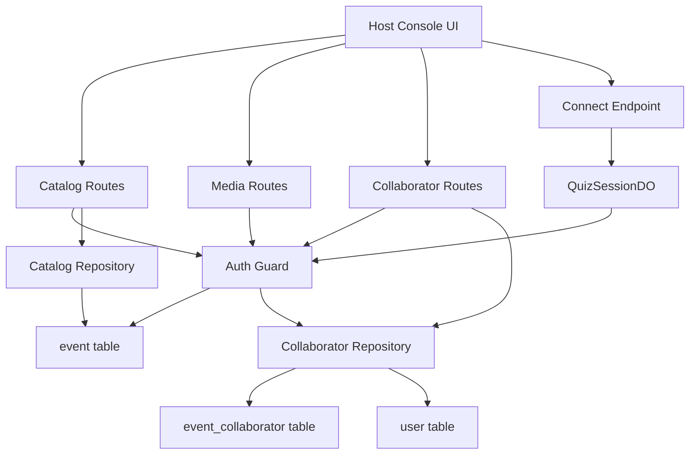
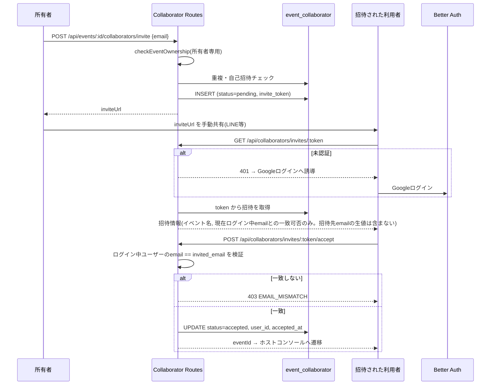

# Technical Design

## Overview

**Purpose**: 本機能は、イベント所有者が自分以外のGoogleアカウントを「共同運営者」として招待し、進行画面・設問編集・外観変更などの操作権限を委譲できるようにする。

**Users**: イベント所有者(主催者)が招待を発行し、招待された利用者(共同運営者)が当日の進行操作や事前準備を担う。

**Impact**: 既存の`event.owner_id`単一カラムによる所有者限定モデルを、「所有者 + 招待によって権限を得た共同運営者」の複数アカウントモデルへ拡張する。認可判定は`auth/guard.ts`・`catalog/repository.ts`・`results/archive.ts`の3箇所に重複しているため(詳細は`gap-analysis.md`)、本機能の実装と同時にこれを`guard.ts`へ一元化する。

### Goals
- 所有者がメールアドレス指定で共同運営者を招待し、招待URLを共有できる
- 招待されたメールアドレスでGoogleログインした利用者のみが招待を受諾できる
- 共同運営者は進行操作・設問編集・外観変更・公開・preflight・結果閲覧を所有者と同様に行える
- イベント削除・参加者データ削除・結果共有設定・共同運営者管理は所有者専用のまま維持する
- 既存の重複した所有権チェックを一元化し、将来の権限拡張の土台を作る

### Non-Goals
- 共同運営者間の権限レベル分け(全共同運営者は同一権限)
- 招待通知のメール送信(URLの共有は主催者が手動で行う、既存の参加用URLと同じ運用)
- イベント所有権そのものの譲渡(所有者アカウントの入れ替え)

## Boundary Commitments

### This Spec Owns
- 招待・共同運営者の状態(`event_collaborator`テーブル)とそのライフサイクル(招待発行・受諾・解除・離脱)
- `auth/guard.ts`における「イベントへのアクセス可否」判定ロジックの一元化(owner/collaborator/forbiddenの判定)
- 招待受諾用のクライアント画面(`/host/invite/:token`)

### Out of Boundary
- カタログ・ライブセッション・結果アーカイブの各ドメインロジックそのもの(既存の`repository.ts`/`archive.ts`/`QuizSessionDO`の業務ロジックは変更しない。呼び出し前段の認可判定のみを差し替える)
- メール送信基盤の新規導入
- 招待メールアドレスに紐づく`user`レコードの作成・管理(既存のBetter Auth/Google OAuthフローに委ねる)

### Allowed Dependencies
- `auth/factory.ts`(`createAuth`)、`better-auth`の`session.user.email`
- `catalog/repository.ts`の`event`テーブルアクセスパターン(`crypto.randomUUID()`によるトークン発行)
- `shared/domain-types.ts`の`Result<T, E>`パターン

### Revalidation Triggers
- `auth/guard.ts`のエクスポート関数のシグネチャ変更
- `event_collaborator`テーブルのスキーマ変更
- `QuizSessionDO#verifyRole`のhost判定ロジックの変更

## Architecture

### Existing Architecture Analysis

現状、所有権チェック(`row.owner_id !== userId`)は下記3箇所に独立して実装されている(詳細は`gap-analysis.md`セクション1参照)。

- `auth/guard.ts`: `checkEventOwnership` / `requireEventOwner` — `media/routes.ts`と`QuizSessionDO#verifyRole`(WebSocket hostロール接続時)が利用
- `catalog/repository.ts`: private `requireOwnedEvent` — カタログAPIのほぼ全操作が利用
- `results/archive.ts`: private `requireOwnedEvent` — 結果閲覧・共有設定・参加者データ削除が利用

`QuizSessionDO#verifyRole`は接続確立時に1回だけ認可判定を行い、以降は`ConnectionRole`のブール判定のみで進行コマンドを処理する。この構造を維持したまま、認可判定の中身だけを差し替える。

### Architecture Pattern & Boundary Map



**Architecture Integration**:
- **選定パターン**: 既存のドメイン境界別レイヤー構成(steering `structure.md`)を維持しつつ、`auth/guard.ts`を「認可の一元窓口」として全ドメインの手前に配置する
- **ドメイン境界**: 招待・共同運営者の永続化(`event_collaborator`テーブルへのアクセス)は新設の`src/server/collaborators/`ドメインが専有する。`auth/guard.ts`はこのテーブルへ直接クエリせず、`CollaboratorRepository`が公開する狭いサービスインターフェース経由でのみ問い合わせる(下記Auth Guardコンポーネント参照)。認可の可否判定(owner/collaborator/forbidden)そのものはドメインをまたぐ横断的関心事として`auth/guard.ts`が専有する
- **既存パターンの維持**: `Result<T, E>`によるエラー表現、`crypto.randomUUID()`による推測困難な識別子、Zodによる境界検証、ドメインごとの`routes.ts`+`repository.ts`構成
- **新規コンポーネントの理由**: `collaborators`ドメインは既存のどのドメインにも属さない新しい集約(招待のライフサイクル)を持つため独立させる。`guard.ts`の拡張は、3箇所の重複を解消するための今回唯一の横断的変更
- **Steering準拠**: `structure.md`の「サーバー: ドメインモジュール」パターン(`routes.ts` + `repository.ts` + `schema.ts`)をそのまま踏襲。`event_collaborator`テーブルへのアクセスを`collaborators`ドメイン内に閉じることで、gap-analysis.mdが指摘した「所有権チェックの3箇所重複」と同種のデータアクセス二重所有を新たに生まないようにする

### Technology Stack

| Layer | Choice / Version | Role in Feature | Notes |
|-------|------------------|-----------------|-------|
| Backend / Services | Hono 4 (既存) | `src/server/collaborators/routes.ts`を新設 | 既存の`catalogRoutes`/`joinRoutes`と同じ`app.route()`合成パターン |
| Data / Storage | Cloudflare D1 (既存) | `event_collaborator`テーブルを新設。マイグレーション`0004_event_collaborators.sql` | 新規外部ライブラリなし |
| Frontend | React 19 + Vite (既存) | `src/client/host/`に招待受諾画面・共同運営者管理タブを追加 | 新規ロール(SPAパス接頭辞)は追加しない。既存の`host`配下に統合 |

新規の外部依存は発生しない(既存スタックの範囲内で完結)。

## File Structure Plan

### Directory Structure
```
src/server/
├── auth/
│   └── guard.ts                    # 変更: checkEventAccess/requireEventAccessを新設
├── collaborators/                  # 新規ドメイン
│   ├── repository.ts               # event_collaborator へのD1操作
│   ├── routes.ts                   # /api/events/:id/collaborators*, /api/collaborators/invites/:token*
│   └── schema.ts                   # 招待作成リクエストのZodスキーマ(email検証)
├── catalog/
│   └── repository.ts               # 変更: private requireOwnedEvent を guard.ts 呼び出しへ置き換え
├── results/
│   └── archive.ts                  # 変更: 同上
├── media/
│   └── routes.ts                   # 変更: checkEventOwnership → checkEventAccess
├── session/
│   └── quiz-session-do.ts          # 変更: #verifyRoleのhost判定を requireEventAccess へ
└── index.ts                        # 変更: collaboratorRoutes を app.route() で合成

src/client/host/
├── route.ts                        # 変更: HostRoute に invite ビューを追加
├── host-app.tsx                    # 変更: /host/invite/:token のルーティング分岐
├── invite-accept.tsx               # 新規: 招待受諾画面
├── collaborators-panel.tsx         # 新規: 共同運営者一覧・招待・解除・離脱UI(EventEditorの新タブ)
├── event-editor.tsx                # 変更: 「共同運営者」タブを追加、role別にタブ・破壊的操作を出し分け
├── event-list.tsx                  # 変更: 所有イベントと共同運営イベントを役割表示付きで一覧
└── api-client.ts                   # 変更: collaborators系エンドポイントのクライアントメソッド追加

migrations/
└── 0004_event_collaborators.sql    # 新規
```

### Modified Files
- `src/server/auth/guard.ts` — `AccessLevel`型と`checkEventAccess`/`requireEventAccess`を新設。既存の`checkEventOwnership`/`requireEventOwner`は所有者専用判定として残す
- `src/server/catalog/repository.ts` — private `requireOwnedEvent`を`checkEventAccess`呼び出し+自ドメインの`event`行取得に分離。`listEvents`を所有イベント+共同運営イベントの合成に拡張。破壊的操作(`deleteEvent`, `duplicateEvent`)は`checkEventOwnership`(所有者専用)のまま
- `src/server/results/archive.ts` — 同様に分離。`deleteParticipantData`/`enableSharing`/`disableSharing`は所有者専用のまま
- `src/server/media/routes.ts` — `checkEventOwnership` → `checkEventAccess`
- `src/server/session/quiz-session-do.ts` — `#verifyRole`のhost分岐を`requireEventOwner` → `requireEventAccess`
- `src/server/index.ts` — `collaboratorRoutes`を合成

## System Flows

### 招待の発行から受諾まで



**Key Decisions**: 招待情報取得(`GET .../invites/:token`)と受諾実行(`POST .../accept`)を分けることで、クライアントは受諾ボタンを押す前に「メールアドレス不一致」を検出してエラーメッセージを事前表示できる(要件2.3)。

## Requirements Traceability

| Requirement | Summary | Components | Interfaces | Flows |
|-------------|---------|------------|------------|-------|
| 1.1, 1.2 | 招待URLの発行 | CollaboratorRepository | `POST /api/events/:id/collaborators/invite` | 招待発行〜受諾 |
| 1.3 | 重複招待の拒否 | CollaboratorRepository | 同上 | — |
| 1.4 | 自己招待の拒否 | CollaboratorRepository | 同上 | — |
| 1.5 | 招待は所有者専用 | Auth Guard (checkEventOwnership) | 同上 | — |
| 1.6 | 複数招待の同時発行 | CollaboratorRepository (Data Model) | — | — |
| 2.1, 2.2, 2.3 | 招待の受諾・メール照合 | CollaboratorRepository, InviteAccept UI | `GET/POST /api/collaborators/invites/:token`(`/accept`) | 招待発行〜受諾 |
| 2.4, 2.5 | 無効な招待・再利用不可 | CollaboratorRepository | 同上 | 同上 |
| 3.1, 3.5 | 進行画面操作の許可 | Auth Guard (checkEventAccess), QuizSessionDO | `#verifyRole` | — |
| 3.2 | 設問・外観編集の許可 | Auth Guard, Catalog Repository | `POST/PATCH/DELETE .../questions`, `PUT .../theme` | — |
| 3.3 | 公開・preflightの許可 | Auth Guard, Catalog Repository | `POST .../publish`, `GET .../preflight` | — |
| 3.4 | 結果閲覧の許可 | Auth Guard, Results Archive | `GET .../results` | — |
| 4.1–4.4 | 所有者専用操作の保護 | Auth Guard (checkEventOwnership) | `DELETE /api/events/:id`, `DELETE .../participant-data`, `POST/DELETE .../share`, collaborators管理系 | — |
| 4.5 | 権限外エラーコード | Auth Guard, Catalog/Results/Collaborator Routes | 各API共通の403応答 | — |
| 5.1–5.3 | 一覧・解除・招待取消 | CollaboratorRepository, CollaboratorsPanel UI | `GET/DELETE /api/events/:id/collaborators*` | — |
| 5.4, 5.5 | 自己離脱・失効後の拒否 | CollaboratorRepository, Auth Guard | `POST /api/events/:id/collaborators/leave` | — |
| 6.1, 6.2 | 推測困難なトークン・画面保護 | CollaboratorRepository, Auth Guard | — | — |
| 6.3 | カスケード削除 | Data Model (`ON DELETE CASCADE`) | — | — |
| 6.4 | 招待メールアドレスの非公開 | CollaboratorsPanel UI, CollaboratorRepository | `GET /api/events/:id/collaborators`の返却値設計 | — |

## Components and Interfaces

| Component | Domain/Layer | Intent | Req Coverage | Key Dependencies (P0/P1) | Contracts |
|-----------|--------------|--------|--------------|--------------------------|-----------|
| Auth Guard | Server / Cross-cutting | イベントへのアクセス可否(owner/collaborator/forbidden)を一元判定 | 1.5, 3.1, 3.2, 3.3, 3.4, 3.5, 4.1–4.5 | Collaborator Repository (P0) | Service |
| Collaborator Repository | Server / collaborators | 招待・共同運営者のライフサイクルを永続化 | 1.1–1.6, 2.1–2.5, 5.1–5.5, 6.1, 6.3, 6.4 | Auth Guard (P0), user table (P0) | Service, API |
| Catalog Repository (変更) | Server / catalog | 既存機能を維持しつつ認可判定をAuth Guardへ委譲 | 3.2, 3.3 | Auth Guard (P0) | Service |
| Results Archive (変更) | Server / results | 同上 | 3.4, 4.2, 4.3 | Auth Guard (P0) | Service |
| QuizSessionDO (変更) | Server / session | hostロール接続時の認可判定をAuth Guardへ委譲 | 3.1, 3.5 | Auth Guard (P0) | State |
| InviteAccept UI | Client / host | 招待URLアクセス時のログイン誘導・受諾操作 | 2.1–2.5 | Collaborator API Client (P0) | — |
| CollaboratorsPanel UI | Client / host | 所有者向け招待・一覧・解除、共同運営者向け離脱 | 5.1–5.5, 6.4 | Collaborator API Client (P0) | — |

### Server / Cross-cutting

#### Auth Guard

| Field | Detail |
|-------|--------|
| Intent | イベントに対する操作者のアクセスレベル(owner/collaborator/forbidden)を判定する唯一の場所 |
| Requirements | 1.5, 3.1, 3.2, 3.3, 3.4, 3.5, 4.1, 4.2, 4.3, 4.4, 4.5 |

**Responsibilities & Constraints**
- 「所有者のみ許可」「所有者+共同運営者を許可」「共同運営者のみ許可(所有者を明示的に除外)」の3種類の判定を提供し、呼び出し元(各ドメインのrepository/routes)がどれを使うかを選択する。3つ目(離脱専用)は新しい関数を設けず、`checkEventAccess`/`requireEventAccess`が返す`accessLevel`を呼び出し元が判定する形で実現する(下記Service Interface参照)
- `event`テーブルは直接参照するが、`event_collaborator`テーブルへは直接クエリしない。共同運営者かどうかの判定は`CollaboratorRepository.isAcceptedCollaborator`を呼び出して委譲する(Critical Issue対応: `event_collaborator`のデータアクセスは`collaborators`ドメイン内に閉じ、guard.tsがテーブルスキーマを直接知ることを避ける)
- 既存の`checkEventOwnership`/`requireEventOwner`のシグネチャ・挙動(所有者のみ許可)は変更しない。呼び出し元の破壊的操作(要件4)はこれらを使い続ける

**Dependencies**
- Inbound: Catalog Repository, Results Archive, Media Routes, QuizSessionDO, Collaborator Routes — 全ドメインの認可判定元 (P0)
- Outbound: Collaborator Repository — `isAcceptedCollaborator`による共同運営者判定の委譲 (P0)
- External: Cloudflare D1 (P0, `event`テーブルの所有者判定のみ)

**Contracts**: Service [x] / API [ ] / Event [ ] / Batch [ ] / State [ ]

##### Service Interface
```typescript
type AccessLevel = "owner" | "collaborator";

interface AuthGuardService {
  // 既存(変更なし): 所有者専用操作向け
  checkEventOwnership(env: Env, eventId: EventId, userId: string): Promise<Result<true, AuthError>>;
  requireEventOwner(request: Request, env: Env, eventId: EventId): Promise<Result<HostSession, AuthError>>;

  // 新設: 所有者+共同運営者を許可する操作向け。accessLevel を見て「共同運営者のみ許可」(離脱等)も表現できる
  checkEventAccess(env: Env, eventId: EventId, userId: string): Promise<Result<AccessLevel, AuthError>>;
  requireEventAccess(
    request: Request,
    env: Env,
    eventId: EventId,
  ): Promise<Result<HostSession & { readonly accessLevel: AccessLevel }, AuthError>>;
}
```
- Preconditions: `eventId`は存在するイベントを指す(存在しない場合は`NOT_FOUND`ではなく`FORBIDDEN`を返し、イベントの存在有無を非所有者に漏らさない。既存の`checkEventOwnership`と同じ方針)
- Postconditions: `checkEventAccess`は`event.owner_id === userId`なら`"owner"`、`CollaboratorRepository.isAcceptedCollaborator(env, eventId, userId)`が`true`なら`"collaborator"`、いずれでもなければ`err(FORBIDDEN)`を返す
- Invariants: `checkEventOwnership`が`ok`を返す場合、同じ入力に対し`checkEventAccess`も必ず`ok("owner")`を返す(owner集合はaccess集合の部分集合)

**Usage Pattern: 離脱(要件5.4)の認可**
`POST /api/events/:id/collaborators/leave`は新しい認可関数を設けず、`requireEventAccess`を呼んだ上で`accessLevel === "owner"`なら明示的に403を返す(所有者は離脱できない)という利用パターンで実現する。これはCollaborator Routesの実装規約として`### Server / collaborators`セクションのAPI Contractに明記する。

**Implementation Notes**
- Integration: `catalog/repository.ts`・`results/archive.ts`の既存private `requireOwnedEvent`は、`checkEventAccess`の呼び出し結果を受けてから自ドメインの`event`行を取得する形に置き換える(研究ログの「Design Decisions」参照)
- Validation: 既存の`guard.test.ts`に加え、collaborator許可/拒否のケースを網羅する
- Risks: `checkEventOwnership`と`checkEventAccess`の呼び分けを誤ると権限漏れが発生する。Requirements Traceability表とコードレビューで対応表を突き合わせる

### Server / collaborators (新規ドメイン)

#### Collaborator Repository

| Field | Detail |
|-------|--------|
| Intent | 招待・共同運営者の作成・受諾・一覧・解除・離脱を`event_collaborator`テーブルに対して行う |
| Requirements | 1.1–1.6, 2.1–2.5, 5.1–5.5, 6.1, 6.3, 6.4 |

**Responsibilities & Constraints**
- 招待の作成時、対象メールアドレスの重複(1.3)・自己招待(1.4)を検証する
- 受諾時、ログイン中ユーザーの`user.email`と`invited_email`の一致を検証する(2.2, 2.3)
- `isAcceptedCollaborator`を`Auth Guard`専用の窓口として公開し、`event_collaborator`テーブルへのアクセスを本ドメイン内に閉じる(Critical Issue対応)
- 所有者専用操作(招待発行・一覧・解除・招待取消)は呼び出し元(routes.ts)が`requireEventOwner`を通した後にのみ到達する。離脱(要件5.4)は呼び出し元が`requireEventAccess`を通し、`accessLevel === "collaborator"`の場合のみ到達する。本コンポーネント自身は「誰が呼んでいるか」を判定しない
- 離脱(5.4)は「自分自身の行のみ」を削除対象とする
- `getInviteByToken`が返す`invitedEmail`は**内部利用専用**(受諾処理でのメール一致判定用)であり、HTTPレスポンスへそのまま含めてはならない(要件6.4対応、下記API Contract参照)

**Dependencies**
- Inbound: Collaborator Routes (P0), Auth Guard(`isAcceptedCollaborator`経由) (P0)
- Outbound: なし
- External: Cloudflare D1 (P0), `user`テーブル(email照合) (P0)

**Contracts**: Service [x] / API [x] / Event [ ] / Batch [ ] / State [ ]

##### Service Interface
```typescript
type CollaboratorError =
  | { readonly code: "NOT_FOUND" }
  | { readonly code: "FORBIDDEN" }
  | { readonly code: "ALREADY_COLLABORATOR" }
  | { readonly code: "SELF_INVITE" }
  | { readonly code: "INVITE_INVALID" }
  | { readonly code: "EMAIL_MISMATCH" }
  | { readonly code: "VALIDATION" };

interface CollaboratorEntry {
  readonly id: string;
  readonly status: "pending" | "accepted";
  readonly invitedEmail: string;
  readonly acceptedAt: number | null;
}

interface CollaboratorRepositoryService {
  createInvite(env: Env, eventId: EventId, invitedEmail: string): Promise<Result<{ inviteToken: string }, CollaboratorError>>;
  listCollaborators(env: Env, eventId: EventId): Promise<readonly CollaboratorEntry[]>;
  getInviteByToken(env: Env, token: string): Promise<Result<{ eventId: EventId; eventTitle: string; invitedEmail: string }, CollaboratorError>>;
  acceptInvite(env: Env, token: string, userId: string, userEmail: string): Promise<Result<{ eventId: EventId }, CollaboratorError>>;
  revokeCollaborator(env: Env, eventId: EventId, collaboratorId: string): Promise<Result<void, CollaboratorError>>;
  cancelInvite(env: Env, eventId: EventId, inviteId: string): Promise<Result<void, CollaboratorError>>;
  leaveCollaboration(env: Env, eventId: EventId, userId: string): Promise<Result<void, CollaboratorError>>;
  /** listEvents 拡張から呼ばれる: userId が共同運営者として accepted なイベントIDを返す */
  listAccessibleEventIds(env: Env, userId: string): Promise<readonly EventId[]>;
  /** Auth Guard 専用の窓口。event_collaborator テーブルへの唯一のアクセス経路とする */
  isAcceptedCollaborator(env: Env, eventId: EventId, userId: string): Promise<boolean>;
}
```
- Preconditions: `createInvite`/`revokeCollaborator`/`cancelInvite`/`listCollaborators`の呼び出し元は事前に`requireEventOwner`で所有者検証済みであること
- Postconditions: `acceptInvite`成功時、対象行は`status = 'accepted'`かつ`user_id`が設定される。以後`checkEventAccess`が`"collaborator"`を返せるようになる
- Invariants: `(event_id, invited_email)`はテーブル制約で一意。同一メールアドレスへの重複招待はDB層でも防止される

##### API Contract
| Method | Endpoint | Request | Response | Errors |
|--------|----------|---------|----------|--------|
| POST | `/api/events/:id/collaborators/invite` | `{ email: string }` | `{ inviteUrl: string }` | 401, 403, 409(ALREADY_COLLABORATOR), 400(SELF_INVITE/VALIDATION) |
| GET | `/api/events/:id/collaborators` | — | `{ collaborators: CollaboratorEntry[] }` | 401, 403 |
| DELETE | `/api/events/:id/collaborators/:collaboratorId` | — | 204 | 401, 403, 404 |
| DELETE | `/api/events/:id/collaborators/invites/:inviteId` | — | 204 | 401, 403, 404 |
| POST | `/api/events/:id/collaborators/leave` | — | 204 | 401, 403(`requireEventAccess`の`accessLevel === "owner"`を明示チェックして返す。要件5.4) |
| GET | `/api/collaborators/invites/:token` | — | `{ eventTitle: string; emailMatches: boolean }`(`invitedEmail`の生値は含めない。要件6.4) | 401, 404(INVITE_INVALID) |
| POST | `/api/collaborators/invites/:token/accept` | — | `{ eventId: string }` | 401, 403(EMAIL_MISMATCH), 404(INVITE_INVALID) |

**Implementation Notes**
- Integration: `listAccessibleEventIds`は`catalog/repository.ts`の`listEvents`拡張から呼ばれ、所有イベントと合成される。`isAcceptedCollaborator`は`Auth Guard`の`checkEventAccess`から呼ばれる(本ドメイン内で完結する`event_collaborator`アクセスの唯一の入口)
- Validation: `email`はZodで形式検証(`schema.ts`)。招待発行時は所有者自身の`user.email`との比較も行う
- Security: `GET /api/collaborators/invites/:token`のルートハンドラは`getInviteByToken`が返す`invitedEmail`をレスポンスへ含めず、ログイン中セッションの`user.email`と比較した`emailMatches`のみを返す。トークンを偶然入手した第三者へ招待先メールアドレスが漏洩することを防ぐ(要件6.4)
- Risks: 招待の`invited_email`は大文字小文字や前後空白の正規化(trim + lowercase)を行わないと、要件2.2の一致判定が意図せず失敗する可能性がある。実装時に正規化ルールを固定する

## Data Models

### Domain Model
- **集約ルート**: `Event`(既存)。`EventCollaborator`は`Event`に従属する子エンティティで、独立したライフサイクルを持たない(イベント削除でカスケード削除)
- **不変条件**: 1つの`(event_id, invited_email)`の組み合わせにつき、有効な行(`pending`または`accepted`)は最大1つ

### Logical Data Model

**Structure Definition**:
- `event_collaborator` (1) — (N) `event`: 1イベントに複数の招待/共同運営者
- `event_collaborator.user_id`は`pending`状態ではNULL、`accepted`状態で設定必須
- `invite_token`は全体で一意(受諾用URLの検索キー)

**Consistency & Integrity**:
- `event_collaborator.event_id`は`event(id) ON DELETE CASCADE`(要件6.3)
- `event_collaborator.user_id`は`user(id) ON DELETE CASCADE`(ただしuser削除機能自体は現状存在しない)
- 状態遷移は`pending → accepted`の一方向のみ。`accepted → pending`は発生しない

### Physical Data Model

```sql
-- migrations/0004_event_collaborators.sql
CREATE TABLE event_collaborator (
  id TEXT PRIMARY KEY,
  event_id TEXT NOT NULL REFERENCES event(id) ON DELETE CASCADE,
  invited_email TEXT NOT NULL,
  invite_token TEXT UNIQUE,
  user_id TEXT REFERENCES user(id) ON DELETE CASCADE,
  status TEXT NOT NULL DEFAULT 'pending' CHECK (status IN ('pending', 'accepted')),
  created_at INTEGER NOT NULL,
  accepted_at INTEGER,
  UNIQUE(event_id, invited_email)
);

CREATE INDEX idx_event_collaborator_event ON event_collaborator(event_id);
CREATE INDEX idx_event_collaborator_token ON event_collaborator(invite_token);
CREATE INDEX idx_event_collaborator_user ON event_collaborator(status, user_id);
```

`idx_event_collaborator_user`は`checkEventAccess`が`WHERE event_id = ? AND user_id = ? AND status = 'accepted'`で引く際の主要インデックス(実際のクエリは`event_id`も条件に含むため、複合インデックスは`(event_id, user_id, status)`が理想だが、D1のクエリプランナ挙動は実装時に`EXPLAIN`で確認する)。

### Data Contracts & Integration

**API Data Transfer**: 上記API Contract参照。`invitedEmail`の生値を含むのは所有者向けの`GET /api/events/:id/collaborators`のみ(要件6.4)。`GET /api/collaborators/invites/:token`は認証さえされていればトークンの持参者なら誰でも到達できるため、招待対象者本人であるかを`emailMatches`(真偽値)のみで伝え、メールアドレス自体は返さない。

## Error Handling

### Error Strategy
既存の`CatalogError`/`ArchiveError`と同様、`CollaboratorError`判別可能ユニオンで表現し、HTTP境界でステータスコードへ変換する。

### Error Categories and Responses
- **User Errors (4xx)**: 未認証は401(既存の`requireHost`と同一パターン)。所有者専用操作への非所有者アクセスは403。招待の重複/自己招待/形式不正は400または409で具体的な理由コードを返す(要件4.5)
- **Business Logic Errors**: `EMAIL_MISMATCH`(招待先と異なるアカウントでの受諾試行)、`INVITE_INVALID`(失効・存在しない招待)はいずれも422相当として扱い、クライアント側に復旧手段(別アカウントでの再ログイン等)を提示する

### Monitoring
既存の構造化ログ方針(steering `tech.md`)を踏襲し、招待発行・受諾・解除の操作を記録する。新規の監視基盤は導入しない。

## Testing Strategy

### Unit Tests
- `checkEventAccess`/`requireEventAccess` — owner/collaborator/forbiddenの3ケースと、`checkEventOwnership`との包含関係(不変条件)
- `CollaboratorRepository.createInvite` — 重複招待・自己招待の拒否、正常発行
- `CollaboratorRepository.acceptInvite` — メールアドレス一致/不一致、失効済み/存在しない招待

### Integration Tests
- 招待発行 → 受諾 → 進行画面操作(WebSocket hostロール接続)までの一気通貫(`src/server/integration/`パターンに追従)
- 所有者専用操作(イベント削除・参加者データ削除・共有設定・共同運営者管理)への共同運営者アクセスがすべて拒否されることの網羅確認
- 解除・離脱後、当該利用者の操作が即座に拒否されること(要件5.5)
- 既存の`guard.test.ts`/`repository.test.ts`/`archive.test.ts`/`quiz-session-do.test.ts`が回帰なく通過すること

### E2E/UI Tests
- 所有者が招待URLを発行し、共同運営者が別アカウントでログインして受諾、進行画面へアクセスできるまでの通し
- 異なるメールアドレスでログインした利用者が招待受諾を拒否されるケース

## Security Considerations

- 招待トークンは`crypto.randomUUID()`による推測困難な識別子とする(要件6.1、既存の`join_code`/`share_code`と同じ強度)
- 招待受諾はトークンの知得だけでは成立させず、必ずログイン中アカウントのメールアドレス一致を要求する。これによりURLの誤送信・転送によるなりすましを防ぐ(要件2.3)
- `checkEventOwnership`と`checkEventAccess`の呼び分けを誤ると権限昇格につながるため、Requirements Traceability表を実装時のセルフレビューチェックリストとして用いる

## Open Questions / Risks

要件文言からは明確に判断できず、初期方針として決め打ちした箇所。実装着手前に確認したい。

1. **設問の削除(`deleteQuestion`)**: 要件3.2は作成・編集・並び替え・外観変更のみ列挙し削除に触れていない。→ 初期方針: 共同運営者にも許可(他の設問操作と同じ性質のため)
2. **イベントのタイトル/概要/定員編集(`updateEvent`)**: 要件3・4のいずれにも明記なし。→ 初期方針: 共同運営者にも許可(開催準備操作として設問編集と同列)
3. **イベントの複製(`duplicateEvent`)**: 複製は実行者を所有者とする新規イベント作成のため、既存イベントへの操作と性質が異なる。→ 初期方針: 所有者専用のまま
4. **`GET /api/events/:id/stage-token`**: 進行画面が投影URLを取得するために必要な操作。→ 初期方針: 共同運営者にも許可(進行操作の一部として扱う)

上記4点は、承認後にタスク化する際の`_Requirements:_`注記にも反映する。
