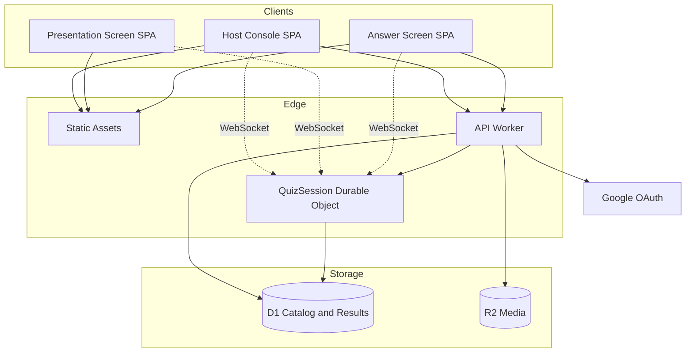
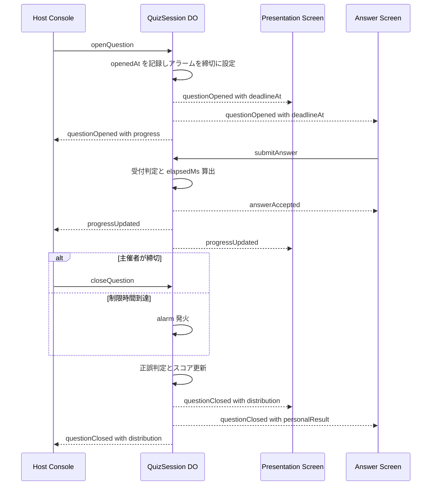
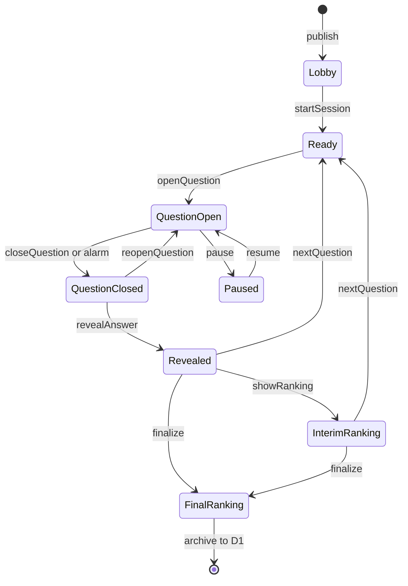
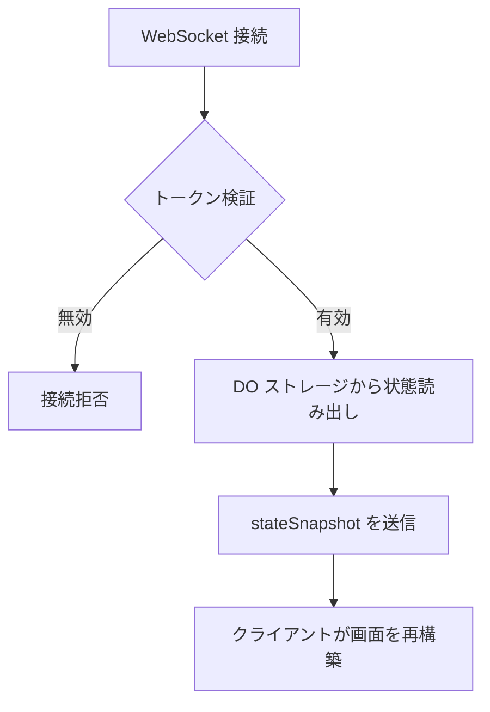
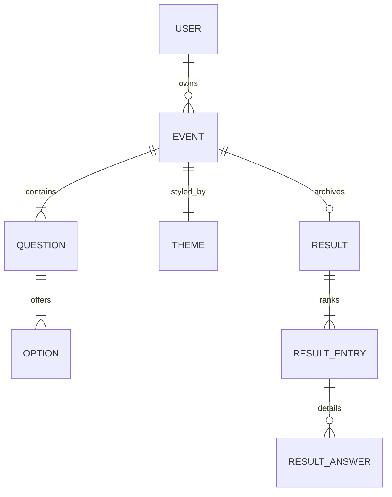

# Technical Design Document

## Overview

**Purpose**: 本機能は、その場に集まった参加者が一斉に回答するリアルタイムクイズ大会を、主催者・参加者・会場スクリーンの3面構成で実施する手段を提供する。主催者は事前にクイズと外観を作り込み、当日は手元の進行画面から出題を制御する。参加者はQRコードを読み取るだけで、登録なしに回答へ参加できる。

**Users**: 主催者は「準備フェーズ」でイベント・設問・外観を編集し、「開催フェーズ」で進行を操作する。参加者は開催フェーズにのみ関与し、スマートフォンから回答を送信する。会場スクリーンは表示専用の受動的なクライアントとして、進行状態を大画面へ反映する。

**Impact**: 新規プロジェクトのため既存システムへの影響はない。本設計は Cloudflare Workers プラットフォーム上に、ライブ進行の権威を担う Durable Object と、カタログ・結果を保持する D1 の二層構造を新規に確立する。

### Goals

- 出題から回答受信までの経過時間を単一の時計で計測し、順位の同率を構造的に発生させない採点基盤を確立する
- 進行操作を1秒以内に全クライアントへ反映し、通信断からの復帰時も進行状態を失わせない
- イベント非開催時の固定課金をゼロに保ち、開催時も無償枠内で運用できる構成とする
- 主催者が外観を変更しても、進行ロジックに一切の変更を要さない分離を維持する

### Non-Goals

- 参加者アカウントの永続化、および端末をまたいだ参加の引き継ぎ
- 複数主催者による同時進行操作・共同編集
- クイズ以外の企画機能（ビンゴ、抽選、アンケート）
- ネイティブアプリの提供、およびオフライン回答

## Boundary Commitments

### This Spec Owns

- **クイズカタログ**: 主催者アカウントに紐づくイベント、設問、選択肢、正解、外観設定の正本
- **ライブセッション状態**: 開催中の進行フェーズ、参加者名簿、回答記録、出題時刻と締切時刻の正本。**イベント状態（`event.status`）の `live` / `finished` 遷移の駆動元**でもあり、D1 へ書き戻す
- **採点と順位の決定**: 正解判定、経過時間の計測、順位付けアルゴリズムの唯一の実装
- **3画面へのリアルタイム配信契約**: 進行画面・投影画面・回答画面が購読するイベントの形式と配信順序保証

### Out of Boundary

- **主催者の身元確認**: 外部IDプロバイダ（Google）に委譲する。本仕様はプロバイダが発行した識別子を受け取るのみで、パスワードや本人確認情報を保持しない
- **参加者の個人識別**: 参加者を実世界の個人へ結びつける情報は取得も保持もしない
- **会場の物理環境**: プロジェクター接続、ネットワーク品質、端末の準備
- **画像の加工**: アップロードされた画像のリサイズ・最適化は行わず、入力制約で担保する

### Allowed Dependencies

- Cloudflare Workers ランタイム、Durable Objects、D1、R2（プラットフォーム基盤）
- Google OAuth 2.0（主催者認証の身元プロバイダ）
- 依存方向の制約: `types → config → repository → domain → session → api → ui`。各層は左側の層のみを参照し、上位層への参照を持たない。特に **domain 層は Cloudflare 固有 API を参照しない**（採点ロジックを純粋関数として単体テスト可能に保つため）

### Revalidation Triggers

- WebSocket メッセージ契約（`ServerEvent` / `ClientCommand`）のフィールド追加・意味変更
- 順位決定基準の変更（正解数・合計回答時間・タイブレーク順序）
- ライブ状態の所有者変更（DO から他コンポーネントへの移動）
- イベント状態機械のフェーズ追加・遷移条件の変更

## Architecture

### Architecture Pattern & Boundary Map

**Selected pattern**: Stateful Actor + CQRS 風の読み書き分離。1イベント＝1 Durable Object インスタンスがライブ進行の唯一の権威（アクター）となり、カタログと確定結果は D1 が保持する。選定根拠と却下した代替案は `research.md` の Architecture Pattern Evaluation に記録。



**Architecture Integration**:

- **責務の分離軸**: 「準備」と「開催」を時間軸で分離する。準備は HTTP + D1 の素直な CRUD、開催は WebSocket + DO の状態機械。両者の接続点は以下の4点に限定し、それ以外の経路を設けない。

  | 接続点 | 方向 | 内容 |
  |--------|------|------|
  | `publish` | Worker → DO | DO を生成し、`capacity`・`status`・外観設定を投入 |
  | `startSession` | DO → D1 | 設問スナップショットを取得して凍結し、`status` を `live` へ更新 |
  | 外観更新 | Worker → DO | 開催中の `themeUpdated` 反映（要件3.7） |
  | `finalize` | DO → D1 | 確定結果の書き戻しと `status` の `finished` 更新 |

  設問スナップショットが `startSession` で凍結されることにより、要件1.6（開催中の設問変更禁止）が設計上自然に強制される。
- **単一の権威**: ライブ中の全ての判断（誰が回答済みか、締切を過ぎたか、経過時間は何ミリ秒か）を DO の単一スレッド実行に集約する。DO は直列実行されるため、回答受付の冪等性（要件7.4）が追加のロック機構なしに保証される。
- **表示と進行の分離**: 外観設定は配信ペイロードに含まれる純粋なデータであり、進行状態機械はこれを一切解釈しない。要件3.7（開催中の外観変更反映）は、進行を中断せずに `themeUpdated` イベントを同報するだけで満たされる。
- **投影画面の情報制限**: 投影画面は「現在配信中のフェーズ」のみを受信し、未出題の設問データを保持しない。URL が漏洩しても事前に問題を閲覧できない（要件10.4 の意図を配信設計で補強）。
- **Steering compliance**: steering ドキュメント未整備のため、本設計が確立する依存方向とレイヤ規約を後続の steering の初期入力とする。

### Technology Stack

| Layer | Choice / Version | Role in Feature | Notes |
|-------|------------------|-----------------|-------|
| Frontend | React 19 + TypeScript 5（strict）/ Vite 7 | 3画面すべてを単一 SPA として実装。ルートで画面を分岐 | SSR 不要（SEO 対象外、初期表示にサーバーデータ不要） |
| Frontend 配信 | Cloudflare Workers Static Assets | SPA バンドルの配信 | 全プランで**リクエスト無課金・無制限**。要件12.1 に寄与 |
| API | Hono 4 on Cloudflare Workers | 認証、カタログ CRUD、参加登録、メディア配信 | 型付きルーティングで Worker バインディングを型安全に扱う |
| Realtime / 状態機械 | Cloudflare Durable Objects（SQLite バックエンド）+ WebSocket Hibernation API | ライブ進行の権威、同報ハブ、採点実行 | 無料プランは SQLite バックエンドのみ対応 |
| Data / Catalog | Cloudflare D1（SQLite） | アカウント、イベント、設問、外観設定、確定結果 | 5GB / 500万行読取・10万行書込 per day |
| Data / Live | Durable Object SQLite Storage | 参加者、回答、進行フェーズ | DO インスタンスにローカル。開催終了時に D1 へ書き戻し |
| Media | Cloudflare R2 | 設問画像、ロゴ、背景画像 | egress 無課金。Worker 経由で配信しアクセス制御 |
| Auth | Better Auth + Google OAuth 2.0 | 主催者のみの認証 | パスワード・メール送信基盤を持たない |
| Validation | Zod 4 | 全境界（HTTP 入力、WebSocket メッセージ、DO 永続データ）のスキーマ検証 | 型定義を単一の情報源とし `z.infer` で TypeScript 型を導出 |

依存関係の詳細な調査結果とコスト試算は `research.md` を参照。

## File Structure Plan

### Directory Structure

```
src/
├── shared/                      # クライアント・サーバー双方が参照する契約
│   ├── protocol.ts              # ServerEvent / ClientCommand の Zod スキーマと型
│   ├── domain-types.ts          # Event, Question, Participant 等のドメイン型と Result<T, E>
│   └── scoring.ts               # 順位決定の純粋関数（Cloudflare API 非依存）
│
├── server/
│   ├── index.ts                 # Worker エントリ。Hono アプリと DO のエクスポート
│   ├── env.ts                   # バインディング型定義（D1, R2, DO namespace）
│   ├── auth/
│   │   ├── factory.ts           # 非自明: リクエストごとに auth を生成するファクトリ
│   │   └── guard.ts             # 主催者セッション検証ミドルウェア
│   ├── catalog/                 # 準備フェーズ（HTTP + D1）
│   │   ├── routes.ts            # イベント・設問・外観の CRUD エンドポイント
│   │   ├── repository.ts        # D1 アクセス。SQL はここに閉じる
│   │   └── schema.ts            # リクエスト・レスポンスの Zod スキーマ
│   ├── media/
│   │   └── routes.ts            # R2 アップロードと保護付き配信
│   ├── session/                 # 開催フェーズ（WebSocket + DO）
│   │   ├── quiz-session-do.ts   # Durable Object 本体。状態機械と同報
│   │   ├── live-store.ts        # DO SQLite への永続化。状態復元を担う
│   │   ├── phase-machine.ts     # フェーズ遷移規則の純粋関数
│   │   └── join-routes.ts       # 参加登録とトークン発行（HTTP）
│   └── participant-token.ts     # 非自明: HMAC 署名トークンの発行と検証
│
└── client/
    ├── main.tsx                 # ルーティング。3画面と共有ページへの分岐
    ├── shared/
    │   ├── use-live-channel.ts  # WebSocket 接続・再接続・状態復元フック
    │   ├── use-server-clock.ts  # 非自明: サーバー時刻オフセットを補正した残り時間
    │   └── theme.tsx            # 外観設定を CSS カスタムプロパティへ適用
    ├── host/                    # 進行画面。準備画面も含む
    ├── stage/                   # 投影画面
    ├── player/                  # 回答画面
    └── share/                   # 結果共有ページ。認証不要・閲覧専用
        └── ranking-image.ts     # 非自明: ランキングを Canvas 経由で画像化
```

依存方向は `shared → server/* ` および `shared → client/*` の一方向。`client` と `server` は `shared` を介してのみ結合し、直接参照しない。`shared/scoring.ts` は純粋関数のみで構成し、サーバー・クライアント双方から同一実装を使う（クライアントは自分の暫定順位表示に利用）。

## System Flows

### 出題から結果確定までの進行フロー



出題時にアラームを設定し、主催者の手動締切が先行した場合はアラームを解除する。**アラームは出題中の1件のみ**に限定する制約を設ける（常時アラームは hibernation を妨げ duration 課金を生むため。`research.md` 参照）。

### ライブセッションの状態機械



#### DO の生成契機と二段階のスナップショット

**DO インスタンスは `POST /publish` の時点で生成し、`Lobby` フェーズで待機する。** 参加受付は `startSession` より前に行われる（要件5.1 が開始前の参加者一覧表示を求める）ため、DO は開始前から存在して参加登録を裁く必要がある。生成時に配置ロケーションのヒントを指定する（この時点が配置を決められる唯一の機会）。

カタログの取り込みは**二段階に分ける**。取り込む対象と時期が異なるためである。

| 契機 | 取り込む内容 | 格納先 | 理由 |
|------|--------------|--------|------|
| `publish`（DO 生成時） | `capacity`、`status`、外観設定 | `event_meta_json`（更新あり） | 開始前の参加受付で定員判定（要件4.6）と終了判定（要件4.8）に必要 |
| `startSession` | 設問・選択肢・正解の全量 | `question_snapshot_json`（凍結） | 公開後・開始前は設問を編集できるため、凍結は開始時点でなければならない（要件1.6） |

この分割により、「開催中は設問を変更できない」という要件1.6 が、バリデーションではなく**凍結されたスナップショットの存在そのもの**によって担保される。一方 `capacity` と外観設定は開始後も更新されうるため可変領域に置き、DO への反映経路（`themeUpdated` 等）を別途持つ。

#### イベント状態（`event.status`）の所有と書き戻し

`status` は D1 に置かれるが、その**遷移を駆動するのは DO 側の出来事**である。所有関係を以下に確定する。

| 遷移 | 駆動元 | 書き込み主体 |
|------|--------|--------------|
| `draft → published` | `POST /publish` | CatalogRoutes |
| `published → live` | `startSession` | **QuizSessionDO** |
| `live → finished` | `finalize` | **QuizSessionDO** |

`status` は `CatalogRoutes` が要件1.6（開催中の編集禁止）と要件3.7（開催中のみ DO へ外観を通知）を判定する唯一の根拠であるため、**書き戻されなければ両要件が例外を出さずに失効する**。DO はライブ状態の権威として自らの遷移時に `CatalogRepository` 経由で D1 を更新し、書き込みは冪等とする。書き戻しに失敗した場合も DO 側の状態を正とし、リトライする。

`Ready` は出題待機状態を表す（要件5.7）。**最終設問の正解発表後は `nextQuestion` が `NO_NEXT_QUESTION` を返し、`finalize` のみが受理される**（要件5.8）。専用の待機フェーズは設けず、`Revealed` のまま結果発表操作を提示する。

**`reopenQuestion` は `QuestionClosed`（正解発表前）からのみ許可する**（要件5.11, 5.12）。`Revealed` を経た設問は正解と解説が全画面へ配信済みであり、再開すると全参加者が正解を知った状態で回答できてしまうため、遷移自体を状態機械で禁止する。既に受け付けた回答は保持し、未回答者の回答のみを追加受付する（要件5.13）。再開後の `elapsedMs` は**元の `openedAt` を基準に継続計測**し、締切時刻のみを延長する。これにより既存回答との比較可能性が保たれる。

**`Paused` は `QuestionOpen` からのみ遷移する**（要件5.9）。残り時間の計測を停止し、`resume` 時に締切時刻を停止していた時間分だけ後ろへずらす。設問と設問の間（`Ready` / `Revealed` / `InterimRanking`）は制限時間が動いておらず、主催者が次へ進めない限り進行が止まったままであるため、中断機能を持たせる意味がない。一時停止が必要になるのはカウントダウンが進行している局面に限られる。

#### アラームのライフサイクル

DO のアラームは hibernation を妨げるため、**出題中の設問の締切1件のみ**に限定する（要件12.1）。各遷移におけるアラーム操作を以下に確定する。この表に現れない遷移ではアラームを操作しない。

| 遷移 | アラーム操作 | 設定時刻 |
|------|--------------|----------|
| `openQuestion` | `setAlarm` | `openedAt + timeLimitMs` |
| `closeQuestion`（手動締切） | `clearAlarm` | — |
| `alarm` 発火による自動締切 | 操作不要（発火により消費済み） | — |
| `pause` | `clearAlarm` | — |
| `resume` | `setAlarm` | `resumedAt + remainingMs` |
| `reopenQuestion` | `setAlarm` | `reopenedAt + 再開時の延長時間` |
| `finalize` | `clearAlarm`（防御的に実行） | — |

`pause` 時にアラームを解除しないと、一時停止中に元の締切で自動締切が発火する。解除漏れは要件5.9 を破るだけでなく、hibernation を妨げてアイドル課金を生む。

### 接続復帰フロー



再接続時は差分ではなく**完全なスナップショット**を送る。差分適用の欠落を考慮する必要がなくなり、要件9.2・9.3・9.4 を単一の経路で満たせる。スナップショットには受信者の役割に応じた内容のみを含める（参加者には他者の回答内容を含めない）。

## Requirements Traceability

| Requirement | Summary | Components | Interfaces | Flows |
|-------------|---------|------------|------------|-------|
| 1.1, 1.2 | 主催者認証とログイン強制 | AuthFactory, HostGuard | HTTP `/api/auth/*` | — |
| 1.3–1.8 | イベント CRUD・複製・削除・開催中の編集禁止 | CatalogRoutes, CatalogRepository, HostConsole | `EventCatalogService` | — |
| 2.1–2.10 | 設問の作成・検証・並び替え | CatalogRoutes, CatalogRepository, HostConsole | `QuestionCatalogService` | — |
| 3.1–3.14 | 外観カスタマイズ・コントラスト警告・全画面ウォークスルー | CatalogRoutes, ThemeProvider, HostConsole, PresentationScreen, AnswerScreen | `ThemeSettings` | — |
| 3.7 | 開催中の外観反映 | QuizSessionDO, ThemeProvider | `themeUpdated` イベント | — |
| 4.1, 4.2 | 参加用 URL と QR コード発行 | CatalogRoutes, HostConsole | `EventCatalogService` | — |
| 4.3–4.8 | 参加登録・重複名・定員・復元 | JoinRoutes, ParticipantToken, QuizSessionDO | HTTP `/api/join/:joinCode` | — |
| 4.9, 4.10 | 途中参加と不利の通知 | QuizSessionDO, AnswerScreen | `stateSnapshot` | 接続復帰フロー |
| 5.1–5.13 | 進行操作全般・再開の制限 | QuizSessionDO, PhaseMachine, HostConsole | `ClientCommand`, `Transition` | 進行フロー / 状態機械 |
| 6.1–6.9 | 投影画面の表示 | PresentationScreen, QuizSessionDO | `ServerEvent` | 進行フロー |
| 7.1–7.9 | 回答画面の表示と送信 | AnswerScreen, QuizSessionDO | `submitAnswer` | 進行フロー |
| 8.1–8.10 | 採点とランキング | ScoringModule, QuizSessionDO, ResultArchive | `RankingEntry` | 進行フロー |
| 8.11–8.14 | 結果の共有と画像化 | ResultArchive, CatalogRoutes, HostConsole, ShareView | `PublicResult` | — |
| 9.1–9.8 | リアルタイム同期と復帰 | LiveChannel, QuizSessionDO, ServerClock | `stateSnapshot` | 接続復帰フロー |
| 10.1–10.8 | データ保護と共有の既定無効 | ParticipantToken, MediaRoutes, HostGuard, ResultArchive, HostConsole | `PublicResult` | — |
| 11.1–11.6 | 非機能（対応環境・応答性） | 全クライアント | — | — |
| 12.1–12.4 | 運用コストと開催前確認 | 全サーバー構成, HealthCheck | HTTP `/api/events/:id/preflight` | — |

## Components and Interfaces

本節で共通に用いる型を先に定義する。エラーは例外送出ではなく判別可能ユニオンで表現し、呼び出し側にコンパイラが分岐を強制する。

```typescript
type Result<T, E> =
  | { readonly ok: true; readonly value: T }
  | { readonly ok: false; readonly error: E };

type EventStatus = "draft" | "published" | "live" | "finished";

// 参加拒否の理由。理由ごとに参加者が取るべき行動が異なるため、
// 単一のエラーへ丸めず HTTP コードまで区別して伝える（要件4.5, 4.6, 4.8）
type JoinRejection =
  | { readonly code: "NICKNAME_TAKEN" }
  | { readonly code: "CAPACITY_REACHED"; readonly capacity: number }
  | { readonly code: "EVENT_FINISHED" };

// 共有ページへ公開してよい情報の全量。要件10.8 の担保はこの型の形状が根拠であり、
// 設問明細・参加者ID を表現できないことが制約そのものとなる
interface PublicResultEntry {
  readonly rank: number;
  readonly nickname: string;
  readonly correctCount: number;
  readonly totalElapsedMs: number;
}

// 共有ページ用の外観。ThemeSettings をそのまま使わず配色のみに絞る。
// 画像は要件10.6 により関係者限定であり、匿名の閲覧者は取得できないため、
// 参照そのものを型に載せない（載せると壊れた画像か認可の緩和かの二択になる）
interface PublicTheme {
  readonly primaryColor: string;
  readonly accentColor: string;
  readonly backgroundColor: string;
  readonly textColor: string;
}

interface PublicResult {
  readonly eventTitle: string;
  readonly theme: PublicTheme;
  readonly finalizedAt: number;
  readonly entries: readonly PublicResultEntry[];
}
```

進行コマンドは `ClientCommand` を全体集合とし、そのうち主催者のみが送出できる部分集合を `HostCommand` として定義する（`submitAnswer` と `resync` は含まれない）。`PhaseMachine` は `HostCommand` のみを受理し、参加者コマンドは状態機械を経由しない。

| Component | Domain/Layer | Intent | Req Coverage | Key Dependencies (P0/P1) | Contracts |
|-----------|--------------|--------|--------------|--------------------------|-----------|
| QuizSessionDO | Session | ライブ進行の権威と同報ハブ、`status` 遷移の駆動 | 1.6, 1.7, 3.7, 4.4–4.10, 5, 6, 7, 8.1–8.10, 9, 10.5 | LiveStore (P0), ScoringModule (P0), CatalogRepository (P0) | Service, Event, State |
| ScoringModule | Domain | 正解判定と順位決定の純粋実装 | 8.1–8.9 | なし | Service |
| PhaseMachine | Domain | フェーズ遷移の妥当性判定 | 5.2–5.13 | なし | Service |
| LiveStore | Session | DO SQLite への永続化と状態復元 | 9.2–9.4 | DO Storage (P0) | State |
| CatalogRepository | Repository | D1 に対するカタログ操作と `status` 更新 | 1.3–1.8, 2, 3.1–3.6 | D1 (P0) | Service |
| CatalogRoutes | API | 準備フェーズの HTTP エンドポイント | 1, 2, 3.1–3.6, 4.1 | CatalogRepository (P0), HostGuard (P0) | API |
| JoinRoutes | API | 参加登録とトークン発行 | 4.3–4.8 | QuizSessionDO (P0), ParticipantToken (P0) | API |
| ParticipantToken | Session | 匿名参加者の署名付き識別 | 4.4, 4.7, 9.3, 10.1 | なし | Service |
| AuthFactory / HostGuard | API | 主催者認証とアクセス制御 | 1.1, 1.2, 1.5, 10.5 | Better Auth (P0), D1 (P0) | Service |
| MediaRoutes | API | 画像の保管と保護付き配信 | 2.5, 3.4, 10.6 | R2 (P0) | API |
| ResultArchive | Repository | 確定結果の D1 への書き戻しと共有制御 | 8.11–8.13, 10.2, 10.3, 10.7 | D1 (P0) | Service |
| ShareView | UI | 共有結果ページの描画と画像化 | 8.12, 8.14, 10.8 | — | State |
| LiveChannel | UI | WebSocket 接続・再接続・状態復元 | 9.2–9.6 | protocol (P0) | State |
| ServerClock | UI | サーバー基準の残り時間算出 | 9.8, 6.2, 7.2 | なし | Service |
| HostConsole | UI | 準備画面（イベント一覧・作成・編集、設問エディタ、外観エディタ、公開・QR/参加URL取得、結果閲覧・共有設定）と進行画面（出題操作・正解発表・結果発表）の描画 | 1.3–1.8, 2.1–2.10, 3.1–3.14, 4.1, 4.2, 5.1–5.13, 8.11, 8.13, 10.2, 10.3, 11.6, 12.3, 12.4 | CatalogRoutes (P0), LiveChannel (P0), ThemeProvider (P1), PresentationScreen (P2), AnswerScreen (P2) | State |
| PresentationScreen / AnswerScreen | UI | 投影画面・回答画面の描画 | 6, 7 | LiveChannel (P0), ThemeProvider (P1) | State |

### Domain 層

#### ScoringModule

| Field | Detail |
|-------|--------|
| Intent | 回答記録から正誤・スコア・順位を決定する純粋関数群 |
| Requirements | 8.1, 8.2, 8.3, 8.4, 8.5, 8.6, 8.7, 8.8, 8.9 |

**Responsibilities & Constraints**

- 順位決定の唯一の実装。他コンポーネントは順位付けロジックを持たない
- **Cloudflare 固有 API を一切参照しない**。時刻は引数として受け取り、内部で `Date.now()` を呼ばない
- 不変条件: 全設問の配点は等価（要件8.3）。合計回答時間には正解した設問のみを加算（要件8.5）
- 不変条件: **1設問の正解はちょうど1つ**（要件2.4）。回答は単一選択であり、部分点の概念を持たない

**Dependencies**

- Inbound: QuizSessionDO — 締切時とランキング要求時に呼び出し (P0)
- Inbound: AnswerScreen — 自分の暫定順位表示に同一実装を使用 (P1)

**Contracts**: Service [x]

##### Service Interface

```typescript
interface AnswerRecord {
  readonly participantId: ParticipantId;
  readonly questionId: QuestionId;
  readonly selectedOptionId: OptionId;
  readonly elapsedMs: number;
}

interface ParticipantScore {
  readonly participantId: ParticipantId;
  readonly nickname: string;
  readonly correctCount: number;
  readonly totalElapsedMs: number;
  readonly joinedSeq: number;
}

interface RankingEntry extends ParticipantScore {
  readonly rank: number;
}

interface ScoringModule {
  judge(
    answer: AnswerRecord,
    correctOptionId: OptionId,
  ): { readonly isCorrect: boolean };

  aggregate(
    participants: readonly ParticipantSummary[],
    answers: readonly AnswerRecord[],
    questions: readonly QuestionSnapshot[],
  ): readonly ParticipantScore[];

  rank(scores: readonly ParticipantScore[]): readonly RankingEntry[];
}
```

- Preconditions: `answers` は締切済み設問の回答のみを含む。`elapsedMs` は非負
- Postconditions: `rank` の結果は `rank` 昇順に整列され、`rank` は 1 起点の連番となる（同率を作らないため、値の重複は発生しない）
- Invariants: 並び順は「`correctCount` 降順 → `totalElapsedMs` 昇順 → `joinedSeq` 昇順」で全順序が定まる。参加登録順 `joinedSeq` が一意であるため、最終的なタイブレークは必ず解決する（要件8.6）

**Implementation Notes**

- Integration: 参加登録より前に締切済みの設問は `answers` に現れないため、要件8.8（未回答扱い）は集計側の特別扱いなしに満たされる
- Validation: 単体テストで「同率が発生しないこと」を性質テストとして検証する
- Risks: 途中参加者は正解数の母数が小さくなるが、順位計算上の特別扱いは行わない（要件8.7）

#### PhaseMachine

| Field | Detail |
|-------|--------|
| Intent | 現在フェーズと進行コマンドから、遷移の可否と次フェーズを決定する |
| Requirements | 5.2, 5.4, 5.5, 5.7, 5.8, 5.9, 5.10 |

**Responsibilities & Constraints**

- 状態機械図の遷移規則を唯一実装する。副作用を持たない純粋関数
- 不正な遷移（例: `Lobby` からの `closeQuestion`）を明示的に拒否する

**Contracts**: Service [x]

##### Service Interface

```typescript
type LivePhase =
  | { readonly kind: "lobby" }
  | { readonly kind: "ready"; readonly nextQuestionId: QuestionId }
  | { readonly kind: "questionOpen"; readonly questionId: QuestionId; readonly openedAt: number; readonly deadlineAt: number }
  | { readonly kind: "questionClosed"; readonly questionId: QuestionId }
  | { readonly kind: "revealed"; readonly questionId: QuestionId }
  | { readonly kind: "interimRanking" }
  | { readonly kind: "paused"; readonly resumeTo: LivePhase; readonly remainingMs: number }
  | { readonly kind: "finalRanking" };

type TransitionError =
  | { readonly code: "INVALID_PHASE"; readonly current: LivePhase["kind"]; readonly command: string }
  | { readonly code: "NO_NEXT_QUESTION" }
  | { readonly code: "ALREADY_REVEALED" };

type AlarmIntent =
  | { readonly kind: "set"; readonly at: number }
  | { readonly kind: "clear" }
  | { readonly kind: "noop" };

interface Transition {
  readonly phase: LivePhase;
  readonly alarm: AlarmIntent;
}

interface PhaseMachine {
  next(
    current: LivePhase,
    command: HostCommand,
    context: { readonly now: number; readonly questions: readonly QuestionSnapshot[] },
  ): Result<Transition, TransitionError>;
}
```

- Preconditions: `questions` は `startSession` 時に凍結されたスナップショットであり、進行中に変化しない。`lobby` フェーズでは未取得のため空配列となる
- Postconditions: 成功時、返却されたフェーズのみが正当な次状態となる。**アラーム操作は必ず `Transition.alarm` として返され**、`QuizSessionDO` はこれをそのまま適用する
- Invariants: `paused` は `resumeTo` に元のフェーズを保持し、`resume` 時に `remainingMs` から締切時刻を再計算する（要件5.9）
- Invariants: `reopenQuestion` は `questionClosed` からのみ成功し、`revealed` に対しては `ALREADY_REVEALED` を返す（要件5.12）
- Invariants: 最終設問の `revealed` からの `nextQuestion` は `NO_NEXT_QUESTION` を返し、`finalize` のみが成功する（要件5.8）

**Implementation Notes**

- Integration: アラーム操作を戻り値に含めることで、「アラームのライフサイクル」表の規則が純粋関数の単体テストで検証可能になる。DO 側に操作判断を持たせると、解除漏れがテストで検出できなくなる

### Session 層

#### QuizSessionDO

| Field | Detail |
|-------|--------|
| Intent | 1イベントのライブ進行を単独で所有し、全クライアントへ同報する |
| Requirements | 3.7, 4.4–4.10, 5.1–5.10, 6.1–6.8, 7.1–7.9, 8.1–8.11, 9.1–9.8 |

**Responsibilities & Constraints**

- **ライブ状態の唯一の権威**。出題時刻・締切判定・回答受付可否を単独で決定する
- **`event.status` の `live` / `finished` への遷移を駆動する**。自らのフェーズ遷移に伴い D1 へ書き戻す（要件1.6, 1.7 の前提を成立させるため）
- 経過時間の計測に用いる時計は本コンポーネント内の1つのみ。クライアント申告の時刻を採用しない（要件9.8）
- トランザクション境界: 1つの WebSocket メッセージ処理が1トランザクション。DO の直列実行により、回答の重複チェックと記録がアトミックになる（要件7.4）
- データ所有: 参加者名簿、回答記録、進行フェーズ。カタログは開始時のスナップショットとして**読み取り専用で保持**する
- 制約: **アラームは出題中の設問の締切1件のみ**。締切処理完了後は必ず解除する

**Dependencies**

- Inbound: LiveChannel（3画面すべて）— WebSocket 接続と進行コマンド (P0)
- Inbound: JoinRoutes — 参加登録の照会 (P0)
- Outbound: LiveStore — 状態の永続化と復元 (P0)
- Outbound: ScoringModule / PhaseMachine — 判定ロジック (P0)
- Outbound: ResultArchive — 確定結果の書き戻し (P1)
- Outbound: CatalogRepository — `startSession` 時の設問スナップショット取得と `event.status` の書き戻し (P0)
- External: Durable Object WebSocket Hibernation API — 接続維持とアイドル時のコスト回避 (P0)

**Contracts**: Service [x] / Event [x] / State [x]

##### Service Interface

```typescript
interface QuizSessionDO {
  fetch(request: Request): Promise<Response>;
  webSocketMessage(ws: WebSocket, message: string | ArrayBuffer): Promise<void>;
  webSocketClose(ws: WebSocket, code: number, reason: string, wasClean: boolean): Promise<void>;
  webSocketError(ws: WebSocket, error: unknown): Promise<void>;
  alarm(): Promise<void>;
}
```

- Preconditions: 接続時に有効な役割トークン（主催者セッション／参加者トークン／投影トークン）が提示されていること
- Postconditions: 状態を変更した全てのメッセージ処理は、DO ストレージへの永続化完了後に同報する
- Invariants: メモリ上の変数のみに依存する状態を持たない。hibernation からの復帰後もストレージから完全に再構築できる

##### Event Contract

配信イベント（`ServerEvent`）は役割ごとに内容を絞る。参加者へは他者の回答内容を含めない（要件6.8, 7.7）。

| Event | 受信者 | Payload 要点 | 要件 |
|-------|--------|--------------|------|
| `stateSnapshot` | 全役割 | 現在フェーズ、外観設定、自分の状態、`serverNow` | 9.2, 9.3, 9.4 |
| `participantJoined` | 主催者, 投影 | 参加者数、ニックネーム | 5.1, 6.1 |
| `questionOpened` | 全役割 | 設問内容、`deadlineAt`、`serverNow` | 5.2, 6.2, 7.2 |
| `progressUpdated` | 主催者, 投影 | 回答済み数／未回答数 | 5.3, 6.3 |
| `answerAccepted` | 該当参加者のみ | 受理した選択肢 | 7.3 |
| `questionClosed` | 全役割 | 正解、選択肢別分布、解説（参加者へは自分の正誤も） | 5.6, 6.4, 7.6 |
| `rankingUpdated` | 主催者, 投影 | 上位者のランキング | 5.9, 6.5, 6.6 |
| `personalRank` | 該当参加者のみ | 自分の順位・正解数・合計時間 | 7.6, 7.9 |
| `themeUpdated` | 投影, 参加者 | 外観設定 | 3.7 |
| `commandRejected` | 送信者のみ | 拒否理由コード | 7.5, 9.6 |

- Ordering / delivery guarantees: 単一 DO からの順次送信により、**同一接続に対する配信順序は保証**される。接続断中の配信は失われるため、再接続時は差分ではなく `stateSnapshot` で完全再構築する
- 受信コマンド（`ClientCommand`）: 主催者から `startSession` / `openQuestion` / `closeQuestion` / `revealAnswer` / `nextQuestion` / `reopenQuestion` / `showRanking` / `pause` / `resume` / `finalize`、参加者から `submitAnswer`、全役割から `resync`

##### State Management

- State model: `LivePhase`（状態機械図参照）、参加者名簿、回答記録、カタログスナップショット
- Persistence & consistency: 全状態を DO SQLite に永続化。WebSocket ごとの役割情報は `serializeAttachment()`（上限16,384バイト）で保持し、hibernation を跨いで復元する
- Concurrency strategy: DO の単一スレッド直列実行に依拠し、明示的なロックを持たない。これが本設計における競合状態対策の中核

**Implementation Notes**

- Integration: hibernation 復帰時にコンストラクタが再実行されるため、**コンストラクタではストレージからの読み出しのみを行う**。アラーム設定や同報などの副作用を持たせてはならない
- Integration: **DO インスタンス生成時に配置ロケーションのヒントを指定する**。DO は最初のリクエスト位置に基づいて配置され、以後移動しないため、指定を怠ると主催者の所在によっては会場から遠いリージョンへ固定される。会場と DO が離れると全参加者の回答が長距離を往復し、要件9.1 の余裕を大きく削る。**一度確定した配置はセッションを作り直さない限り変更できない**ため、生成時が唯一の機会となる
- Integration: 外観の更新（要件3.7）は `CatalogRoutes` からの内部 `fetch()` で受け取り、`themeUpdated` として同報する。この経路は進行フェーズを変更せず、状態機械を経由しない
- Integration: `startSession` では「設問スナップショットの取得と凍結」「`status` の `live` 更新」を行い、`finalize` では「結果の書き戻し」「`status` の `finished` 更新」を行う。いずれも冪等とし、**D1 への書き込み失敗時も DO のフェーズ遷移は成立させたうえでリトライする**。DO 側を正とすることで、書き戻しの遅延が進行を止めない
- Validation: 受信メッセージは `protocol.ts` の Zod スキーマで検証し、不正なペイロードは `commandRejected` で拒否する
- Risks: アラームは hibernation を妨げるため、締切以外の用途に拡張しないこと。定期ポーリング用アラームを追加するとアイドル課金が発生し要件12.1 を破る

#### LiveStore

| Field | Detail |
|-------|--------|
| Intent | ライブ状態を DO SQLite に永続化し、hibernation 復帰時に完全復元する |
| Requirements | 1.6, 4.5, 7.4, 9.2, 9.3, 9.4 |

**Responsibilities & Constraints**

- `QuizSessionDO` のメモリ状態を一切の残余なく永続化する。**メモリ変数のみに存在する状態を作らせない**ことが本コンポーネントの存在理由
- 凍結領域（`question_snapshot_json`）と可変領域（`event_meta_json`）の書き分けを型で強制する
- DO SQLite の同期 API を前提とし、呼び出しは DO の直列実行内で完結する

**Dependencies**

- Inbound: QuizSessionDO — 全状態の読み書き (P0)
- External: Durable Object SQLite Storage (P0)

**Contracts**: State [x]

##### State Management

```typescript
interface SessionState {
  readonly phase: LivePhase;
  readonly eventMeta: EventMeta;
  readonly questions: readonly QuestionSnapshot[] | null;
  readonly startedAt: number | null;
}

type AnswerOutcome =
  | { readonly kind: "recorded"; readonly record: AnswerRecord }
  | { readonly kind: "alreadyAnswered"; readonly existing: AnswerRecord };

interface LiveStore {
  load(): SessionState | null;
  initialize(meta: EventMeta): void;
  savePhase(phase: LivePhase): void;
  saveEventMeta(meta: EventMeta): void;
  freezeQuestionSnapshot(questions: readonly QuestionSnapshot[], startedAt: number): void;

  addParticipant(nickname: string, now: number): Result<Participant, JoinRejection>;
  listParticipants(): readonly Participant[];
  findParticipant(participantId: ParticipantId): Participant | null;

  recordAnswer(input: AnswerRecord): AnswerOutcome;
  listAnswers(questionId: QuestionId): readonly AnswerRecord[];
  listAllAnswers(): readonly AnswerRecord[];
  discardAnswers(questionId: QuestionId): void;
}
```

- Preconditions: `freezeQuestionSnapshot` は `questions` が `null` の状態でのみ呼び出せる
- Postconditions: `freezeQuestionSnapshot` の成功後、`questions` は以後変化しない（要件1.6 の担保）
- Postconditions: `recordAnswer` は既存回答がある場合に `alreadyAnswered` を返し、**既存値を上書きしない**（要件7.4）
- Invariants: `load()` の戻り値のみから `QuizSessionDO` の全状態を再構築できる。これが成立しない限り hibernation 復帰は保証されない
- Concurrency: DO の直列実行に依拠し、明示的なロックを持たない。`addParticipant` のニックネーム一意性は UNIQUE 制約と直列実行による二重の担保とする（要件4.5）

**Implementation Notes**

- Integration: `discardAnswers` は `reopenQuestion` から使用するが、**要件5.13 により再開時は既存回答を保持する**ため通常の進行では呼ばれない。締切前の設問に対する管理操作としてのみ用いる
- Risks: 凍結領域を更新するコードパスを作らないこと。`freezeQuestionSnapshot` 以外に `question_snapshot_json` を書く経路を設けてはならない

#### ParticipantToken

| Field | Detail |
|-------|--------|
| Intent | 個人情報を含まない匿名参加者の識別子を、改竄不能な形で発行・検証する |
| Requirements | 4.4, 4.7, 9.3, 10.1 |

**Responsibilities & Constraints**

- トークンに含めるのは `eventId`、`participantId`、発行時刻のみ。氏名・連絡先を含めない（要件10.1）
- イベント単位でスコープし、他イベントへの流用を検証時に拒否する

**Contracts**: Service [x]

##### Service Interface

```typescript
interface ParticipantClaims {
  readonly eventId: EventId;
  readonly participantId: ParticipantId;
  readonly issuedAt: number;
}

type TokenError =
  | { readonly code: "MALFORMED" }
  | { readonly code: "BAD_SIGNATURE" }
  | { readonly code: "EVENT_MISMATCH" };

interface ParticipantTokenService {
  issue(claims: ParticipantClaims): Promise<string>;
  verify(token: string, expectedEventId: EventId): Promise<Result<ParticipantClaims, TokenError>>;
}
```

- Invariants: 署名鍵は Worker のシークレットとして保持し、クライアントへ露出しない

**Implementation Notes**

- Integration: クライアントは `localStorage` にイベントIDでスコープして保存する。保存不可の環境では参加登録画面へ誘導する（要件4.7 の代替経路）
- Risks: 端末変更時は参加を引き継げない。**同一端末でもブラウザが異なる場合（SNS アプリ内ブラウザから既定ブラウザへ切り替えた場合を含む）は `localStorage` が共有されないため、新規参加者として扱われる。** 復帰コード等の救済手段は導入しないことを決定済み（検討経緯は `research.md` の参加者識別に関する決定を参照）。フィンガープリンティングによる識別は精度と要件10.1 の双方から採用しない

### Repository 層

#### CatalogRepository

| Field | Detail |
|-------|--------|
| Intent | D1 に対するカタログ操作を一箇所に閉じ込め、`event.status` の遷移を仲介する |
| Requirements | 1.3, 1.4, 1.5, 1.6, 1.7, 1.8, 2.1–2.10, 3.1–3.5 |

**Responsibilities & Constraints**

- **SQL は本コンポーネントの外に漏らさない**。呼び出し元は意味のある操作単位でのみアクセスする
- `event.status` の書き込み口は `updateStatus` のみ。他のメソッドが `status` を変更してはならない
- トランザクション境界: 設問と選択肢の更新は1トランザクションで整合させる

**Dependencies**

- Inbound: CatalogRoutes — 準備フェーズの CRUD (P0)
- Inbound: QuizSessionDO — 設問スナップショット取得と `status` 書き戻し (P0)
- External: Cloudflare D1 (P0)

**Contracts**: Service [x]

##### Service Interface

```typescript
type CatalogError =
  | { readonly code: "NOT_FOUND" }
  | { readonly code: "FORBIDDEN" }
  | { readonly code: "EVENT_LIVE" }
  | { readonly code: "VALIDATION"; readonly fields: readonly string[] }
  | { readonly code: "STATUS_CONFLICT"; readonly actual: EventStatus };

interface CatalogRepository {
  listEvents(ownerId: UserId): Promise<readonly EventSummary[]>;
  findEvent(eventId: EventId, ownerId: UserId): Promise<Result<EventDetail, CatalogError>>;
  createEvent(ownerId: UserId, input: CreateEventInput): Promise<EventDetail>;
  updateEvent(eventId: EventId, ownerId: UserId, input: UpdateEventInput): Promise<Result<EventDetail, CatalogError>>;
  duplicateEvent(eventId: EventId, ownerId: UserId): Promise<Result<EventDetail, CatalogError>>;
  deleteEvent(eventId: EventId, ownerId: UserId): Promise<Result<void, CatalogError>>;

  upsertQuestion(eventId: EventId, ownerId: UserId, input: QuestionInput): Promise<Result<Question, CatalogError>>;
  deleteQuestion(eventId: EventId, ownerId: UserId, questionId: QuestionId): Promise<Result<void, CatalogError>>;
  reorderQuestions(eventId: EventId, ownerId: UserId, order: readonly QuestionId[]): Promise<Result<readonly Question[], CatalogError>>;
  putTheme(eventId: EventId, ownerId: UserId, theme: ThemeSettings): Promise<Result<ThemeSettings, CatalogError>>;

  publish(eventId: EventId, ownerId: UserId): Promise<Result<PublishResult, CatalogError>>;
  loadQuestionSnapshot(eventId: EventId): Promise<readonly QuestionSnapshot[]>;
  updateStatus(eventId: EventId, expected: EventStatus, next: EventStatus): Promise<Result<void, CatalogError>>;
}
```

- Preconditions: `updateStatus` は**期待する現在値 `expected` を必須引数とする**条件付き更新。実際の値が異なる場合は `STATUS_CONFLICT` を返す
- Postconditions: `updateStatus` は既に `next` である場合も成功として扱う（冪等）。これにより DO からのリトライが安全になる
- Invariants: 設問を変更する全メソッドは `status` が `live` の場合に `EVENT_LIVE` を返す（要件1.7）。この判定を呼び出し元に委ねない
- Invariants: 所有者 `ownerId` を伴わないメソッドは `loadQuestionSnapshot` と `updateStatus` のみ。この2つは DO からの内部呼び出し専用であり、外部 HTTP に露出させない

**Implementation Notes**

- Integration: `publish` は参加用コード・投影トークンの採番と `status` の `published` 更新を1トランザクションで行う
- Risks: `expected` を省略可能にすると順序が逆転した書き戻しで `live → published` の巻き戻りが起こりうる。必須引数として型で防ぐ

#### ResultArchive

| Field | Detail |
|-------|--------|
| Intent | 確定結果を D1 へ書き戻し、共有の有効化・無効化と公開参照を担う |
| Requirements | 8.11, 8.12, 8.13, 10.2, 10.3, 10.7, 10.8 |

**Responsibilities & Constraints**

- 確定結果の書き込みは冪等。`result.event_id` の UNIQUE 制約により再実行で重複しない
- **公開参照 `findPublicByShareCode` の戻り値型を `PublicResult` に固定**し、設問明細や参加者IDが型として表現できないようにする（要件10.8）
- 共有は既定で無効（`share_code` が NULL）。有効化は明示操作のみ（要件10.7）

**Dependencies**

- Inbound: QuizSessionDO — `finalize` 時の書き戻し (P0)
- Inbound: CatalogRoutes — 共有制御と主催者向け参照 (P0)
- External: Cloudflare D1 (P0)

**Contracts**: Service [x]

##### Service Interface

```typescript
type ArchiveError =
  | { readonly code: "NOT_FOUND" }
  | { readonly code: "FORBIDDEN" }
  | { readonly code: "NOT_FINALIZED" }
  | { readonly code: "SHARING_DISABLED" };

interface ResultArchive {
  save(eventId: EventId, ranking: readonly RankingEntry[], answers: readonly AnswerRecord[]): Promise<Result<ResultId, ArchiveError>>;
  findForOwner(eventId: EventId, ownerId: UserId): Promise<Result<ArchivedResult, ArchiveError>>;
  deleteParticipantData(eventId: EventId, ownerId: UserId): Promise<Result<void, ArchiveError>>;

  enableSharing(eventId: EventId, ownerId: UserId): Promise<Result<{ readonly shareCode: string }, ArchiveError>>;
  disableSharing(eventId: EventId, ownerId: UserId): Promise<Result<void, ArchiveError>>;
  findPublicByShareCode(shareCode: string): Promise<Result<PublicResult, ArchiveError>>;
}
```

- Preconditions: `enableSharing` は結果確定済み（`result` 行が存在する）場合のみ成功し、未確定時は `NOT_FINALIZED` を返す
- Postconditions: `save` の再実行は既存の `ResultId` を返し、行を重複させない（冪等）
- Postconditions: `disableSharing` 後の `findPublicByShareCode` は `SHARING_DISABLED` を返す（HTTP 410 に対応、要件8.13）
- Invariants: `PublicResult` が含む参加者情報はニックネーム・順位・正解数・合計回答時間のみ。これに加えてイベントタイトルと配色（`PublicTheme`）を含む。`result_answer` の内容は `findForOwner` からのみ到達可能（要件10.8）
- Invariants: `PublicResult` に画像参照を含めない。共有ページの閲覧者は匿名であり、要件10.6 により画像を取得できないため（`PublicTheme` が `ThemeSettings` と別型である理由）

**Implementation Notes**

- Integration: `deleteParticipantData`（要件10.3）は共有も同時に無効化する。参加者データを消しながら共有ページが生き残る状態を作らない
- Risks: 共有コードは `join_code` と独立に採番する。同一値を流用すると参加URLから結果ページが推測できてしまう

### API 層

#### AuthFactory / HostGuard

| Field | Detail |
|-------|--------|
| Intent | 主催者の認証を提供し、イベント所有権に基づくアクセス制御を強制する |
| Requirements | 1.1, 1.2, 1.5, 10.5 |

**Responsibilities & Constraints**

- 認証は Google OAuth 単独。**パスワードを保持せず、メール送信基盤も持たない**（要件1.1）
- 主催者以外の役割（参加者・投影）は本コンポーネントの対象外。役割ごとにトークン体系を分離する

**Dependencies**

- Inbound: CatalogRoutes / MediaRoutes — セッション検証 (P0)
- External: Better Auth + Google OAuth 2.0 (P0)
- External: Cloudflare D1 — セッションとアカウントの保存 (P0)

**Contracts**: Service [x]

##### Service Interface

```typescript
type AuthError =
  | { readonly code: "UNAUTHENTICATED" }
  | { readonly code: "FORBIDDEN" };

interface HostSession {
  readonly userId: UserId;
}

interface AuthFactory {
  create(env: Env): AuthInstance;
}

interface HostGuard {
  requireHost(request: Request): Promise<Result<HostSession, AuthError>>;
  requireEventOwner(request: Request, eventId: EventId): Promise<Result<HostSession, AuthError>>;
}
```

- Invariants: `requireHost` が失敗した経路では、いかなるカタログ操作も実行されない（要件1.2）

**Implementation Notes**

- Integration: **Workers ではリクエストごとに D1 バインディングを受け取るため、`betterAuth` のシングルトンをモジュールスコープでエクスポートできない。** 必ず `Env` を引数に取るファクトリ関数として構成し、リクエストスコープでインスタンスを生成する。この制約は Node の一般的な構成と異なり、知らずに実装すると動作しない（調査経緯は `research.md > 主催者認証の実装方式`）
- Integration: OAuth のリダイレクト URI は環境ごとに Google 側へ登録が必要（手順は `manual-setup.md` A-3）
- Validation: 投影画面の URL は本ガードを通らないが、進行操作は `QuizSessionDO` 側で役割トークンにより拒否される（要件10.5）
- Risks: プロバイダを追加する場合も本インターフェースは変更不要。`AuthInstance` の生成設定のみが変わる

#### CatalogRoutes

| Field | Detail |
|-------|--------|
| Intent | 準備フェーズにおけるイベント・設問・外観の操作を提供する |
| Requirements | 1.2–1.8, 2.1–2.10, 3.1–3.6, 4.1, 4.2 |

**Responsibilities & Constraints**

- 全エンドポイントで主催者セッションを検証し、所有権を確認する（要件1.2, 1.5）
- 開催中イベントに対する設問の追加・削除・正解変更を拒否する（要件1.6）。外観更新のみ開催中も許可し、DO へ `themeUpdated` を通知する（要件3.7）

**Contracts**: API [x]

##### API Contract

| Method | Endpoint | Request | Response | Errors |
|--------|----------|---------|----------|--------|
| GET | `/api/events` | — | `EventSummary[]` | 401 |
| POST | `/api/events` | `CreateEventRequest` | `EventDetail` | 400, 401 |
| GET | `/api/events/:id` | — | `EventDetail` | 401, 403, 404 |
| PATCH | `/api/events/:id` | `UpdateEventRequest` | `EventDetail` | 400, 401, 403, 409 |
| POST | `/api/events/:id/duplicate` | — | `EventDetail` | 401, 403 |
| DELETE | `/api/events/:id` | — | 204 | 401, 403 |
| POST | `/api/events/:id/questions` | `CreateQuestionRequest` | `Question` | 400, 401, 403, 409 |
| PATCH | `/api/events/:id/questions/:qid` | `UpdateQuestionRequest` | `Question` | 400, 401, 403, 409 |
| DELETE | `/api/events/:id/questions/:qid` | — | 204 | 401, 403, 409 |
| PUT | `/api/events/:id/questions/order` | `{ questionIds: QuestionId[] }` | `Question[]` | 400, 401, 403, 409 |
| PUT | `/api/events/:id/theme` | `ThemeSettings` | `ThemeSettings` | 400, 401, 403 |
| POST | `/api/events/:id/publish` | — | `PublishResult` | 401, 403, 422 |
| GET | `/api/events/:id/stage-token` | — | `{ stageToken: string; stageUrl: string }` | 401, 403, 409 |
| GET | `/api/events/:id/preflight` | — | `PreflightReport` | 401, 403 |
| GET | `/api/events/:id/results` | — | `ArchivedResult` | 401, 403, 404 |
| POST | `/api/events/:id/share` | — | `{ shareCode: string; shareUrl: string }` | 401, 403, 404 |
| DELETE | `/api/events/:id/share` | — | 204 | 401, 403 |
| GET | `/api/share/:shareCode` | — | `PublicResult` | 404, 410 |
| DELETE | `/api/events/:id/participants` | — | 204 | 401, 403 |

409 は開催中の禁止操作（要件1.6）および未公開イベントへの投影トークン要求、422 は公開時の検証失敗（要件2.10）、410 は共有が無効化済み（要件8.13）に対応する。

`PublishResult` は参加用と投影用の両方の入口を1回のレスポンスで返す。

```typescript
interface PublishResult {
  readonly joinCode: string;
  readonly joinUrl: string;
  readonly stageToken: string;
  readonly stageUrl: string;
}
```

`GET /api/share/:shareCode` は**本 API 群で唯一認証を要求しない**エンドポイントであり、参加者情報としてはニックネーム・順位・正解数・合計回答時間のみを含める（要件10.8）。設問ごとの正誤・参加者ID・画像参照は返さない。

`PreflightReport` は開催前チェック（要件12.3, 12.4）の確認項目を確定させる。**項目を固定することが本機能の目的**であり、実装者の裁量で増減させない。

```typescript
type PreflightStatus = "ok" | "warn" | "fail";

type PreflightCheck =
  | { readonly id: "authValid"; readonly status: PreflightStatus; readonly detail: string }
  | { readonly id: "sessionReachable"; readonly status: PreflightStatus; readonly detail: string }
  | { readonly id: "roundTripMs"; readonly status: PreflightStatus; readonly measuredMs: number }
  | { readonly id: "stageUrlReachable"; readonly status: PreflightStatus; readonly detail: string }
  | { readonly id: "questionsReady"; readonly status: PreflightStatus; readonly questionCount: number };

interface PreflightReport {
  readonly overall: PreflightStatus;
  readonly checkedAt: number;
  readonly checks: readonly PreflightCheck[];
}
```

各項目の意図: `authValid` は主催者の認証期限切れ（当日の再ログイン要求）を事前に検知する。`roundTripMs` は DO の配置ロケーションが会場から遠い場合を検知する唯一の手段であり、**配置は作り直さない限り変更できないため開催前に判明する必要がある**。`overall` は最も重い個別ステータスを反映する。

**Implementation Notes**

- Integration: `POST /publish` は参加用コードと投影トークンを採番し、いずれも推測困難な識別子で構成する（要件10.4）。投影トークンは表示専用の役割を表し、`QuizSessionDO` は当該トークンでの接続に対し進行コマンドを一切受理しない（要件10.5）
- Integration: `POST /publish` は**同時に DO インスタンスを生成し**、`capacity` / `status` / 外観設定を流し込んで `Lobby` フェーズで待機させる。設問スナップショットの取り込みは `startSession` まで行わない（要件1.6）
- Integration: `POST /share` は結果確定後のみ成功する。共有コードは `event.join_code` とは独立に採番し、参加用URLから結果ページを推測できないようにする
- Integration: `PUT /theme` は**イベントが開催中の場合に限り** DO へ反映を通知する。未開催時に通知すると不要な DO インスタンスが起動するため、`event.status` を確認してから呼び出す（要件3.7）
- Validation: `PATCH /questions/:qid` は正解がちょうど1つでない場合、および選択肢2個未満を 400 で拒否する（要件2.9）
- Validation: `capacity`（参加者上限、要件4.6）は `CreateEventRequest` / `UpdateEventRequest` の任意フィールドとし、未指定時は既定値を適用する
- Validation: 制限時間は5秒以上300秒以下（要件2.6）、選択肢は2個以上4個以下（要件2.2）を Zod スキーマで境界検証する
- Risks: コントラスト比の警告（要件3.6）はクライアント側で算出し、保存自体はブロックしない

#### JoinRoutes

| Field | Detail |
|-------|--------|
| Intent | 参加登録を受け付け、参加者トークンを発行する |
| Requirements | 4.3, 4.4, 4.5, 4.6, 4.7, 4.8 |

**Contracts**: API [x]

##### API Contract

| Method | Endpoint | Request | Response | Errors |
|--------|----------|---------|----------|--------|
| GET | `/api/join/:joinCode` | — | `JoinPageInfo`（タイトル・外観・受付可否） | 404, 410 |
| POST | `/api/join/:joinCode` | `{ nickname: string }` | `{ token: string; participantId: string }` | 400, 404, 409, 410, 423 |

409 はニックネーム重複（要件4.5）、410 はイベント終了（要件4.8）、423 は定員到達（要件4.6）。

**Implementation Notes**

- Integration: 登録の可否判定は DO へ委譲する。参加者名簿の一意性は DO の直列実行により保証され、同時登録による重複を防ぐ。**DO は `publish` 時点で生成済みであり、定員（要件4.6）と終了判定（要件4.8）に必要な情報を保持している**ため、`JoinRoutes` が D1 を参照する必要はない
- Integration: DO が返す `JoinRejection` を HTTP コードへ変換する。**3つの理由を同一コードへ丸めない**。参加者が取るべき行動が理由ごとに異なり（改名すれば入れるのか、諦めるべきか）、当日その場で判断できる必要があるため

  | `JoinRejection.code` | HTTP | 参加者への提示 | 要件 |
  |----------------------|------|----------------|------|
  | `NICKNAME_TAKEN` | 409 | 別のニックネームを促す | 4.5 |
  | `CAPACITY_REACHED` | 423 | 定員に達している旨を表示 | 4.6 |
  | `EVENT_FINISHED` | 410 | イベントが終了している旨を表示 | 4.8 |
- Validation: ニックネームは長さと文字種を検証し、投影画面での表示崩れを防ぐ

#### MediaRoutes

| Field | Detail |
|-------|--------|
| Intent | 画像を R2 に保管し、アクセス制御付きで配信する |
| Requirements | 2.5, 3.4, 10.6 |

**Contracts**: API [x]

##### API Contract

| Method | Endpoint | Request | Response | Errors |
|--------|----------|---------|----------|--------|
| POST | `/api/events/:id/media` | multipart（画像） | `{ assetId: string }` | 400, 401, 403, 413 |
| GET | `/api/events/:id/media/:assetId` | — | 画像バイナリ | 401, 403, 404 |

**Implementation Notes**

- Integration: GET は主催者セッションまたは当該イベントの参加者トークンを検証する。`Cache-Control: private, max-age=3600` を付与し再取得を抑える
- Validation: 形式（JPEG/PNG/WebP）とサイズ上限を入力時点で拒否する（413）。リサイズは行わない（Out of Boundary）

### UI 層

#### LiveChannel

| Field | Detail |
|-------|--------|
| Intent | WebSocket 接続を維持し、切断・復帰・状態再構築を単一の場所で扱う |
| Requirements | 9.2, 9.3, 9.4, 9.5, 9.6 |

**Contracts**: State [x]

##### State Management

- State model: `connecting` / `open` / `reconnecting` / `closed` の接続状態と、最後に受信した `stateSnapshot`
- Persistence & consistency: 参加者トークンを `localStorage` から復元して再接続する。再接続後は必ずスナップショットで全状態を置換する（差分適用を行わない）
- Concurrency strategy: 指数バックオフで再接続。接続不良中は `connectionStatus` を画面に表示する（要件9.5）

**Implementation Notes**

- Integration: 回答送信は送信中・受理済みを区別して表示し、失敗時は再送手段を提示する（要件9.6）。再送は要件7.4 の冪等性により安全
- Risks: モバイルのバックグラウンド遷移で切断されるため、復帰時の再接続を `visibilitychange` で確実に起動する

#### ServerClock

| Field | Detail |
|-------|--------|
| Intent | サーバー時刻との差分を補正し、端末時計に依存しない残り時間を算出する |
| Requirements | 9.8, 6.2, 7.2 |

**Contracts**: Service [x]

##### Service Interface

```typescript
interface ServerClock {
  sync(serverNow: number, receivedAt: number): void;
  remainingMs(deadlineAt: number): number;
}
```

- Invariants: 表示専用。順位計算には一切使用しない（採点は常に DO 側の計測値を用いる）

#### ShareView

| Field | Detail |
|-------|--------|
| Intent | 共有URLから最終ランキングを閲覧専用で表示し、画像として保存できるようにする |
| Requirements | 8.12, 8.14, 10.8 |

**Responsibilities & Constraints**

- 認証を要求しない唯一の画面。WebSocket を使わず `GET /api/share/:shareCode` の1回のフェッチのみで描画する
- 表示するのはニックネーム・順位・正解数・合計回答時間のみ。**設問ごとの正誤や設問文を表示しない**（要件10.8）
- 画像化はクライアント側の Canvas 描画で完結し、サーバー処理を伴わない（要件12.1 を損なわない）

**Contracts**: State [x]

**Implementation Notes**

- Integration: 画像は Canvas から生成し、Web Share API が利用可能な環境では共有シートを、非対応環境ではダウンロードを提供する
- Integration: `PublicTheme` の配色を適用し、当日の見た目と連続性のあるランキング画像にする。**ロゴ・背景画像は使用しない**（要件10.6 により匿名の閲覧者は取得できないため）。視覚的な連続性は配色で担保する
- Validation: 共有が無効化されている場合は 410 を受け取り、共有が終了している旨を表示する（要件8.13）
- Risks: 参加者数が多い場合、画像に全員を収めると可読性が落ちる。画像化の対象は上位者に限定し、ページ本体では全員を表示する

#### HostConsole / PresentationScreen / AnswerScreen

`client/host/` は準備画面と進行画面の両方を含む（要件1・2・3・4・5の表示要素）。`client/stage/` と `client/player/` は要件6・7の表示要素のみを担う。3画面いずれも新たな境界を導入せず、`LiveChannel` の状態と `ThemeProvider` の外観設定を描画する。

**Responsibilities & Constraints（HostConsole の準備画面パート）**

- イベント一覧・作成・編集・複製・削除の各操作を `CatalogRoutes` の HTTP API 経由で行う（要件1.3–1.8）。開催中イベントに対しては設問編集系のUI操作を無効化し、`CatalogRoutes` からの409応答時にも同等の表示で禁止を伝える（要件1.6, 1.7）
- 設問エディタは、二択／四択の形式選択に応じて選択肢入力欄の数を切り替え、正解をちょうど1つだけ選択できるUIとする。画像添付は `MediaRoutes` へのアップロードと連動する（要件2.1–2.9）
- 公開操作は設問が1件も無い場合にクライアント側でも送信前に抑止し、`CatalogRoutes` の422応答をエラー表示として提示する（要件2.10）
- 外観エディタは基調色・アクセント色・背景色・文字色の指定とプリセットテーマ選択、ロゴ／背景画像アップロードを提供する（要件3.1–3.4）。ロゴ・背景画像は、ホスト自身のセッションCookieで完結する`/api/events/:id/media/:assetId`から解決したURLをプレビューにも適用する。コントラスト比警告は保存をブロックしない（要件3.6）
- プレビューは独自のミニレイアウトではなく、`PresentationScreen`（`WaitingRoom`/`QuestionView`/`RevealView`/`RankingView`）と`AnswerScreen`側の実コンポーネント（`NicknameForm`/`WaitingScreen`/`AnswerScreen`/`ResultScreen`）を描画する「プレビューウォークスルー」として実装し、実画面との見た目の乖離を構造的に排除する（要件3.5）
- プレビューは外観エディタへ埋め込まず、「プレビューを開く」から別タブ(`/host/events/:id/theme-preview`)として開く。別タブは主催者自身のセッションCookieでイベントを取得し直すため、常に保存済みの最新の外観設定と、主催者自身が登録した1問目の設問(添付画像を含む)を表示する。「次へ／前へ」操作で投影5状態・回答4状態、計9ステップを順に切り替えられるようにする（要件3.8, 3.9）
- 公開完了後に参加用URL・QRコード（印刷用・投影用）とステージURLを表示する（要件4.1, 4.2）
- 結果閲覧・共有設定画面は `CatalogRoutes` の `GET /api/events/:id/results`（設問別正誤を含む確定結果、要件10.2）と `POST/DELETE /api/events/:id/share`（共有の有効化・無効化、要件8.11, 8.13）を呼び出す。参加者データ削除操作もこの画面から提供する（要件10.3）

**Implementation Notes**

- 3画面は共通の `BaseScreenProps`（`snapshot`, `theme`, `connectionStatus`）を受け取り、役割固有のコールバックのみを追加で定義する。準備画面パートは `LiveChannel` を使わず `CatalogRoutes` への通常の HTTP リクエストで完結する
- `PresentationScreen` は投影を前提に、ビューポート幅に対する相対的な文字サイズで描画する（要件6.7）。レイアウトは16:9の全画面表示を基準とする（要件11.2）
- `AnswerScreen` は縦画面での単一カラム配置とし、選択肢のタップ領域を十分に確保する（要件7.8）。**選択は単一選択**であり、複数選択の UI を持たない（要件2.4）
- 途中参加者には、出題済み設問へ回答できず不利になる旨を参加直後に表示する（要件4.10）
- `ThemeProvider`（`client/shared/theme.tsx`）は任意の`logoImageUrl`/`backgroundImageUrl`（呼び出し側が解決済みのURL文字列）を受け取り、背景画像はラッパーへのcover適用、ロゴは固定位置バッジとして`children`の外側に描画する。`stage-app.tsx`/`player-app.tsx`は既存の`buildStageMediaUrl`/`buildPlayerMediaUrl`（設問添付画像で使用中の認可URLパターン）で`ThemeSettings.logoAssetId`/`backgroundAssetId`をURLへ解決してから渡す（要件3.4）。`share-app.tsx`はこれらのpropsを渡さず、要件10.6の非公開方針を維持する
- `ThemeProvider`は4色をTailwindの`@theme`トークン名（`--color-brand-primary`等）へ**直接**インライン設定する。以前は`--quizoom-color-*`という別名を経由し、`styles.css`の`@theme`ブロック側で`var(--quizoom-color-primary, #4338ca)`のように解決する二重参照になっていたが、これはCSSカスタムプロパティの継承モデル上機能しない（`--color-brand-primary`の「定義」は`:root`にしか存在しないため、ネストした要素で別名を上書きしても再評価されず、常に`:root`で解決済みのフォールバック値が継承され続ける）。この不具合により、外観プレビュー・投影画面・回答画面のいずれでもカスタム配色が一切反映されていなかった（Issue #7で複数回報告された「保存しても色が変わらない」の真因）。修正後は二重参照を排し、`ThemeProvider`が`--color-brand-*`を直接上書きする
- `ThemeEditor`はロゴ・背景画像が設定されている場合のみ「削除」操作を提示し、選択すると編集中の`theme`ローカルstateの該当`logoAssetId`/`backgroundAssetId`を`null`に戻す。サーバーへの反映は既存の「保存する」操作（`PUT /api/events/:id/theme`）を通じて行い、削除専用のAPIエンドポイントは設けない（`themeSettingsRequestSchema`は元々`nullable()`で受理可能）。R2上の既存オブジェクトの物理削除は行わず、画像差し替え時と同じくオーファン化を許容する（要件3.10）
- `ThemePreviewWalkthrough`の表示枠は、ステップの種別（`step.group`）に応じて投影画面は`aspect-video`（16:9）、回答画面はスマートフォンを模した縦長比の枠として描画し、いずれも`overflow-hidden`とする。全体表示のためのスクロール制御は各フェーズ画面コンポーネント自身が持つ内部スクロール（`overflow-y-auto`、visual refresh作業で導入済み）に委ね、表示枠自体はスクロールコンテナにしない（要件3.11, 3.12）
- 投影画面のセーフティゾーン余白は、新設する`StageSafeArea`（`src/client/stage/safe-area.tsx`）という薄いラッパーコンポーネントとして実装し、実画面の`stage-app.tsx`とプレビューの`theme-preview-walkthrough.tsx`（投影画面ステップ）の双方が同一コンポーネントを共有する。1箇所に定義することで、既存の設計原則「実画面との見た目の乖離が構造的に発生しない」を維持したまま余白を導入する（要件3.13）。回答画面（スマートフォン想定）はプロジェクターのセーフティゾーンと無関係のため対象外とする
- `ThemePreviewWalkthrough`は単一の`question` propに代えて`questions`（配列）を受け取り、内部で選択中の設問インデックスをstateとして保持する。設問選択UIから任意の設問へ切り替えると、出題・正解発表の各ステップの表示内容がその設問に切り替わる。`theme-preview-page.tsx`の`toPreviewQuestion`（単数、既存）はそのまま残し、全設問をマッピングする`toPreviewQuestions`（複数）を追加する（要件3.14）
- ニックネームの文字数制限（1〜20文字、制御文字禁止）自体は`join-routes.ts`の`nicknameRequestSchema`とクライアント側`maxLength`で既に担保されている。20文字のCJK文字列は依然として横幅が広く、`RankingView`の`stage-nickname`（幅制約なしの`flex-1`）や`LiveConsole`の参加者一覧ピルでは折り返し・はみ出しが起こり得るため、両箇所に`truncate`（`overflow-hidden text-ellipsis whitespace-nowrap`相当）を適用し、表示側でも安全側に丸め込む（要件13.1）
- `RankingView`の1位行の順位バッジ（`stage-rank`）は固定幅`w-14`のためStarIconと「1位」の文字が折り返されていた。固定幅をやめ`shrink-0 whitespace-nowrap`とし、内容に応じた幅で1行に収まるようにする（要件13.2）

## Data Models

### Domain Model

**集約とトランザクション境界**:

- `EventCatalog` 集約（ルート: Event）— Event, Question, Option, ThemeSettings。D1 のトランザクション内で整合を保つ。不変条件: 公開済みイベントは設問を1件以上持つ（要件2.10）
- `LiveSession` 集約（ルート: SessionState）— Participant, Answer, LivePhase。DO インスタンス内で整合を保つ。不変条件: 1参加者・1設問につき Answer は最大1件（要件7.4）
- `ArchivedResult` 集約（ルート: Result）— 確定した順位と設問別正誤。確定後は不変

**ドメインイベント**: `SessionStarted`, `QuestionOpened`, `AnswerAccepted`, `QuestionClosed`, `ResultFinalized`



### Logical Data Model

**D1（カタログと結果）**:

| Entity | 主要属性 | 制約 |
|--------|----------|------|
| `user` | id, google_subject, created_at | Better Auth が管理 |
| `event` | id, owner_id, title, subtitle, status, join_code, stage_token, capacity, created_at | `join_code` / `stage_token` は UNIQUE かつ推測困難。`status` は draft/published/live/finished |
| `question` | id, event_id, order_index, body, image_asset_id, time_limit_sec, explanation | `(event_id, order_index)` に UNIQUE |
| `option` | id, question_id, label, is_correct, order_index | 1設問あたり2〜4件、`is_correct` が**ちょうど1件**（要件2.4） |
| `theme` | event_id, primary_color, accent_color, background_color, text_color, logo_asset_id, background_asset_id | `event_id` が主キー |
| `result` | id, event_id, finalized_at, share_code | `event_id` に UNIQUE（1イベント1結果）。`share_code` は NULL 可（NULL＝共有無効、要件10.7）で UNIQUE。`join_code` とは独立に採番 |
| `result_entry` | id, result_id, nickname, rank, correct_count, total_elapsed_ms, joined_seq | `(result_id, rank)` に UNIQUE |
| `result_answer` | result_entry_id, question_id, is_correct, elapsed_ms | 主催者向けの結果参照用（要件10.2）。**共有ページには一切公開しない**（要件10.8） |

**参照整合性**: `event` 削除時は `question` / `option` / `theme` / `result` を連鎖削除（要件1.8）。`result` のみ独立して削除可能（要件10.3）。

**インデックス**: `event(owner_id, status)` で一覧を高速化（要件1.4）。`event(join_code)` は参加時の解決に使用。

**DO SQLite（ライブ状態）**:

| Entity | 主要属性 | 用途 |
|--------|----------|------|
| `session_state` | phase_json, event_meta_json, question_snapshot_json, started_at | 単一行。hibernation 復帰時の状態復元。`event_meta_json`（capacity・status・外観）は `publish` 時に投入され開催中も更新されうる。`question_snapshot_json` は `startSession` 時に凍結され以後不変（NULL＝未開始） |
| `participant` | id, nickname, joined_seq, joined_at | `nickname` に UNIQUE（要件4.5）、`joined_seq` は単調増加（要件8.6） |
| `answer` | participant_id, question_id, option_id, elapsed_ms, is_correct | `(participant_id, question_id)` に UNIQUE（要件7.4 の冪等性を DB レベルでも保証） |

**時間的側面**: `question_snapshot_json` は `startSession` 時に固定され、開催中は変化しない。これが要件1.6 の実現手段となる。可変領域（`event_meta_json`）と凍結領域を列レベルで分離することで、どちらが不変かがスキーマ上で判別できる。

**`event.status` の所有**: D1 の `event.status` は CatalogRoutes と QuizSessionDO の双方が書き込む唯一のカラムである。書き込み契機は「イベント状態の所有と書き戻し」表に限定し、それ以外の箇所からは更新しない。

### Data Contracts & Integration

**WebSocket ペイロード**: `shared/protocol.ts` の Zod スキーマを単一の情報源とし、サーバー・クライアント双方が `z.infer` で型を導出する。これによりクライアントとサーバーの契約ずれをコンパイル時に検出する。

```typescript
type ServerEvent =
  | { readonly type: "stateSnapshot"; readonly payload: StateSnapshot }
  | { readonly type: "questionOpened"; readonly payload: QuestionOpenedPayload }
  | { readonly type: "progressUpdated"; readonly payload: ProgressPayload }
  | { readonly type: "answerAccepted"; readonly payload: AnswerAcceptedPayload }
  | { readonly type: "questionClosed"; readonly payload: QuestionClosedPayload }
  | { readonly type: "rankingUpdated"; readonly payload: RankingPayload }
  | { readonly type: "personalRank"; readonly payload: PersonalRankPayload }
  | { readonly type: "themeUpdated"; readonly payload: ThemeSettings }
  | { readonly type: "participantJoined"; readonly payload: ParticipantJoinedPayload }
  | { readonly type: "commandRejected"; readonly payload: CommandRejectedPayload };
```

判別可能ユニオンとし、`type` による網羅的な分岐をコンパイラに検査させる。

**結果アーカイブの同期**: DO から D1 への書き戻しは `finalize` 時の一度のみ。`result` テーブルの `event_id` UNIQUE 制約により、リトライ時も重複行が発生しない（冪等）。書き戻し失敗時は DO 側に状態が残るため、主催者は再実行できる。

## Error Handling

### Error Strategy

境界ごとに扱いを分ける。HTTP 境界は標準的なステータスコード、WebSocket 境界は `commandRejected` イベントによる理由コードの返却。いずれも**進行状態を失わせない**ことを最優先とする（要件11.5）。

### Error Categories and Responses

**User Errors (4xx)**: 入力検証の失敗はフィールド単位で不足項目を提示（要件2.9）。未認証は 401 とログイン導線（要件1.2）。権限外は 403（要件1.5, 10.5）。

**System Errors (5xx)**: D1・R2 への一時障害はリトライ可能な旨を提示する。**WebSocket 切断は障害ではなく通常の状態遷移として扱い**、自動再接続とスナップショット再取得で回復する（要件9.2〜9.4）。

**Business Logic Errors**: 進行コマンドの不正な遷移は `commandRejected` に `INVALID_PHASE` を返し、現在フェーズを併せて通知する。締切後の回答は `ANSWER_WINDOW_CLOSED`（要件7.5）、重複回答は `ALREADY_ANSWERED`（要件7.4）を返す。いずれもクライアント側は最新スナップショットへ同期して回復する。

### Monitoring

- 進行操作、フェーズ遷移、締切、確定を構造化ログとして記録し、開催後の問い合わせに応じられるようにする
- 無料枠の日次上限接近を検知できるよう、DO リクエスト数と D1 書込行数を開催ごとに集計する（要件12.2 の継続的な確認）
- `GET /api/events/:id/preflight` は各画面の疎通、DO の起動、認証状態を確認し `PreflightReport` を返す（要件12.3, 12.4）

## Testing Strategy

### Unit Tests

- `ScoringModule.rank` — 正解数同数・合計時間同数の入力で必ず一意な順位が決まること（要件8.3, 8.6）
- `ScoringModule.aggregate` — 不正解・未回答の設問が合計回答時間に加算されないこと（要件8.5）
- `PhaseMachine.next` — 各フェーズで許可されないコマンドが `INVALID_PHASE` を返すこと（要件5.2〜5.13）
- `PhaseMachine.next` — `pause` → `resume` で締切時刻が停止時間分だけ後ろへずれること。`questionOpen` 以外からの `pause` が拒否されること（要件5.9）
- `PhaseMachine.next` — `revealed` からの `reopenQuestion` が `ALREADY_REVEALED` で拒否されること（要件5.12）
- `PhaseMachine.next` — 最終設問の `revealed` からの `nextQuestion` が `NO_NEXT_QUESTION` を返すこと（要件5.8）
- `PhaseMachine.next` — 「アラームのライフサイクル」表の全遷移について、返却される `AlarmIntent` が表と一致すること。特に `pause` が `clear` を返すこと（要件5.9, 12.1）
- `ParticipantTokenService.verify` — 他イベントのトークンが `EVENT_MISMATCH` で拒否されること（要件10.4）

### Integration Tests

- 参加登録の同時実行で同一ニックネームが1件のみ成功すること（要件4.5）
- 同一参加者・同一設問への二重送信で、2件目が `ALREADY_ANSWERED` となり最初の回答が保持されること（要件7.4）
- 締切到達アラームによる自動締切と、主催者の手動締切の双方で同一の締切処理が実行されること（要件5.4, 5.5）
- 開催中イベントへの設問変更が 409 で拒否されること（要件1.6）
- `reopenQuestion` の後、既存回答が保持されたまま未回答者のみ追加受付されること。既存回答の `elapsedMs` が再計測されないこと（要件5.13）
- 一時停止中に元の締切時刻を経過しても自動締切が発火しないこと（要件5.9）
- `publish` 時点で DO が生成され、`startSession` 前の参加登録で定員判定と終了判定が機能すること（要件4.6, 4.8）
- `startSession` 前に設問を編集した場合は反映され、`startSession` 後の編集が 409 で拒否されること（要件1.6）
- **`startSession` 後に D1 の `event.status` が `live` になり、`finalize` 後に `finished` になること**。これが失われると要件1.6・3.7 が黙って失効するため、回帰テストとして必須（要件1.6, 1.7, 3.7）
- `status` が `live` のときのみ `PUT /theme` が DO へ通知され、未開催時は DO が起動しないこと（要件3.7）
- `status` 書き戻しの再実行で状態が壊れないこと（冪等性）
- `finalize` の再実行で結果が重複登録されないこと（冪等性）
- 投影トークンでの WebSocket 接続が進行コマンドを一切受理しないこと（要件10.5）
- 共有を無効化した後、同一の共有URLが 410 となること（要件8.13）
- 共有APIのレスポンスに設問明細・参加者IDが含まれないこと（要件10.8）
- DO の hibernation 復帰後にライブ状態が完全に再構築されること（要件9.2〜9.4）

### E2E Tests

- 主催者がログイン→イベント作成→設問登録→公開→QR取得までを完走できること（要件1, 2, 4.1）
- 参加者がQRのURLから参加→回答→結果表示までを完走できること（要件4.3, 7.3, 7.6）
- 3画面が同一の進行状態を表示し、出題が1秒以内に反映されること（要件9.1）
- 回答画面のリロード後、送信済み回答が保持されたまま復帰すること（要件9.3）
- 途中参加者が未出題の設問のみ回答でき、ランキングに含まれること（要件4.9, 8.7）

### Performance / Load

- 100接続からの同時回答送信で、全接続への同報が1秒以内に完了すること（要件9.1, 9.7）
- 1イベント完走時の DO リクエスト数と D1 書込行数が無料枠内に収まること（要件12.2）
- 回答画面の初期表示がモバイル回線相当の条件で3秒以内に操作可能となること（要件11.3）

## Security Considerations

- **役割ごとのトークン分離**: 主催者セッション（Cookie）、参加者トークン（localStorage）、投影トークン（URL 埋め込み）を分離し、DO 接続時に役割を判定する。投影トークンは表示専用で進行コマンドを受け付けない（要件10.5）
- **正解の秘匿**: 未出題の設問データと正解は、締切まで参加者・投影のいずれにも配信しない。配信ペイロードを役割とフェーズで絞ることで、クライアント側の実装ミスによる漏洩経路を断つ（要件6.8, 7.7）
- **参加用コードの推測耐性**: 短い連番を避け、十分なエントロピーを持つ識別子とする（要件10.4）
- **個人情報の不取得**: 参加者から取得するのはニックネームのみ。トークンにも個人情報を含めない（要件10.1）
- **画像の保護**: R2 バケットを公開せず、Worker 経由でセッション検証を挟んで配信する（要件10.6）
- **共有ページの露出範囲**: 結果共有は**既定で無効**であり、主催者の明示操作でのみ有効化される（要件10.7）。有効時も公開するのはニックネームと成績、イベントタイトル、配色のみで、設問文・正誤明細・参加者ID・画像は返さない（要件10.8）。**公開用に `PublicTheme` を別型として定義し、画像参照を型に載せないことで、要件10.6 の緩和を伴う実装を選べないようにしている**。無効化により即座にアクセスを遮断できる（要件8.13）。共有コードは参加用コードと独立に採番し、参加URLから結果ページを推測できないようにする

## Performance & Scalability

- **目標**: 進行操作から全クライアント反映まで1秒以内（要件9.1）、1イベント100接続以上（要件9.7）
- **スケーリング方針**: イベント単位で DO が独立するため、**イベント数方向には自然に水平分割**される。1イベント内の接続数がスケールの上限となるが、想定規模（100〜数百）は単一 DO で十分に扱える
- **同報コストの最適化**: 送信 WebSocket メッセージは無課金であり、`progressUpdated` のような高頻度イベントも同報コスト上の懸念がない。ただし受信側の描画負荷を抑えるため、進捗更新は一定間隔でまとめて配信する
- **アイドル時のコスト**: WebSocket Hibernation により、参加者が接続したまま待機している間の duration 課金が発生しない。これが要件12.1 を満たす中核機構であり、**アラームの常用はこの前提を壊す**ため禁止する
- **配置ロケーション**: DO は生成時に配置が確定し移動しないため、想定利用地域をヒントとして指定する。`preflight`（要件12.4）の確認項目に往復遅延の実測を含め、配置ミスを開催前に検知できるようにする

## Supporting References

- 基盤選定の比較検討、コスト試算の内訳、却下した代替案は `research.md` を参照
- Cloudflare プラットフォームの無料枠上限と WebSocket 課金規則の一次情報は `research.md` の References に集約
