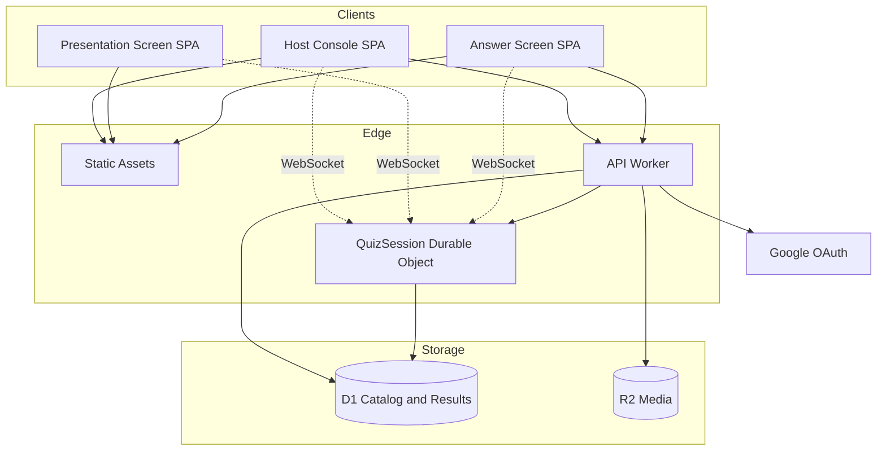
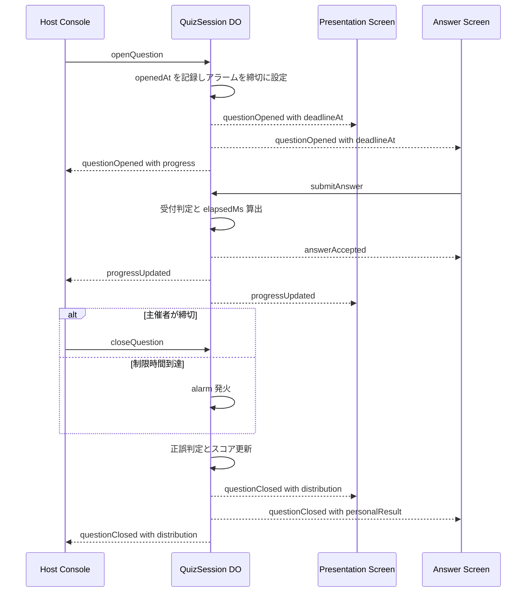
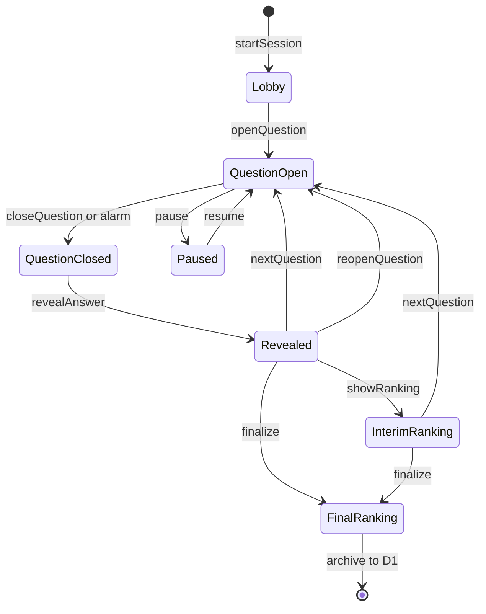
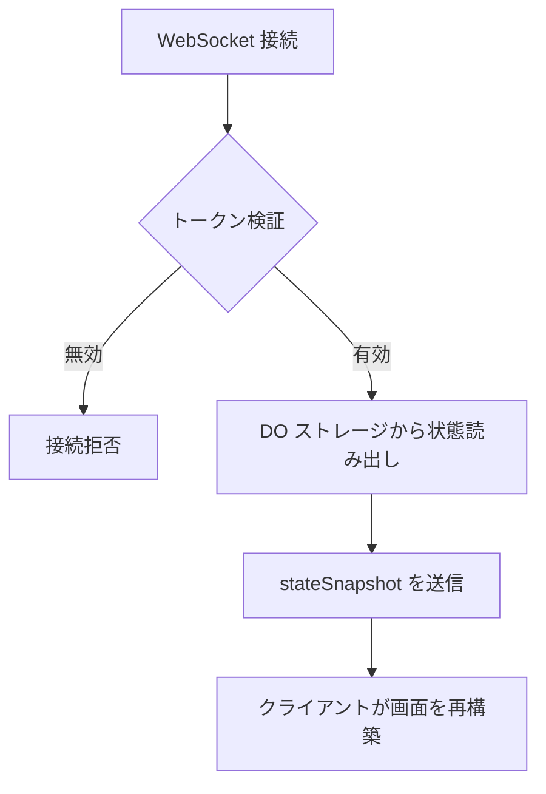
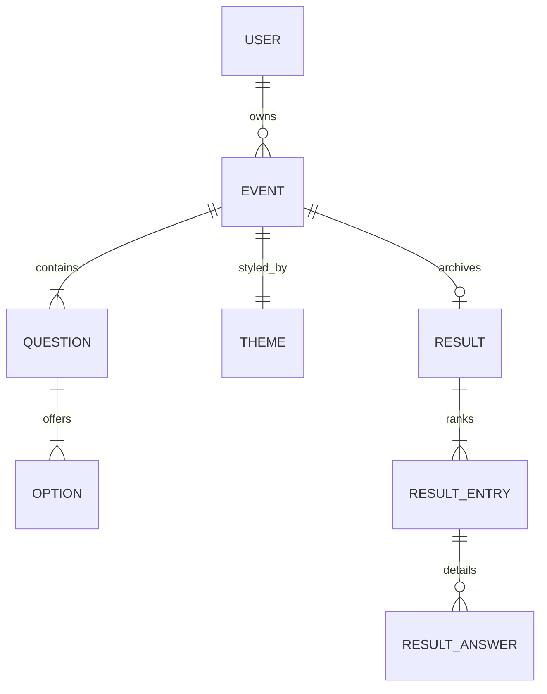

# Technical Design Document

## Overview

**Purpose**: 本機能は、その場に集まった参加者が一斉に回答するリアルタイムクイズ大会を、主催者・参加者・会場スクリーンの3面構成で実施する手段を提供する。主催者は事前にクイズと外観を作り込み、当日は手元の進行画面から出題を制御する。参加者はQRコードを読み取るだけで、登録なしに回答へ参加できる。

**Users**: 主催者は「準備フェーズ」でイベント・設問・外観を編集し、「開催フェーズ」で進行を操作する。参加者は開催フェーズにのみ関与し、スマートフォンから回答を送信する。会場スクリーンは表示専用の受動的なクライアントとして、進行状態を大画面へ反映する。

**Impact**: 新規プロジェクトのため既存システムへの影響はない。本設計は Cloudflare Workers プラットフォーム上に、ライブ進行の権威を担う Durable Object と、カタログ・結果を保持する D1 の二層構造を新規に確立する。

### Goals

- 出題から回答受信までの経過時間を単一の時計で計測し、順位の同率を構造的に発生させない採点基盤を確立する
- 進行操作を1秒以内に全クライアントへ反映し、通信断からの復帰時も進行状態を失わせない
- イベント非開催時の固定課金をゼロに保ち、開催時も無償枠内で運用できる構成とする
- 主催者が外観を変更しても、進行ロジックに一切の変更を要さない分離を維持する

### Non-Goals

- 参加者アカウントの永続化、および端末をまたいだ参加の引き継ぎ
- 複数主催者による同時進行操作・共同編集
- クイズ以外の企画機能（ビンゴ、抽選、アンケート）
- ネイティブアプリの提供、およびオフライン回答

## Boundary Commitments

### This Spec Owns

- **クイズカタログ**: 主催者アカウントに紐づくイベント、設問、選択肢、正解、外観設定の正本
- **ライブセッション状態**: 開催中の進行フェーズ、参加者名簿、回答記録、出題時刻と締切時刻の正本
- **採点と順位の決定**: 正解判定、経過時間の計測、順位付けアルゴリズムの唯一の実装
- **3画面へのリアルタイム配信契約**: 進行画面・投影画面・回答画面が購読するイベントの形式と配信順序保証

### Out of Boundary

- **主催者の身元確認**: 外部IDプロバイダ（Google）に委譲する。本仕様はプロバイダが発行した識別子を受け取るのみで、パスワードや本人確認情報を保持しない
- **参加者の個人識別**: 参加者を実世界の個人へ結びつける情報は取得も保持もしない
- **会場の物理環境**: プロジェクター接続、ネットワーク品質、端末の準備
- **画像の加工**: アップロードされた画像のリサイズ・最適化は行わず、入力制約で担保する

### Allowed Dependencies

- Cloudflare Workers ランタイム、Durable Objects、D1、R2（プラットフォーム基盤）
- Google OAuth 2.0（主催者認証の身元プロバイダ）
- 依存方向の制約: `types → config → repository → domain → session → api → ui`。各層は左側の層のみを参照し、上位層への参照を持たない。特に **domain 層は Cloudflare 固有 API を参照しない**（採点ロジックを純粋関数として単体テスト可能に保つため）

### Revalidation Triggers

- WebSocket メッセージ契約（`ServerEvent` / `ClientCommand`）のフィールド追加・意味変更
- 順位決定基準の変更（正解数・合計回答時間・タイブレーク順序）
- ライブ状態の所有者変更（DO から他コンポーネントへの移動）
- イベント状態機械のフェーズ追加・遷移条件の変更

## Architecture

### Architecture Pattern & Boundary Map

**Selected pattern**: Stateful Actor + CQRS 風の読み書き分離。1イベント＝1 Durable Object インスタンスがライブ進行の唯一の権威（アクター）となり、カタログと確定結果は D1 が保持する。選定根拠と却下した代替案は `research.md` の Architecture Pattern Evaluation に記録。



**Architecture Integration**:

- **責務の分離軸**: 「準備」と「開催」を時間軸で分離する。準備は HTTP + D1 の素直な CRUD、開催は WebSocket + DO の状態機械。両者は**イベント開始時のスナップショット取り込み**という一方向の接続のみを持つ。これにより要件1.6（開催中の設問変更禁止）が設計上自然に強制される。
- **単一の権威**: ライブ中の全ての判断（誰が回答済みか、締切を過ぎたか、経過時間は何ミリ秒か）を DO の単一スレッド実行に集約する。DO は直列実行されるため、回答受付の冪等性（要件7.4）が追加のロック機構なしに保証される。
- **表示と進行の分離**: 外観設定は配信ペイロードに含まれる純粋なデータであり、進行状態機械はこれを一切解釈しない。要件3.7（開催中の外観変更反映）は、進行を中断せずに `themeUpdated` イベントを同報するだけで満たされる。
- **投影画面の情報制限**: 投影画面は「現在配信中のフェーズ」のみを受信し、未出題の設問データを保持しない。URL が漏洩しても事前に問題を閲覧できない（要件10.4 の意図を配信設計で補強）。
- **Steering compliance**: steering ドキュメント未整備のため、本設計が確立する依存方向とレイヤ規約を後続の steering の初期入力とする。

### Technology Stack

| Layer | Choice / Version | Role in Feature | Notes |
|-------|------------------|-----------------|-------|
| Frontend | React 19 + TypeScript 5（strict）/ Vite 7 | 3画面すべてを単一 SPA として実装。ルートで画面を分岐 | SSR 不要（SEO 対象外、初期表示にサーバーデータ不要） |
| Frontend 配信 | Cloudflare Workers Static Assets | SPA バンドルの配信 | 全プランで**リクエスト無課金・無制限**。要件12.1 に寄与 |
| API | Hono 4 on Cloudflare Workers | 認証、カタログ CRUD、参加登録、メディア配信 | 型付きルーティングで Worker バインディングを型安全に扱う |
| Realtime / 状態機械 | Cloudflare Durable Objects（SQLite バックエンド）+ WebSocket Hibernation API | ライブ進行の権威、同報ハブ、採点実行 | 無料プランは SQLite バックエンドのみ対応 |
| Data / Catalog | Cloudflare D1（SQLite） | アカウント、イベント、設問、外観設定、確定結果 | 5GB / 500万行読取・10万行書込 per day |
| Data / Live | Durable Object SQLite Storage | 参加者、回答、進行フェーズ | DO インスタンスにローカル。開催終了時に D1 へ書き戻し |
| Media | Cloudflare R2 | 設問画像、ロゴ、背景画像 | egress 無課金。Worker 経由で配信しアクセス制御 |
| Auth | Better Auth + Google OAuth 2.0 | 主催者のみの認証 | パスワード・メール送信基盤を持たない |
| Validation | Zod 4 | 全境界（HTTP 入力、WebSocket メッセージ、DO 永続データ）のスキーマ検証 | 型定義を単一の情報源とし `z.infer` で TypeScript 型を導出 |

依存関係の詳細な調査結果とコスト試算は `research.md` を参照。

## File Structure Plan

### Directory Structure

```
src/
├── shared/                      # クライアント・サーバー双方が参照する契約
│   ├── protocol.ts              # ServerEvent / ClientCommand の Zod スキーマと型
│   ├── domain-types.ts          # Event, Question, Participant 等のドメイン型
│   └── scoring.ts               # 順位決定の純粋関数（Cloudflare API 非依存）
│
├── server/
│   ├── index.ts                 # Worker エントリ。Hono アプリと DO のエクスポート
│   ├── env.ts                   # バインディング型定義（D1, R2, DO namespace）
│   ├── auth/
│   │   ├── factory.ts           # 非自明: リクエストごとに auth を生成するファクトリ
│   │   └── guard.ts             # 主催者セッション検証ミドルウェア
│   ├── catalog/                 # 準備フェーズ（HTTP + D1）
│   │   ├── routes.ts            # イベント・設問・外観の CRUD エンドポイント
│   │   ├── repository.ts        # D1 アクセス。SQL はここに閉じる
│   │   └── schema.ts            # リクエスト・レスポンスの Zod スキーマ
│   ├── media/
│   │   └── routes.ts            # R2 アップロードと保護付き配信
│   ├── session/                 # 開催フェーズ（WebSocket + DO）
│   │   ├── quiz-session-do.ts   # Durable Object 本体。状態機械と同報
│   │   ├── live-store.ts        # DO SQLite への永続化。状態復元を担う
│   │   ├── phase-machine.ts     # フェーズ遷移規則の純粋関数
│   │   └── join-routes.ts       # 参加登録とトークン発行（HTTP）
│   └── participant-token.ts     # 非自明: HMAC 署名トークンの発行と検証
│
└── client/
    ├── main.tsx                 # ルーティング。3画面への分岐
    ├── shared/
    │   ├── use-live-channel.ts  # WebSocket 接続・再接続・状態復元フック
    │   ├── use-server-clock.ts  # 非自明: サーバー時刻オフセットを補正した残り時間
    │   └── theme.tsx            # 外観設定を CSS カスタムプロパティへ適用
    ├── host/                    # 進行画面。準備画面も含む
    ├── stage/                   # 投影画面
    └── player/                  # 回答画面
```

依存方向は `shared → server/* ` および `shared → client/*` の一方向。`client` と `server` は `shared` を介してのみ結合し、直接参照しない。`shared/scoring.ts` は純粋関数のみで構成し、サーバー・クライアント双方から同一実装を使う（クライアントは自分の暫定順位表示に利用）。

## System Flows

### 出題から結果確定までの進行フロー



出題時にアラームを設定し、主催者の手動締切が先行した場合はアラームを解除する。**アラームは出題中の1件のみ**に限定する制約を設ける（常時アラームは hibernation を妨げ duration 課金を生むため。`research.md` 参照）。

### ライブセッションの状態機械



`reopenQuestion`（要件5.10）は直前の設問のみを対象とし、`Revealed` からの復帰時に当該設問のスコアを破棄してから再受付する。`Paused` は残り時間の計測を停止し、`resume` 時に締切時刻を経過分だけ後ろへずらす。

### 接続復帰フロー



再接続時は差分ではなく**完全なスナップショット**を送る。差分適用の欠落を考慮する必要がなくなり、要件9.2・9.3・9.4 を単一の経路で満たせる。スナップショットには受信者の役割に応じた内容のみを含める（参加者には他者の回答内容を含めない）。

## Requirements Traceability

| Requirement | Summary | Components | Interfaces | Flows |
|-------------|---------|------------|------------|-------|
| 1.1, 1.2 | 主催者認証とログイン強制 | AuthFactory, HostGuard | HTTP `/api/auth/*` | — |
| 1.3–1.8 | イベント CRUD・複製・削除・開催中の編集禁止 | CatalogRoutes, CatalogRepository | `EventCatalogService` | — |
| 2.1–2.10 | 設問の作成・検証・並び替え | CatalogRoutes, CatalogRepository | `QuestionCatalogService` | — |
| 3.1–3.6 | 外観カスタマイズとコントラスト警告 | CatalogRoutes, ThemeProvider | `ThemeSettings` | — |
| 3.7 | 開催中の外観反映 | QuizSessionDO, ThemeProvider | `themeUpdated` イベント | — |
| 4.1, 4.2 | 参加用 URL と QR コード発行 | CatalogRoutes, HostConsole | `EventCatalogService` | — |
| 4.3–4.8 | 参加登録・重複名・定員・復元 | JoinRoutes, ParticipantToken, QuizSessionDO | HTTP `/api/events/:code/join` | — |
| 4.9, 4.10 | 途中参加と不利の通知 | QuizSessionDO, AnswerScreen | `stateSnapshot` | 接続復帰フロー |
| 5.1–5.10 | 進行操作全般 | QuizSessionDO, HostConsole | `ClientCommand` | 進行フロー / 状態機械 |
| 6.1–6.8 | 投影画面の表示 | PresentationScreen, QuizSessionDO | `ServerEvent` | 進行フロー |
| 7.1–7.9 | 回答画面の表示と送信 | AnswerScreen, QuizSessionDO | `submitAnswer` | 進行フロー |
| 8.1–8.11 | 採点とランキング | ScoringModule, QuizSessionDO, ResultArchive | `RankingEntry` | 進行フロー |
| 9.1–9.8 | リアルタイム同期と復帰 | LiveChannel, QuizSessionDO, ServerClock | `stateSnapshot` | 接続復帰フロー |
| 10.1–10.6 | データ保護 | ParticipantToken, MediaRoutes, HostGuard | — | — |
| 11.1–11.6 | 非機能（対応環境・応答性） | 全クライアント | — | — |
| 12.1–12.4 | 運用コストと開催前確認 | 全サーバー構成, HealthCheck | HTTP `/api/events/:id/preflight` | — |

## Components and Interfaces

| Component | Domain/Layer | Intent | Req Coverage | Key Dependencies (P0/P1) | Contracts |
|-----------|--------------|--------|--------------|--------------------------|-----------|
| QuizSessionDO | Session | ライブ進行の権威と同報ハブ | 3.7, 4.9, 5, 6, 7, 8, 9 | LiveStore (P0), ScoringModule (P0), D1 (P1) | Service, Event, State |
| ScoringModule | Domain | 正解判定と順位決定の純粋実装 | 8.1–8.9 | なし | Service |
| PhaseMachine | Domain | フェーズ遷移の妥当性判定 | 5.2–5.10 | なし | Service |
| LiveStore | Session | DO SQLite への永続化と状態復元 | 9.2–9.4 | DO Storage (P0) | State |
| CatalogRepository | Repository | D1 に対するカタログ操作 | 1.3–1.8, 2, 3.1–3.6 | D1 (P0) | Service |
| CatalogRoutes | API | 準備フェーズの HTTP エンドポイント | 1, 2, 3.1–3.6, 4.1 | CatalogRepository (P0), HostGuard (P0) | API |
| JoinRoutes | API | 参加登録とトークン発行 | 4.3–4.8 | QuizSessionDO (P0), ParticipantToken (P0) | API |
| ParticipantToken | Session | 匿名参加者の署名付き識別 | 4.4, 4.7, 9.3, 10.1 | なし | Service |
| AuthFactory / HostGuard | API | 主催者認証とアクセス制御 | 1.1, 1.2, 1.5, 10.5 | Better Auth (P0), D1 (P0) | Service |
| MediaRoutes | API | 画像の保管と保護付き配信 | 2.5, 3.4, 10.6 | R2 (P0) | API |
| ResultArchive | Repository | 確定結果の D1 への書き戻し | 8.11, 10.2, 10.3 | D1 (P0) | Service |
| LiveChannel | UI | WebSocket 接続・再接続・状態復元 | 9.2–9.6 | protocol (P0) | State |
| ServerClock | UI | サーバー基準の残り時間算出 | 9.8, 6.2, 7.2 | なし | Service |
| HostConsole / PresentationScreen / AnswerScreen | UI | 3画面の描画 | 5, 6, 7 | LiveChannel (P0), ThemeProvider (P1) | State |

### Domain 層

#### ScoringModule

| Field | Detail |
|-------|--------|
| Intent | 回答記録から正誤・スコア・順位を決定する純粋関数群 |
| Requirements | 8.1, 8.2, 8.3, 8.4, 8.5, 8.6, 8.7, 8.8, 8.9 |

**Responsibilities & Constraints**

- 順位決定の唯一の実装。他コンポーネントは順位付けロジックを持たない
- **Cloudflare 固有 API を一切参照しない**。時刻は引数として受け取り、内部で `Date.now()` を呼ばない
- 不変条件: 全設問の配点は等価（要件8.3）。合計回答時間には正解した設問のみを加算（要件8.5）

**Dependencies**

- Inbound: QuizSessionDO — 締切時とランキング要求時に呼び出し (P0)
- Inbound: AnswerScreen — 自分の暫定順位表示に同一実装を使用 (P1)

**Contracts**: Service [x]

##### Service Interface

```typescript
interface AnswerRecord {
  readonly participantId: ParticipantId;
  readonly questionId: QuestionId;
  readonly selectedOptionIds: readonly OptionId[];
  readonly elapsedMs: number;
}

interface ParticipantScore {
  readonly participantId: ParticipantId;
  readonly nickname: string;
  readonly correctCount: number;
  readonly totalElapsedMs: number;
  readonly joinedSeq: number;
}

interface RankingEntry extends ParticipantScore {
  readonly rank: number;
}

interface ScoringModule {
  judge(
    answer: AnswerRecord,
    correctOptionIds: readonly OptionId[],
  ): { readonly isCorrect: boolean };

  aggregate(
    participants: readonly ParticipantSummary[],
    answers: readonly AnswerRecord[],
    questions: readonly QuestionSnapshot[],
  ): readonly ParticipantScore[];

  rank(scores: readonly ParticipantScore[]): readonly RankingEntry[];
}
```

- Preconditions: `answers` は締切済み設問の回答のみを含む。`elapsedMs` は非負
- Postconditions: `rank` の結果は `rank` 昇順に整列され、`rank` は 1 起点の連番となる（同率を作らないため、値の重複は発生しない）
- Invariants: 並び順は「`correctCount` 降順 → `totalElapsedMs` 昇順 → `joinedSeq` 昇順」で全順序が定まる。参加登録順 `joinedSeq` が一意であるため、最終的なタイブレークは必ず解決する（要件8.6）

**Implementation Notes**

- Integration: 参加登録より前に締切済みの設問は `answers` に現れないため、要件8.8（未回答扱い）は集計側の特別扱いなしに満たされる
- Validation: 単体テストで「同率が発生しないこと」を性質テストとして検証する
- Risks: 途中参加者は正解数の母数が小さくなるが、順位計算上の特別扱いは行わない（要件8.7）

#### PhaseMachine

| Field | Detail |
|-------|--------|
| Intent | 現在フェーズと進行コマンドから、遷移の可否と次フェーズを決定する |
| Requirements | 5.2, 5.4, 5.5, 5.7, 5.8, 5.9, 5.10 |

**Responsibilities & Constraints**

- 状態機械図の遷移規則を唯一実装する。副作用を持たない純粋関数
- 不正な遷移（例: `Lobby` からの `closeQuestion`）を明示的に拒否する

**Contracts**: Service [x]

##### Service Interface

```typescript
type LivePhase =
  | { readonly kind: "lobby" }
  | { readonly kind: "questionOpen"; readonly questionId: QuestionId; readonly openedAt: number; readonly deadlineAt: number }
  | { readonly kind: "questionClosed"; readonly questionId: QuestionId }
  | { readonly kind: "revealed"; readonly questionId: QuestionId }
  | { readonly kind: "interimRanking" }
  | { readonly kind: "paused"; readonly resumeTo: LivePhase; readonly remainingMs: number }
  | { readonly kind: "finalRanking" };

type TransitionError =
  | { readonly code: "INVALID_PHASE"; readonly current: LivePhase["kind"]; readonly command: string }
  | { readonly code: "NO_NEXT_QUESTION" }
  | { readonly code: "NOT_REOPENABLE" };

interface PhaseMachine {
  next(
    current: LivePhase,
    command: HostCommand,
    context: { readonly now: number; readonly questions: readonly QuestionSnapshot[] },
  ): Result<LivePhase, TransitionError>;
}
```

- Preconditions: `questions` はイベント開始時のスナップショットであり、進行中に変化しない
- Postconditions: 成功時、返却されたフェーズのみが正当な次状態となる
- Invariants: `paused` は `resumeTo` に元のフェーズを保持し、`resume` 時に `remainingMs` から締切時刻を再計算する（要件5.8）

### Session 層

#### QuizSessionDO

| Field | Detail |
|-------|--------|
| Intent | 1イベントのライブ進行を単独で所有し、全クライアントへ同報する |
| Requirements | 3.7, 4.4–4.10, 5.1–5.10, 6.1–6.8, 7.1–7.9, 8.1–8.11, 9.1–9.8 |

**Responsibilities & Constraints**

- **ライブ状態の唯一の権威**。出題時刻・締切判定・回答受付可否を単独で決定する
- 経過時間の計測に用いる時計は本コンポーネント内の1つのみ。クライアント申告の時刻を採用しない（要件9.8）
- トランザクション境界: 1つの WebSocket メッセージ処理が1トランザクション。DO の直列実行により、回答の重複チェックと記録がアトミックになる（要件7.4）
- データ所有: 参加者名簿、回答記録、進行フェーズ。カタログは開始時のスナップショットとして**読み取り専用で保持**する
- 制約: **アラームは出題中の設問の締切1件のみ**。締切処理完了後は必ず解除する

**Dependencies**

- Inbound: LiveChannel（3画面すべて）— WebSocket 接続と進行コマンド (P0)
- Inbound: JoinRoutes — 参加登録の照会 (P0)
- Outbound: LiveStore — 状態の永続化と復元 (P0)
- Outbound: ScoringModule / PhaseMachine — 判定ロジック (P0)
- Outbound: ResultArchive — 確定結果の書き戻し (P1)
- External: Durable Object WebSocket Hibernation API — 接続維持とアイドル時のコスト回避 (P0)

**Contracts**: Service [x] / Event [x] / State [x]

##### Service Interface

```typescript
interface QuizSessionDO {
  fetch(request: Request): Promise<Response>;
  webSocketMessage(ws: WebSocket, message: string | ArrayBuffer): Promise<void>;
  webSocketClose(ws: WebSocket, code: number, reason: string, wasClean: boolean): Promise<void>;
  webSocketError(ws: WebSocket, error: unknown): Promise<void>;
  alarm(): Promise<void>;
}
```

- Preconditions: 接続時に有効な役割トークン（主催者セッション／参加者トークン／投影トークン）が提示されていること
- Postconditions: 状態を変更した全てのメッセージ処理は、DO ストレージへの永続化完了後に同報する
- Invariants: メモリ上の変数のみに依存する状態を持たない。hibernation からの復帰後もストレージから完全に再構築できる

##### Event Contract

配信イベント（`ServerEvent`）は役割ごとに内容を絞る。参加者へは他者の回答内容を含めない（要件6.8, 7.7）。

| Event | 受信者 | Payload 要点 | 要件 |
|-------|--------|--------------|------|
| `stateSnapshot` | 全役割 | 現在フェーズ、外観設定、自分の状態、`serverNow` | 9.2, 9.3, 9.4 |
| `participantJoined` | 主催者, 投影 | 参加者数、ニックネーム | 5.1, 6.1 |
| `questionOpened` | 全役割 | 設問内容、`deadlineAt`、`serverNow` | 5.2, 6.2, 7.2 |
| `progressUpdated` | 主催者, 投影 | 回答済み数／未回答数 | 5.3, 6.3 |
| `answerAccepted` | 該当参加者のみ | 受理した選択肢 | 7.3 |
| `questionClosed` | 全役割 | 正解、選択肢別分布、解説（参加者へは自分の正誤も） | 5.6, 6.4, 7.6 |
| `rankingUpdated` | 主催者, 投影 | 上位者のランキング | 5.9, 6.5, 6.6 |
| `personalRank` | 該当参加者のみ | 自分の順位・正解数・合計時間 | 7.6, 7.9 |
| `themeUpdated` | 投影, 参加者 | 外観設定 | 3.7 |
| `commandRejected` | 送信者のみ | 拒否理由コード | 7.5, 9.6 |

- Ordering / delivery guarantees: 単一 DO からの順次送信により、**同一接続に対する配信順序は保証**される。接続断中の配信は失われるため、再接続時は差分ではなく `stateSnapshot` で完全再構築する
- 受信コマンド（`ClientCommand`）: 主催者から `startSession` / `openQuestion` / `closeQuestion` / `revealAnswer` / `nextQuestion` / `reopenQuestion` / `showRanking` / `pause` / `resume` / `finalize`、参加者から `submitAnswer`、全役割から `resync`

##### State Management

- State model: `LivePhase`（状態機械図参照）、参加者名簿、回答記録、カタログスナップショット
- Persistence & consistency: 全状態を DO SQLite に永続化。WebSocket ごとの役割情報は `serializeAttachment()`（上限16,384バイト）で保持し、hibernation を跨いで復元する
- Concurrency strategy: DO の単一スレッド直列実行に依拠し、明示的なロックを持たない。これが本設計における競合状態対策の中核

**Implementation Notes**

- Integration: hibernation 復帰時にコンストラクタが再実行されるため、**コンストラクタではストレージからの読み出しのみを行う**。アラーム設定や同報などの副作用を持たせてはならない
- Validation: 受信メッセージは `protocol.ts` の Zod スキーマで検証し、不正なペイロードは `commandRejected` で拒否する
- Risks: アラームは hibernation を妨げるため、締切以外の用途に拡張しないこと。定期ポーリング用アラームを追加するとアイドル課金が発生し要件12.1 を破る

#### ParticipantToken

| Field | Detail |
|-------|--------|
| Intent | 個人情報を含まない匿名参加者の識別子を、改竄不能な形で発行・検証する |
| Requirements | 4.4, 4.7, 9.3, 10.1 |

**Responsibilities & Constraints**

- トークンに含めるのは `eventId`、`participantId`、発行時刻のみ。氏名・連絡先を含めない（要件10.1）
- イベント単位でスコープし、他イベントへの流用を検証時に拒否する

**Contracts**: Service [x]

##### Service Interface

```typescript
interface ParticipantClaims {
  readonly eventId: EventId;
  readonly participantId: ParticipantId;
  readonly issuedAt: number;
}

type TokenError =
  | { readonly code: "MALFORMED" }
  | { readonly code: "BAD_SIGNATURE" }
  | { readonly code: "EVENT_MISMATCH" };

interface ParticipantTokenService {
  issue(claims: ParticipantClaims): Promise<string>;
  verify(token: string, expectedEventId: EventId): Promise<Result<ParticipantClaims, TokenError>>;
}
```

- Invariants: 署名鍵は Worker のシークレットとして保持し、クライアントへ露出しない

**Implementation Notes**

- Integration: クライアントは `localStorage` にイベントIDでスコープして保存する。保存不可の環境では参加登録画面へ誘導する（要件4.7 の代替経路）
- Risks: 端末変更時は参加を引き継げない。**同一端末でもブラウザが異なる場合（SNS アプリ内ブラウザから既定ブラウザへ切り替えた場合を含む）は `localStorage` が共有されないため、新規参加者として扱われる。** 復帰コード等の救済手段は導入しないことを決定済み（検討経緯は `research.md` の参加者識別に関する決定を参照）。フィンガープリンティングによる識別は精度と要件10.1 の双方から採用しない

### API 層

#### CatalogRoutes

| Field | Detail |
|-------|--------|
| Intent | 準備フェーズにおけるイベント・設問・外観の操作を提供する |
| Requirements | 1.2–1.8, 2.1–2.10, 3.1–3.6, 4.1, 4.2 |

**Responsibilities & Constraints**

- 全エンドポイントで主催者セッションを検証し、所有権を確認する（要件1.2, 1.5）
- 開催中イベントに対する設問の追加・削除・正解変更を拒否する（要件1.6）。外観更新のみ開催中も許可し、DO へ `themeUpdated` を通知する（要件3.7）

**Contracts**: API [x]

##### API Contract

| Method | Endpoint | Request | Response | Errors |
|--------|----------|---------|----------|--------|
| GET | `/api/events` | — | `EventSummary[]` | 401 |
| POST | `/api/events` | `CreateEventRequest` | `EventDetail` | 400, 401 |
| GET | `/api/events/:id` | — | `EventDetail` | 401, 403, 404 |
| PATCH | `/api/events/:id` | `UpdateEventRequest` | `EventDetail` | 400, 401, 403, 409 |
| POST | `/api/events/:id/duplicate` | — | `EventDetail` | 401, 403 |
| DELETE | `/api/events/:id` | — | 204 | 401, 403 |
| POST | `/api/events/:id/questions` | `CreateQuestionRequest` | `Question` | 400, 401, 403, 409 |
| PATCH | `/api/events/:id/questions/:qid` | `UpdateQuestionRequest` | `Question` | 400, 401, 403, 409 |
| DELETE | `/api/events/:id/questions/:qid` | — | 204 | 401, 403, 409 |
| PUT | `/api/events/:id/questions/order` | `{ questionIds: QuestionId[] }` | `Question[]` | 400, 401, 403, 409 |
| PUT | `/api/events/:id/theme` | `ThemeSettings` | `ThemeSettings` | 400, 401, 403 |
| POST | `/api/events/:id/publish` | — | `{ joinCode: string; joinUrl: string }` | 401, 403, 422 |
| GET | `/api/events/:id/preflight` | — | `PreflightReport` | 401, 403 |
| GET | `/api/events/:id/results` | — | `ArchivedResult` | 401, 403, 404 |
| DELETE | `/api/events/:id/participants` | — | 204 | 401, 403 |

409 は開催中の禁止操作（要件1.6）、422 は公開時の検証失敗（要件2.10）に対応する。

**Implementation Notes**

- Integration: `POST /publish` は参加用コードを採番し、推測困難な識別子で構成する（要件10.4）
- Validation: `PATCH /questions/:qid` は正解未指定・選択肢2個未満を 400 で拒否する（要件2.9）
- Risks: コントラスト比の警告（要件3.6）はクライアント側で算出し、保存自体はブロックしない

#### JoinRoutes

| Field | Detail |
|-------|--------|
| Intent | 参加登録を受け付け、参加者トークンを発行する |
| Requirements | 4.3, 4.4, 4.5, 4.6, 4.7, 4.8 |

**Contracts**: API [x]

##### API Contract

| Method | Endpoint | Request | Response | Errors |
|--------|----------|---------|----------|--------|
| GET | `/api/join/:joinCode` | — | `JoinPageInfo`（タイトル・外観・受付可否） | 404, 410 |
| POST | `/api/join/:joinCode` | `{ nickname: string }` | `{ token: string; participantId: string }` | 400, 404, 409, 410, 423 |

409 はニックネーム重複（要件4.5）、410 はイベント終了（要件4.8）、423 は定員到達（要件4.6）。

**Implementation Notes**

- Integration: 登録の可否判定は DO へ委譲する。参加者名簿の一意性は DO の直列実行により保証され、同時登録による重複を防ぐ
- Validation: ニックネームは長さと文字種を検証し、投影画面での表示崩れを防ぐ

#### MediaRoutes

| Field | Detail |
|-------|--------|
| Intent | 画像を R2 に保管し、アクセス制御付きで配信する |
| Requirements | 2.5, 3.4, 10.6 |

**Contracts**: API [x]

##### API Contract

| Method | Endpoint | Request | Response | Errors |
|--------|----------|---------|----------|--------|
| POST | `/api/events/:id/media` | multipart（画像） | `{ assetId: string }` | 400, 401, 403, 413 |
| GET | `/api/events/:id/media/:assetId` | — | 画像バイナリ | 401, 403, 404 |

**Implementation Notes**

- Integration: GET は主催者セッションまたは当該イベントの参加者トークンを検証する。`Cache-Control: private, max-age=3600` を付与し再取得を抑える
- Validation: 形式（JPEG/PNG/WebP）とサイズ上限を入力時点で拒否する（413）。リサイズは行わない（Out of Boundary）

### UI 層

#### LiveChannel

| Field | Detail |
|-------|--------|
| Intent | WebSocket 接続を維持し、切断・復帰・状態再構築を単一の場所で扱う |
| Requirements | 9.2, 9.3, 9.4, 9.5, 9.6 |

**Contracts**: State [x]

##### State Management

- State model: `connecting` / `open` / `reconnecting` / `closed` の接続状態と、最後に受信した `stateSnapshot`
- Persistence & consistency: 参加者トークンを `localStorage` から復元して再接続する。再接続後は必ずスナップショットで全状態を置換する（差分適用を行わない）
- Concurrency strategy: 指数バックオフで再接続。接続不良中は `connectionStatus` を画面に表示する（要件9.5）

**Implementation Notes**

- Integration: 回答送信は送信中・受理済みを区別して表示し、失敗時は再送手段を提示する（要件9.6）。再送は要件7.4 の冪等性により安全
- Risks: モバイルのバックグラウンド遷移で切断されるため、復帰時の再接続を `visibilitychange` で確実に起動する

#### ServerClock

| Field | Detail |
|-------|--------|
| Intent | サーバー時刻との差分を補正し、端末時計に依存しない残り時間を算出する |
| Requirements | 9.8, 6.2, 7.2 |

**Contracts**: Service [x]

##### Service Interface

```typescript
interface ServerClock {
  sync(serverNow: number, receivedAt: number): void;
  remainingMs(deadlineAt: number): number;
}
```

- Invariants: 表示専用。順位計算には一切使用しない（採点は常に DO 側の計測値を用いる）

#### HostConsole / PresentationScreen / AnswerScreen

要件5・6・7 の表示要素を担う画面群。いずれも新たな境界を導入せず、`LiveChannel` の状態と `ThemeProvider` の外観設定を描画する。

**Implementation Notes**

- 3画面は共通の `BaseScreenProps`（`snapshot`, `theme`, `connectionStatus`）を受け取り、役割固有のコールバックのみを追加で定義する
- `PresentationScreen` は投影を前提に、ビューポート幅に対する相対的な文字サイズで描画する（要件6.7）
- `AnswerScreen` は縦画面での単一カラム配置とし、選択肢のタップ領域を十分に確保する（要件7.8）
- 途中参加者には、出題済み設問へ回答できず不利になる旨を参加直後に表示する（要件4.10）

## Data Models

### Domain Model

**集約とトランザクション境界**:

- `EventCatalog` 集約（ルート: Event）— Event, Question, Option, ThemeSettings。D1 のトランザクション内で整合を保つ。不変条件: 公開済みイベントは設問を1件以上持つ（要件2.10）
- `LiveSession` 集約（ルート: SessionState）— Participant, Answer, LivePhase。DO インスタンス内で整合を保つ。不変条件: 1参加者・1設問につき Answer は最大1件（要件7.4）
- `ArchivedResult` 集約（ルート: Result）— 確定した順位と設問別正誤。確定後は不変

**ドメインイベント**: `SessionStarted`, `QuestionOpened`, `AnswerAccepted`, `QuestionClosed`, `ResultFinalized`



### Logical Data Model

**D1（カタログと結果）**:

| Entity | 主要属性 | 制約 |
|--------|----------|------|
| `user` | id, google_subject, created_at | Better Auth が管理 |
| `event` | id, owner_id, title, subtitle, status, join_code, capacity, created_at | `join_code` は UNIQUE かつ推測困難。`status` は draft/published/live/finished |
| `question` | id, event_id, order_index, body, image_asset_id, time_limit_sec, explanation | `(event_id, order_index)` に UNIQUE |
| `option` | id, question_id, label, is_correct, order_index | 1設問あたり2〜4件、`is_correct` が1件以上 |
| `theme` | event_id, primary_color, accent_color, background_color, text_color, logo_asset_id, background_asset_id | `event_id` が主キー |
| `result` | id, event_id, finalized_at | `event_id` に UNIQUE（1イベント1結果） |
| `result_entry` | id, result_id, nickname, rank, correct_count, total_elapsed_ms, joined_seq | `(result_id, rank)` に UNIQUE |
| `result_answer` | result_entry_id, question_id, is_correct, elapsed_ms | 要件8.11 のエクスポート用 |

**参照整合性**: `event` 削除時は `question` / `option` / `theme` / `result` を連鎖削除（要件1.8）。`result` のみ独立して削除可能（要件10.3）。

**インデックス**: `event(owner_id, status)` で一覧を高速化（要件1.4）。`event(join_code)` は参加時の解決に使用。

**DO SQLite（ライブ状態）**:

| Entity | 主要属性 | 用途 |
|--------|----------|------|
| `session_state` | phase_json, catalog_snapshot_json, started_at | 単一行。hibernation 復帰時の状態復元 |
| `participant` | id, nickname, joined_seq, joined_at | `nickname` に UNIQUE（要件4.5）、`joined_seq` は単調増加（要件8.6） |
| `answer` | participant_id, question_id, option_ids_json, elapsed_ms, is_correct | `(participant_id, question_id)` に UNIQUE（要件7.4 の冪等性を DB レベルでも保証） |

**時間的側面**: `catalog_snapshot_json` はイベント開始時に固定され、開催中は変化しない。これが要件1.6 の実現手段となる。

### Data Contracts & Integration

**WebSocket ペイロード**: `shared/protocol.ts` の Zod スキーマを単一の情報源とし、サーバー・クライアント双方が `z.infer` で型を導出する。これによりクライアントとサーバーの契約ずれをコンパイル時に検出する。

```typescript
type ServerEvent =
  | { readonly type: "stateSnapshot"; readonly payload: StateSnapshot }
  | { readonly type: "questionOpened"; readonly payload: QuestionOpenedPayload }
  | { readonly type: "progressUpdated"; readonly payload: ProgressPayload }
  | { readonly type: "answerAccepted"; readonly payload: AnswerAcceptedPayload }
  | { readonly type: "questionClosed"; readonly payload: QuestionClosedPayload }
  | { readonly type: "rankingUpdated"; readonly payload: RankingPayload }
  | { readonly type: "personalRank"; readonly payload: PersonalRankPayload }
  | { readonly type: "themeUpdated"; readonly payload: ThemeSettings }
  | { readonly type: "participantJoined"; readonly payload: ParticipantJoinedPayload }
  | { readonly type: "commandRejected"; readonly payload: CommandRejectedPayload };
```

判別可能ユニオンとし、`type` による網羅的な分岐をコンパイラに検査させる。

**結果アーカイブの同期**: DO から D1 への書き戻しは `finalize` 時の一度のみ。`result` テーブルの `event_id` UNIQUE 制約により、リトライ時も重複行が発生しない（冪等）。書き戻し失敗時は DO 側に状態が残るため、主催者は再実行できる。

## Error Handling

### Error Strategy

境界ごとに扱いを分ける。HTTP 境界は標準的なステータスコード、WebSocket 境界は `commandRejected` イベントによる理由コードの返却。いずれも**進行状態を失わせない**ことを最優先とする（要件11.5）。

### Error Categories and Responses

**User Errors (4xx)**: 入力検証の失敗はフィールド単位で不足項目を提示（要件2.9）。未認証は 401 とログイン導線（要件1.2）。権限外は 403（要件1.5, 10.5）。

**System Errors (5xx)**: D1・R2 への一時障害はリトライ可能な旨を提示する。**WebSocket 切断は障害ではなく通常の状態遷移として扱い**、自動再接続とスナップショット再取得で回復する（要件9.2〜9.4）。

**Business Logic Errors**: 進行コマンドの不正な遷移は `commandRejected` に `INVALID_PHASE` を返し、現在フェーズを併せて通知する。締切後の回答は `ANSWER_WINDOW_CLOSED`（要件7.5）、重複回答は `ALREADY_ANSWERED`（要件7.4）を返す。いずれもクライアント側は最新スナップショットへ同期して回復する。

### Monitoring

- 進行操作、フェーズ遷移、締切、確定を構造化ログとして記録し、開催後の問い合わせに応じられるようにする
- 無料枠の日次上限接近を検知できるよう、DO リクエスト数と D1 書込行数を開催ごとに集計する（要件12.2 の継続的な確認）
- `GET /api/events/:id/preflight` は各画面の疎通、DO の起動、認証状態を確認し `PreflightReport` を返す（要件12.3, 12.4）

## Testing Strategy

### Unit Tests

- `ScoringModule.rank` — 正解数同数・合計時間同数の入力で必ず一意な順位が決まること（要件8.3, 8.6）
- `ScoringModule.aggregate` — 不正解・未回答の設問が合計回答時間に加算されないこと（要件8.5）
- `PhaseMachine.next` — 各フェーズで許可されないコマンドが `INVALID_PHASE` を返すこと（要件5.2〜5.10）
- `PhaseMachine.next` — `pause` → `resume` で締切時刻が停止時間分だけ後ろへずれること（要件5.8）
- `ParticipantTokenService.verify` — 他イベントのトークンが `EVENT_MISMATCH` で拒否されること（要件10.4）

### Integration Tests

- 参加登録の同時実行で同一ニックネームが1件のみ成功すること（要件4.5）
- 同一参加者・同一設問への二重送信で、2件目が `ALREADY_ANSWERED` となり最初の回答が保持されること（要件7.4）
- 締切到達アラームによる自動締切と、主催者の手動締切の双方で同一の締切処理が実行されること（要件5.4, 5.5）
- 開催中イベントへの設問変更が 409 で拒否されること（要件1.6）
- `finalize` の再実行で結果が重複登録されないこと（冪等性）
- DO の hibernation 復帰後にライブ状態が完全に再構築されること（要件9.2〜9.4）

### E2E Tests

- 主催者がログイン→イベント作成→設問登録→公開→QR取得までを完走できること（要件1, 2, 4.1）
- 参加者がQRのURLから参加→回答→結果表示までを完走できること（要件4.3, 7.3, 7.6）
- 3画面が同一の進行状態を表示し、出題が1秒以内に反映されること（要件9.1）
- 回答画面のリロード後、送信済み回答が保持されたまま復帰すること（要件9.3）
- 途中参加者が未出題の設問のみ回答でき、ランキングに含まれること（要件4.9, 8.7）

### Performance / Load

- 100接続からの同時回答送信で、全接続への同報が1秒以内に完了すること（要件9.1, 9.7）
- 1イベント完走時の DO リクエスト数と D1 書込行数が無料枠内に収まること（要件12.2）
- 回答画面の初期表示がモバイル回線相当の条件で3秒以内に操作可能となること（要件11.3）

## Security Considerations

- **役割ごとのトークン分離**: 主催者セッション（Cookie）、参加者トークン（localStorage）、投影トークン（URL 埋め込み）を分離し、DO 接続時に役割を判定する。投影トークンは表示専用で進行コマンドを受け付けない（要件10.5）
- **正解の秘匿**: 未出題の設問データと正解は、締切まで参加者・投影のいずれにも配信しない。配信ペイロードを役割とフェーズで絞ることで、クライアント側の実装ミスによる漏洩経路を断つ（要件6.8, 7.7）
- **参加用コードの推測耐性**: 短い連番を避け、十分なエントロピーを持つ識別子とする（要件10.4）
- **個人情報の不取得**: 参加者から取得するのはニックネームのみ。トークンにも個人情報を含めない（要件10.1）
- **画像の保護**: R2 バケットを公開せず、Worker 経由でセッション検証を挟んで配信する（要件10.6）

## Performance & Scalability

- **目標**: 進行操作から全クライアント反映まで1秒以内（要件9.1）、1イベント100接続以上（要件9.7）
- **スケーリング方針**: イベント単位で DO が独立するため、**イベント数方向には自然に水平分割**される。1イベント内の接続数がスケールの上限となるが、想定規模（100〜数百）は単一 DO で十分に扱える
- **同報コストの最適化**: 送信 WebSocket メッセージは無課金であり、`progressUpdated` のような高頻度イベントも同報コスト上の懸念がない。ただし受信側の描画負荷を抑えるため、進捗更新は一定間隔でまとめて配信する
- **アイドル時のコスト**: WebSocket Hibernation により、参加者が接続したまま待機している間の duration 課金が発生しない。これが要件12.1 を満たす中核機構であり、**アラームの常用はこの前提を壊す**ため禁止する

## Supporting References

- 基盤選定の比較検討、コスト試算の内訳、却下した代替案は `research.md` を参照
- Cloudflare プラットフォームの無料枠上限と WebSocket 課金規則の一次情報は `research.md` の References に集約
