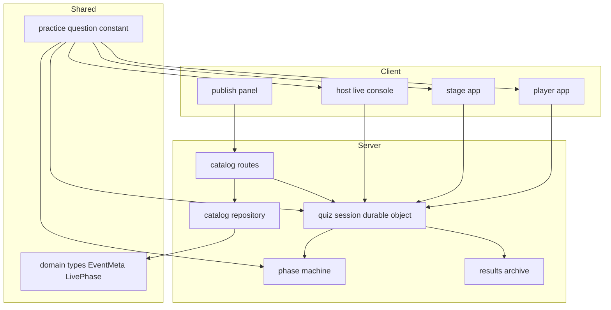
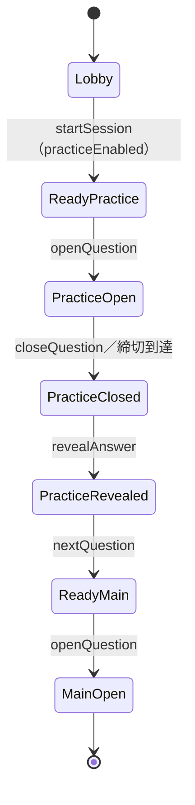

# Technical Design Document

## Overview

本機能は、既存のライブクイズアプリ（`live-quiz-app`）に「テスト問題（練習問題）モード」を追加する。主催者はイベント単位でテスト問題モードを有効化でき、有効な場合は開催直後の待機状態から本編最初の設問に入る前に、採点に一切影響しない固定1問の出題〜回答〜正解発表サイクルを実演できる。あわせて、テスト問題モードの有無に関わらず、投影画面の待機状態に採点方式の簡易なルール説明を追加する。

**Purpose**: 初めてサービスを使う参加者が回答方法に戸惑うことを防ぎ、本編開始前に安心して回答方法を理解できるようにする。
**Users**: 主催者（Host Console からテスト問題モードのON/OFFと進行操作を行う）、投影画面・回答画面を見る参加者。
**Impact**: 既存の `PhaseMachine`・`QuizSessionDO`・`ScoringModule` に新しい `LivePhase` バリアントやワイヤーコマンドを追加することなく、固定のテスト問題を「本編設問一覧に含まれない `QuestionSnapshot`」として既存の出題サイクルに乗せる。

### Goals
- イベント単位でテスト問題モードをON/OFFでき、既定は無効。
- ONの場合、本編最初の設問に入る前に固定1問（2択または4択）の出題〜正解発表サイクルを実演できる。
- テスト問題への回答・所要時間は正解数・合計回答時間・最終ランキング・結果アーカイブに一切反映されない。
- 投影画面の待機状態に、採点方式（選択式で回答し、正解数と回答時間で順位が決まること）を説明する簡易文言を表示する。

### Non-Goals
- テスト問題の問題文・選択肢・正解を主催者がカスタマイズする機能。
- テスト問題を複数問用意する機能。
- 途中参加者に個別にテスト問題を実施する機能。
- 待機画面のルール説明文言を主催者がカスタマイズする機能。

## Boundary Commitments

### This Spec Owns
- 固定テスト問題の内容定義（`src/shared/practice-question.ts`）。
- イベント単位のテスト問題モードON/OFF設定の永続化・取得・「開催中は変更不可」制約。
- `PhaseMachine` における「テスト問題→本編最初の設問」の遷移分岐（新しい `LivePhase` バリアントは追加しない）。
- Host Console におけるテスト問題進行操作のラベル出し分けと表示条件。
- 投影画面・回答画面での「テスト問題である」ことの明示。
- テスト問題回答の採点・結果アーカイブからの除外。
- 投影画面の待機状態へのルール説明表示。

### Out of Boundary
- 採点ロジック（`ScoringModule.aggregate`/`rank`）自体の変更 — 既存の「questions配列に存在しない questionId は除外される」という既存の不変条件をそのまま利用するのみで、ロジックには手を入れない。
- 新しい `HostCommand`/`ClientCommand` の追加 — 既存の `openQuestion`/`nextQuestion` を流用する。
- 共有ページ（`findPublicByShareCode`）の変更 — 既に設問別データを返さないため対象外。

### Allowed Dependencies
- `src/shared/domain-types.ts`（`LivePhase`, `EventMeta`, `QuestionSnapshot` 等）
- `src/shared/scoring.ts`（変更なしで利用）
- `src/server/session/phase-machine.ts`, `src/server/session/quiz-session-do.ts`
- `src/server/catalog/{schema,repository,routes}.ts`
- `src/client/host/{live-console,live-console-state,publish-panel}.tsx`
- `src/client/stage/{waiting-room,question-view,reveal-view}.tsx`
- `src/client/player/{answer-screen,result-screen,player-app}.tsx`

### Revalidation Triggers
- `LivePhase` の discriminated union に新しい種類を追加する変更（本設計では追加しない前提）。
- `QuestionSnapshot`/`QuestionPublicView` のフィールド形状変更。
- `ScoringModule.aggregate`/`rank` のシグネチャ変更。
- `EventMeta` の永続化スキーマ変更。

## Architecture

### Existing Architecture Analysis
- `PhaseMachine.next(current, command, context)` は `LivePhase` と `HostCommand`、および `{ now, questions }` の `PhaseContext` のみから次の `LivePhase` と `AlarmIntent` を導出する純粋関数。DO 以外は呼び出さない（要件3の同期性の根拠）。
- `QuizSessionDO` は唯一の権威として `LiveStore`（DO SQLite）を介して `SessionState` を保持し、`PhaseMachine.next` の結果を保存してから `ServerEvent` をブロードキャストする。
- `ScoringModule.aggregate(participants, answers, questions)` は `questions` に存在する `questionId` の回答のみを集計する（存在しない `questionId` は無条件でスキップ）。
- Host Console のボタンは `phase.kind` のみで活性化条件を決めており、対象の設問IDには依存しない（`live-console-state.ts` の `canOpenQuestion`/`canShowNextQuestion` 等）。

### Architecture Pattern & Boundary Map



**Architecture Integration**:
- 選定パターン: Sentinel QuestionId 方式（`research.md` の Decision 参照）。テスト問題を「本編設問一覧に含まれない固定 `QuestionSnapshot`」として既存の `questionOpen`/`questionClosed`/`revealed` フェーズにそのまま乗せる。
- ドメイン境界: テスト問題の内容は `src/shared/practice-question.ts` が単独で所有する。イベント単位のON/OFF設定は既存の catalog ドメイン（`event` テーブル）が所有する。進行そのものは既存の session ドメイン（`PhaseMachine`/`QuizSessionDO`）がそのまま所有する。
- 既存パターンの維持: `LivePhase` は discriminated union のまま変更しない。`PhaseContext` に `practiceEnabled: boolean` を追加するのみ。DOの単一権威・アラーム規則（同時に1つの締切アラームのみ）は変更しない。
- 新規コンポーネントの根拠: `src/shared/practice-question.ts` のみが新規の「コンポーネント」であり、他は既存コンポーネントへの分岐追加。
- Steering準拠: `types → config → repository → domain → session → api → ui` の依存方向を維持（`practice-question.ts` は `domain-types.ts` にのみ依存する末端の共有データ）。

### Technology Stack

| Layer | Choice / Version | Role in Feature | Notes |
|-------|------------------|-----------------|-------|
| Backend / Services | 既存 Hono + Durable Object（変更なし） | `PhaseMachine`/`QuizSessionDO` の分岐追加 | 新規依存なし |
| Data / Storage | D1（既存）、新規マイグレーション1本 | `event.practice_mode_enabled` 列追加 | `0005_theme_template_id.sql` と同じ前例パターン |
| Frontend | 既存 React 19 SPA（変更なし） | Host Console / Stage / Player の分岐追加 | 新規依存なし |

## File Structure Plan

### Modified Files
- `src/shared/domain-types.ts` — `EventMeta` に `practiceMode: boolean` を追加。
- `src/shared/practice-question.ts`（新規） — `PRACTICE_QUESTION_ID`・`PRACTICE_QUESTION` 固定定数の定義。
- `src/server/session/phase-machine.ts` — `PhaseContext` に `practiceEnabled` を追加し、`lobby`/`ready`/`revealed`/`questionClosed` の4ケースにテスト問題分岐を追加。
- `src/server/session/quiz-session-do.ts` — 設問解決ヘルパーをテスト問題対応にし、`next(...)` 呼び出し全箇所に `practiceEnabled` を渡す。`#handleStartSession` で開催開始直前に最新の `practiceMode` をD1から再取得。`#afterFinalize` でテスト問題回答をアーカイブ対象から除外。
- `src/server/catalog/schema.ts` — `updateEventRequestSchema` に `practiceMode: z.boolean().optional()` を追加。
- `src/server/catalog/repository.ts` — `EventDetail`/`EventRow`/`CreateEventInput`/`UpdateEventInput` に `practiceMode` を追加。`updateEvent` に「開催中はテスト問題モードのみ変更禁止」の分岐を追加。単一イベントの `practiceMode` のみを取得する軽量関数を追加し、`quiz-session-do.ts` の開催開始時再同期から利用する。
- `src/server/catalog/routes.ts` — publish 時に組み立てる `EventMeta` に `practiceMode` を追加。
- `migrations/0006_practice_mode.sql`（新規） — `event.practice_mode_enabled INTEGER NOT NULL DEFAULT 0`。
- `src/client/host/live-console-state.ts` — `isPracticeQuestion(questionId)` 等の純粋判定関数を追加。
- `src/client/host/live-console.tsx` — 「出題する」「次の設問へ」ボタンのラベル・表示分岐、テスト問題revealed時の専用操作ブロックを追加。
- `src/client/host/publish-panel.tsx` — テスト問題モードのON/OFFトグルを追加（要件1.1, 1.3, 1.4）。
- `src/client/host/api-client.ts` — `UpdateEventInput`/`EventDetail` 型に `practiceMode` を追加。
- `src/client/stage/waiting-room.tsx` — ルール説明の固定文言を追加（要件5）。
- `src/client/stage/question-view.tsx` — テスト問題時に「第N問」バッジを「テスト問題」表示へ切り替え。
- `src/client/stage/reveal-view.tsx` — テスト問題時に「テスト問題」バッジを追加。
- `src/client/player/answer-screen.tsx` — テスト問題時に「テスト問題」バッジを追加。
- `src/client/player/result-screen.tsx` — テスト問題の正解発表時は本編の正解数・順位ではなく練習完了メッセージを表示する専用分岐を追加。
- `src/client/player/player-app.tsx` — `closedQuestion.questionId` からテスト問題かどうかを判定して `ResultScreen` に渡す。

## System Flows

### テスト問題モードが有効な場合の進行フロー



- `ReadyPractice`/`PracticeOpen`/`PracticeClosed`/`PracticeRevealed` は実装上は既存の `ready`/`questionOpen`/`questionClosed`/`revealed` と同一の `LivePhase` 種別であり、`questionId`（または `nextQuestionId`）が `PRACTICE_QUESTION_ID` であるかどうかだけで区別される。新しいフェーズ種別は導入しない。
- `practiceEnabled` が偽、またはテスト問題実演済み（＝ `PracticeRevealed` を経由済み）の場合、`Lobby → ReadyMain` に直接遷移する。

## Requirements Traceability

| Requirement | Summary | Components | Interfaces | Flows |
|-------------|---------|------------|------------|-------|
| 1.1, 1.2, 1.4 | イベント単位のON/OFF設定・既定無効・表示 | PublishPanel, EventMeta | `PATCH /api/events/:id` | - |
| 1.3 | 開催中は変更禁止・開催開始直前に最新値を再同期 | updateEvent (repository), QuizSessionDO#handleStartSession | `PATCH /api/events/:id` | - |
| 2.1, 2.2 | 固定テスト問題の内容・本編一覧からの除外 | practice-question.ts | - | - |
| 3.1, 3.2 | テスト問題出題操作の提供・同時配信 | live-console-state, PhaseMachine, QuizSessionDO | `openQuestion` | テスト問題モード進行フロー |
| 3.3 | テスト問題である明示 | QuestionView, RevealView, AnswerScreen | `QuestionPublicView` | - |
| 3.4 | 締切操作／制限時間経過での受付終了 | PhaseMachine (questionOpen), alarm() | `closeQuestion` | - |
| 3.5, 3.6 | 正解発表操作・正解表示 | PhaseMachine (questionClosed), RevealView, ResultScreen | `revealAnswer` | - |
| 3.7 | 本編最初の設問へ進む操作 | live-console-state, PhaseMachine (revealed) | `nextQuestion` | テスト問題モード進行フロー |
| 3.8 | 無効時は操作を表示しない | live-console-state | - | - |
| 4.1, 4.2, 4.3 | 採点・ランキングからの除外 | ScoringModule（既存ロジック流用） | `aggregate`, `rank` | - |
| 4.4 | 共有ページへ含めない | QuizSessionDO#afterFinalize, archive.save | `JudgedAnswer` | - |
| 5.1, 5.2, 5.3 | 待機画面のルール説明 | WaitingRoom | - | - |

## Components and Interfaces

| Component | Domain/Layer | Intent | Req Coverage | Key Dependencies (P0/P1) | Contracts |
|-----------|--------------|--------|--------------|--------------------------|-----------|
| PracticeQuestion (shared constant) | Shared/Domain | 固定テスト問題の唯一の定義源 | 2.1, 2.2 | domain-types (P0) | State |
| PhaseMachine（拡張） | Session/Domain | テスト問題⇄本編の遷移分岐 | 3.1, 3.2, 3.4, 3.5, 3.7, 3.8 | practice-question (P0) | State |
| QuizSessionDO（拡張） | Session/Runtime | 設問解決・開催開始時の設定再同期・アーカイブ除外 | 1.1, 1.3, 3.2, 3.3, 4.4 | PhaseMachine (P0), archive (P0), Catalog Repository (P0) | State, Batch |
| Catalog Repository（拡張） | Catalog/Domain | practiceMode の永続化・開催中変更禁止 | 1.1, 1.2, 1.3, 1.4 | D1 event table (P0) | Service |
| PublishPanel（拡張） | Host UI | テスト問題モードのトグルUI | 1.1, 1.3, 1.4 | api-client (P0) | API |
| LiveConsole / live-console-state（拡張） | Host UI | テスト問題進行操作のラベル分岐 | 3.1, 3.7, 3.8 | QuizSessionDO (P0) | State |
| WaitingRoom（拡張） | Stage UI | 待機画面ルール説明 | 5.1, 5.2, 5.3 | - | - |
| QuestionView / RevealView（拡張） | Stage UI | テスト問題の明示 | 3.3, 3.6 | practice-question (P1) | - |
| AnswerScreen / ResultScreen（拡張） | Player UI | テスト問題の明示・練習完了表示 | 3.3, 3.6 | practice-question (P1) | - |

### Session / Domain

#### PracticeQuestion（shared constant）

| Field | Detail |
|-------|--------|
| Intent | テスト問題の固定内容（設問文・選択肢・正解・制限時間）を唯一の場所で定義する |
| Requirements | 2.1, 2.2 |

**Responsibilities & Constraints**
- `QuestionId`・`OptionId` のブランド型と整合する固定IDを発行する（`"practice-question"` 等の文字列リテラルをキャストする）。
- `orderIndex` には本編設問と衝突しない番兵値（`-1`）を持たせる。UIは `orderIndex` を表示に使わず、`id === PRACTICE_QUESTION_ID` を判定に使う。
- この定数を本編設問のスナップショット配列（`state.questions`）へ絶対に混入させない。

**Dependencies**
- Outbound: なし（`domain-types.ts` の型のみに依存する末端モジュール）

**Contracts**: State [x]

##### State Management
- State model: 不変の定数（`readonly QuestionSnapshot`）。ランタイムで生成・変更されない。
- Persistence & consistency: 永続化不要（コードとして配布される固定値）。

**Implementation Notes**
- Integration: `PhaseMachine`・`QuizSessionDO`・各UIコンポーネントから `import { PRACTICE_QUESTION, PRACTICE_QUESTION_ID } from "../../shared/practice-question"` で参照する。
- Validation: 選択肢2〜4件・正解ちょうど1件という既存のバリデーションルール（`validateQuestionInput` 相当）を手動で満たす形で定数を定義する（実行時バリデーションは不要、レビュー時に確認する）。
- Risks: なし。

#### PhaseMachine（拡張）

| Field | Detail |
|-------|--------|
| Intent | テスト問題⇄本編間の遷移をテスト問題モードの有無に応じて分岐する |
| Requirements | 3.1, 3.2, 3.4, 3.5, 3.7, 3.8 |

**Responsibilities & Constraints**
- `PhaseContext` に `practiceEnabled: boolean` を追加する。
- `lobby` ケース: `startSession` 時、`practiceEnabled` が真なら `ready.nextQuestionId = PRACTICE_QUESTION_ID`、そうでなければ従来どおり本編最初の設問IDを積む。
- `ready` ケース: `openQuestion` 時、`current.nextQuestionId === PRACTICE_QUESTION_ID` なら `PRACTICE_QUESTION` を使って `questionOpen` フェーズを組み立てる（`timeLimitSec` 由来の `deadlineAt` 計算・アラーム設定は既存ロジックをそのまま使う）。
- `questionClosed` ケース（`reopenQuestion`）: `current.questionId === PRACTICE_QUESTION_ID` のときも `PRACTICE_QUESTION` から `timeLimitSec` を取得して再オープンできるようにする。
- `revealed` ケース: `nextQuestion` 時、`current.questionId === PRACTICE_QUESTION_ID` なら本編の最初の設問（`context.questions` を `orderIndex` でソートした先頭）へ明示的に進める。それ以外は既存の `findNextQuestionId` を使う。
- `revealed` ケースの `showRanking`/`finalize` はテスト問題revealed時にも技術的には呼び出し可能なままにする（Host Console 側で当該ボタンを非表示にすることでUI上防止する。フェーズ機械自体に新しいエラーは追加しない）。

**Dependencies**
- Inbound: QuizSessionDO — 全ホストコマンド処理から呼び出される (P0)
- Outbound: PracticeQuestion — テスト問題の固定内容参照 (P0)

**Contracts**: Service [x]

##### Service Interface
```typescript
interface PhaseContext {
  readonly now: number;
  readonly questions: readonly QuestionSnapshot[];
  readonly practiceEnabled: boolean;
}

function next(
  current: LivePhase,
  command: HostCommand,
  context: PhaseContext,
): Result<Transition, TransitionError>;
```
- Preconditions: `context.questions` は本編設問のみを含み、`PRACTICE_QUESTION_ID` を持つ要素を含まない。
- Postconditions: 返却される `LivePhase` の `questionId`/`nextQuestionId` が `PRACTICE_QUESTION_ID` の場合、呼び出し側は `PRACTICE_QUESTION` を実体として解決する責務を持つ。
- Invariants: `LivePhase` の discriminated union の形状は変更しない（`kind` の種類を増やさない）。

**Implementation Notes**
- Integration: `QuizSessionDO` の全 `next(...)` 呼び出し（`#handleHostCommand`, `#handleStartSession`, `alarm()`）に `practiceEnabled: state.eventMeta.practiceMode` を渡すよう変更する。
- Validation: 既存のユニットテスト（`phase-machine.test.ts`）に `practiceEnabled: true/false` の分岐ケースを追加する。
- Risks: `practiceEnabled` を渡し忘れる呼び出し箇所があると、テスト問題が出題されない／本編がスキップされるなどの回帰になる。全呼び出し箇所をタスクでチェックリスト化する。

#### QuizSessionDO（拡張）

| Field | Detail |
|-------|--------|
| Intent | テスト問題IDに対する設問解決・開催開始時の設定再同期・アーカイブ除外 |
| Requirements | 1.1, 1.3, 3.2, 3.3, 4.4 |

**Responsibilities & Constraints**
- `#afterQuestionOpened`/`#afterRevealAnswer` 内の `questions.find((q) => q.id === phase.questionId)` を、`resolveQuestion(id, questions)` ヘルパー（`id === PRACTICE_QUESTION_ID` なら `PRACTICE_QUESTION` を返し、それ以外は従来どおり `questions.find(...)`）経由に置き換える。
- `#afterFinalize` で `judgedAnswers` を組み立てる前に `answers.filter((a) => a.questionId !== PRACTICE_QUESTION_ID)` を適用する。
- `#broadcastRanking`/`#afterRevealAnswer` の `aggregate`/`rank` 呼び出しは変更しない（`questions` に本編のみが渡る既存の呼び出し方のままで要件4.1〜4.3を満たす）。
- **`#handleStartSession` は `startSession` の遷移計算を行う前に、D1から最新の `practiceMode` を再取得し、`state.eventMeta.practiceMode` を更新してから `next(...)` を呼ぶ。**
  `#handlePublish`（`/internal/publish`）は `status: "draft"` から初めて公開された時のみ呼ばれ、その時点の `EventMeta` をDOへ一度だけ書き込む。一方 `updateEvent` は `status !== "live"` の間（＝「公開済み・開催開始前」を含む）`practiceMode` の変更を許可する（要件1.3）。したがって公開後・開催開始前にトグルが変更された場合、DOが保持する値を明示的に再同期しない限り、開催開始時の判定が公開時点の古い値のまま行われてしまう（設計レビューで指摘、要件1.1/1.3の期待との不整合）。この再同期により、開催開始（`startSession`）の直前に確定した設定値が必ず反映されることを保証する。

**Dependencies**
- Inbound: WebSocket message handler (P0)
- Outbound: PhaseMachine (P0), ScoringModule（変更なし、参照のみ）(P0), results/archive (P0), Catalog Repository — 開催開始時の `practiceMode` 再取得 (P0)

**Contracts**: State [x] / Batch [x]

**Implementation Notes**
- Integration: `resolveQuestion` は `quiz-session-do.ts` 内のモジュールプライベート関数として実装する（`toPublicView` の直後に追加）。Catalog Repository へ、単一イベントの `practiceMode` のみを返す軽量な取得関数を追加し（`loadQuestionSnapshot` と同じ「session層から呼ばれる repository 関数」という既存パターンに従う）、`#handleStartSession` の冒頭でそれを呼び出す。
- Validation: `quiz-session-do.test.ts`（存在する場合）にテスト問題フローの統合テストケースを追加する。存在しない場合はDO単体の既存テスト構成に合わせて追加場所を決める。公開後にD1上の `practiceMode` を変更してから `startSession` を実行し、変更後の値が遷移に反映されることを検証するケースを含める。
- Risks: `#afterFinalize` のフィルタ漏れは要件4.4の回帰に直結するため、専用のユニットテスト（テスト問題回答を含む `answers` を渡した場合に `result_answer` へ保存されないこと）を必須とする。

### Catalog / Domain

#### Catalog Repository（拡張）

| Field | Detail |
|-------|--------|
| Intent | イベント単位のテスト問題モード設定の永続化 |
| Requirements | 1.1, 1.2, 1.3, 1.4 |

**Responsibilities & Constraints**
- `EventMeta`（`domain-types.ts`）に `practiceMode: boolean` を追加。
- `EventRow`/`EventDetail`/`CreateEventInput`/`UpdateEventInput` に `practiceMode`（DBカラム名 `practice_mode_enabled`）を追加。
- `createEvent`: 常に `practiceMode: false` で作成（要件1.2）。
- `updateEvent`: `input.practiceMode !== undefined` かつ `owned.status === "live"` の場合のみ `EVENT_LIVE` エラーを返す。それ以外のフィールド（title/subtitle/capacity）は既存どおり開催中でも更新可能なままにする。
- `toEventDetail`: `row.practice_mode_enabled === 1` を `practiceMode: boolean` へ変換。

**Dependencies**
- Inbound: catalog routes（`PATCH /api/events/:id`, `POST /api/events/:id/publish`）(P0)
- Outbound: D1 `event` table (P0)

**Contracts**: API [x] / State [x]

##### API Contract
| Method | Endpoint | Request | Response | Errors |
|--------|----------|---------|----------|--------|
| PATCH | /api/events/:id | `{ practiceMode?: boolean, ... }` | `EventDetail`（`practiceMode` を含む） | 400 VALIDATION, 403 FORBIDDEN, 404 NOT_FOUND, 409 EVENT_LIVE |

**Implementation Notes**
- Integration: `POST /api/events/:id/publish` で組み立てる `EventMeta` に `practiceMode: eventDetail.value.practiceMode` を追加する。
- Validation: `updateEventRequestSchema` に `practiceMode: z.boolean().optional()` を追加。
- Risks: `updateEvent` の live ガードをフィールド単位にする実装ミスにより、title/subtitle/capacity の既存の「開催中でも更新可能」という挙動を壊す回帰リスク。既存の `updateEvent` テストで回帰を確認する。

### Host UI

#### PublishPanel（拡張）

| Field | Detail |
|-------|--------|
| Intent | テスト問題モードのON/OFFトグルと現在値の表示 |
| Requirements | 1.1, 1.3, 1.4 |

**Responsibilities & Constraints**
- `event.status === "live"` の間はトグルを `disabled` にする（要件1.3）。
- トグル変更時に `apiClient.updateEvent(eventId, { practiceMode: !event.practiceMode })` を呼び、成功時に `onEventChange` で親の `EventDetail` を更新する。

**Contracts**: (Summary-only — 新しい境界を持たないプレゼンテーション拡張)

**Implementation Notes**
- Integration: 公開前セクション（`!alreadyPublished` ブロック）の直前にトグルUIを追加し、公開後も設定値の表示自体は継続する（要件1.4は「一覧または編集画面を開いた際に表示する」なので、公開後の閲覧でも値は見える必要がある）。
- Validation: `publish-panel.test.tsx` にトグル操作・disabled状態のテストを追加。
- Risks: なし。

#### LiveConsole / live-console-state（拡張）

| Field | Detail |
|-------|--------|
| Intent | テスト問題出題・本編移行操作のラベル分岐と表示制御 |
| Requirements | 3.1, 3.7, 3.8 |

**Responsibilities & Constraints**
- `live-console-state.ts` に純粋関数 `isPracticeReady(phase: LivePhase | null): boolean`（`phase.kind === "ready" && phase.nextQuestionId === PRACTICE_QUESTION_ID`）と `isPracticeRevealed(closedQuestionId: QuestionId | null): boolean`（`closedQuestionId === PRACTICE_QUESTION_ID`）を追加する。
- `live-console.tsx` の `ready` ブロック: `isPracticeReady(state.phase)` が真なら「テスト問題を出題する」、偽なら従来の「出題する」を表示する（要件3.1、3.8は `practiceMode` が無効なら `nextQuestionId` が `PRACTICE_QUESTION_ID` になり得ないため自然に満たされる）。
- `live-console.tsx` の `revealed` ブロック: `isPracticeRevealed(state.closedQuestion?.questionId ?? null)` が真の場合、中間ランキング表示・結果確定ボタンを非表示にし、「本編を開始する」ボタン（`send({ type: "nextQuestion" })`）のみを表示する（要件3.7）。

**Contracts**: State [x]

##### State Management
- State model: 既存の `HostConsoleState` は変更しない。判定関数は既存フィールド（`phase`, `closedQuestion`）から導出する。

**Implementation Notes**
- Integration: `live-console-state.test.ts` に両判定関数のユニットテストを追加。
- Validation: `live-console.test.tsx`（存在すれば）または新規テストでボタンラベル分岐を検証。
- Risks: なし。

### Stage / Player UI

#### QuestionView / RevealView / AnswerScreen（拡張）

| Field | Detail |
|-------|--------|
| Intent | テスト問題であることの明示 |
| Requirements | 3.3, 3.6 |

**Responsibilities & Constraints**
- 各コンポーネントは `question.id === PRACTICE_QUESTION_ID` を自コンポーネント内で判定する（新規propは追加しない。`QuestionPublicView` に既に `id` が含まれているため）。
- `QuestionView`: 真の場合、「第{orderIndex+1}問」バッジの代わりに「テスト問題」バッジを表示する。
- `RevealView`: 真の場合、見出し付近に「テスト問題」バッジを追加表示する（既存の正解ハイライト・分布表示はそのまま）。
- `AnswerScreen`: 真の場合、見出し付近に「テスト問題」バッジを追加表示する。

**Contracts**: (Summary-only)

**Implementation Notes**
- Integration: バッジ表示は既存の `stage-question-number` 等のクラス命名パターンに合わせる。
- Validation: 各コンポーネントの既存テストファイルにテスト問題ケースを追加。
- Risks: なし。

#### ResultScreen（拡張）／PlayerApp（拡張）

| Field | Detail |
|-------|--------|
| Intent | テスト問題の正解発表時に、誤解を招く正解数・順位を出さず練習完了メッセージを表示する |
| Requirements | 3.3, 3.6 |

**Responsibilities & Constraints**
- `PlayerApp` は `state.closedQuestion.questionId === PRACTICE_QUESTION_ID` を判定し、`ResultScreen` に `isPractice: boolean` プロパティとして渡す（`ResultScreen` 自身は `questionId` を受け取らないため、判定済みの真偽値を渡す設計とする）。
- `ResultScreen` は `isPractice` が真の場合、`personalResult`/`personalRank` の数値表示（現在の正解数・順位）を行わず、「これはテスト問題です。正解数・順位には反映されません」という趣旨の固定メッセージと正誤（`personalResult.isCorrect`）のみを表示する。

**Contracts**: (Summary-only)

##### Shared Interface
```typescript
interface ResultScreenProps {
  readonly personalResult: PersonalResult | null;
  readonly personalRank: PersonalRankPayload | null;
  readonly isPractice: boolean;
}
```

**Implementation Notes**
- Integration: `player-app.tsx` の `ResultScreen` 呼び出し箇所に `isPractice={state.closedQuestion?.questionId === PRACTICE_QUESTION_ID}` を追加。
- Validation: `result-screen.test.tsx` に `isPractice: true` のレンダリングケースを追加。
- Risks: `personalRank.isFinal` 分岐（最終結果表示）とテスト問題分岐が両立しないことを確認する（テスト問題の revealed 時点では `personalRank` はまだ存在しないため、実質的に競合しない）。

### Stage / Player UI（待機画面）

#### WaitingRoom（拡張）

| Field | Detail |
|-------|--------|
| Intent | 採点方式の簡易ルール説明を待機状態の投影画面に表示する |
| Requirements | 5.1, 5.2, 5.3 |

**Responsibilities & Constraints**
- 既存の表示要素（イベントタイトル・QR・参加者数）の下に、固定文言（例:「2択・4択のクイズに答えて、正解数と回答時間でランキングが決まります」）を追加する。
- `practiceMode` の値に関わらず常に表示する（要件5.2）。propの追加は不要（既存表示を隠さない形でレイアウトに追記するのみ）。

**Contracts**: (Summary-only)

**Implementation Notes**
- Integration: 既存の `flex flex-col items-center justify-center gap-6` レイアウトに1要素追加するのみ。
- Validation: `waiting-room.test.tsx` に文言表示のテストケースを追加。
- Risks: なし。

## Data Models

### Logical Data Model

**event テーブルへの列追加**:
| Column | Type | Constraint | Notes |
|--------|------|------------|-------|
| `practice_mode_enabled` | INTEGER | NOT NULL DEFAULT 0 | 0=無効, 1=有効（既存の `is_correct` 等と同じ真偽値表現規約） |

- 参照整合性・カスケード規則への影響なし（既存の `event` テーブルへの単純な列追加）。
- マイグレーションはローカルD1へ `npx wrangler d1 migrations apply quizoom-db --local` で手動適用が必要（既存の運用パターンを踏襲）。

### Data Contracts & Integration

**EventMeta（DO間の内部ペイロード、`domain-types.ts`）**
```typescript
export interface EventMeta {
  readonly capacity: number;
  readonly status: EventStatus;
  readonly theme: ThemeSettings;
  readonly practiceMode: boolean;
}
```

**PATCH /api/events/:id リクエスト（追加分のみ）**
```typescript
{
  practiceMode?: boolean;
}
```

## Error Handling

### Error Categories and Responses
- **Business Logic Errors**: 開催中（`status === "live"`）にテスト問題モードを変更しようとした場合、`updateEvent` は既存の `EVENT_LIVE` エラーコードをそのまま再利用して返す（新しいエラーコードは追加しない）。
- **State Conflict**: テスト問題revealed後に本編へ進む前に主催者が誤って `showRanking`/`finalize` を送っても（Host Console上はボタン非表示のため通常発生しないが、念のため）、`PhaseMachine` は既存の `revealed` ケースのロジックにより正常に処理する（テスト問題のみのランキング・確定が技術的には可能だが、UIで導線を塞ぐことで運用上発生しないようにする）。

## Testing Strategy

- **Unit Tests**:
  - `phase-machine.test.ts`: `practiceEnabled: true/false` による `lobby→ready`・`ready→questionOpen`・`revealed→ready`（テスト問題ID→本編最初のID）の各分岐。
  - `scoring.test.ts`（既存があれば変更不要の確認のみ）: `questions` にテスト問題を含めない場合の既存の除外挙動の回帰確認。
  - `live-console-state.test.ts`: `isPracticeReady`/`isPracticeRevealed` の判定関数。
- **Integration Tests**:
  - `QuizSessionDO` レベル（既存のDOテスト構成に合わせる）: テスト問題出題→締切→正解発表→`nextQuestion`→本編最初の設問出題、という一連のコマンド列で `result_answer` にテスト問題の行が残らないこと。
  - `repository`（`updateEvent`）: `status: "live"` の際に `practiceMode` の変更のみ `EVENT_LIVE` になり、他フィールドの更新は成功すること。
- **E2E/UI Tests**:
  - `waiting-room.test.tsx`: ルール説明文言の表示。
  - `question-view.test.tsx`/`reveal-view.test.tsx`/`answer-screen.test.tsx`: テスト問題バッジ表示。
  - `result-screen.test.tsx`: `isPractice: true` 時の練習完了メッセージ表示。
  - `publish-panel.test.tsx`: トグルのON/OFF・`status: "live"` 時のdisabled表示。

## Supporting References

- 詳細な調査ログ・代替案比較は `research.md` を参照。
