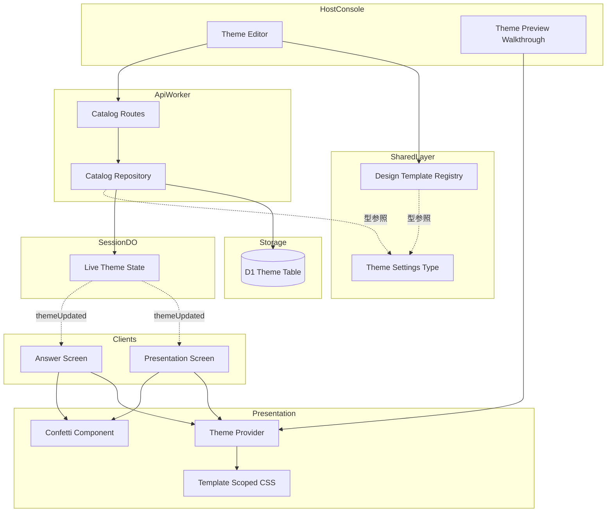
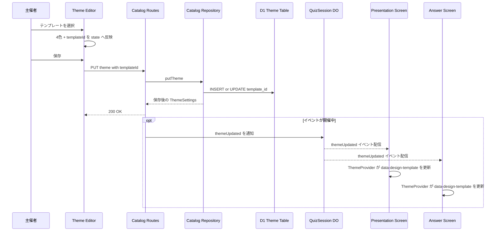

# Technical Design Document

## Overview

**Purpose**: 本機能は、既存のライブクイズアプリ`live-quiz-app`が備える「投影画面」(`src/client/stage`)と「回答画面」(`src/client/player`)のビジュアルデザインを刷新し、あわせて配色と装飾モチーフを1セットにした「デザインテンプレート」を主催者が選ぶだけで、結婚式などフォーマルで華やかな場、社内イベントなどファンシーで楽しい場、といった開催シーンに合ったおしゃれな見た目を実現できるようにする。

**Users**: 主催者は準備フェーズで`ThemeEditor`からデザインテンプレートを選択し、必要に応じて配色を微調整する。会場スクリーン(投影画面)と参加者のスマートフォン(回答画面)は、開催フェーズにおいて選択済みのテンプレートに沿った見た目で進行状態を表示する。

**Impact**: 進行ロジック・採点・WebSocketプロトコルの構造には変更を加えない。既存の`ThemeSettings`型と`theme`テーブルへ、テンプレート識別子(`templateId`)という1フィールド/1列を追加し、`ThemeProvider`が持つ配色反映の仕組みを装飾モチーフの切り替えへ拡張する。既存の`THEME_PRESETS`(匿名の配色プリセット、client/server双方に重複定義)は、名称と対象シーンを持つ`DESIGN_TEMPLATES`(`src/shared/design-templates.ts`)へ置き換える。

### Goals
- 投影画面・回答画面の各フェーズ画面を、既存の情報構造を保ったまま視覚的に洗練させる
- 結婚式など向けの「エレガント」、イベント向けの「ファンシー」を含む複数のデザインテンプレート(配色+装飾モチーフ)を提供し、主催者が用途に応じて選択できるようにする
- 選択したテンプレートを、投影画面・回答画面の双方へ一貫して反映する
- 新規ランタイム依存を追加せず、既存のTailwind CSS基盤の上でアニメーション・装飾を実現する
- 既存のアクセシビリティ(コントラスト比4.5:1)・同期性能(1秒以内反映)・読み込み性能(3秒以内)を劣化させない

### Non-Goals
- 進行画面(`src/client/host`のライブ操作部分)、結果共有ページ(`src/client/share`)自体のビジュアルデザイン刷新
- 主催者が独自のデザインテンプレートを新規作成・保存できるビルダー機能
- フォント選択・アニメーション種別など、テンプレート単位を超えた個別のデザイン項目の追加
- フェーズ(待機・出題・正解発表・ランキング)ごとに異なる装飾モチーフを個別に作り込むこと。装飾モチーフはテンプレート単位で統一されたビジュアル語彙とし、フェーズごとの差は既存の情報構造への強調表現と、正解発表・ランキング確定時の一過性の演出(後述`Confetti`)に限定する

## Boundary Commitments

### This Spec Owns
- 投影画面・回答画面の各フェーズ画面(`src/client/stage/*`, `src/client/player/*`)のTailwindクラス・レイアウト・装飾要素
- デザインテンプレートの定義(名称・対象シーン・配色)を一元管理する静的カタログ(`src/shared/design-templates.ts`)
- `ThemeSettings`への`templateId`フィールドの追加と、その永続化(`theme`テーブルの`template_id`列)
- `ThemeProvider`が担う、配色反映に加えたテンプレート識別子の反映(CSS属性経由)

### Out of Boundary
- 進行状態の判定・配信ロジック(フェーズ遷移、採点、WebSocketメッセージの型定義そのもの) — `live-quiz-app`の設計を変更しない
- テンプレートの新規作成・編集を主催者に許可する仕組み — 用意された固定の選択肢からの選択のみ
- 結果共有ページの`PublicTheme`へのテンプレート概念の追加 — 共有ページは既存どおり4色のみを扱う

### Allowed Dependencies
- `src/shared/domain-types.ts`(`ThemeSettings`)、`src/shared/protocol.ts`(`themeUpdated`イベント) — 既存の型をそのまま利用し、構造を変更しない
- `src/client/shared/theme.tsx`(`ThemeProvider`, `themeToCssProperties`) — 拡張対象
- Tailwind CSS v4のCSSカスタムプロパティ機構、および素のCSS `@keyframes` — 新規ライブラリを追加しない(`research.md`のDesign Decisions参照)
- 依存方向は`live-quiz-app`設計を継承する: `shared types → server catalog → client shared → client role apps`。テンプレートの色・装飾定義(`shared/design-templates.ts`)はUIより下位の層に置き、`client/host`(選択UI)・`client/stage`・`client/player`(表示)の双方から一方向に参照される

### Revalidation Triggers
- `ThemeSettings`のフィールド追加・削除(`templateId`を含む)
- `theme`テーブルのスキーマ変更
- `ThemeProvider`が公開するprops契約(`theme`, `templateId`, `logoImageUrl`, `backgroundImageUrl`)の変更
- `DESIGN_TEMPLATES`の要素追加・削除(テンプレート数が変わるとホストUIのプレビュー・一覧表示が影響を受ける)

## Architecture

### Existing Architecture Analysis

`live-quiz-app`の外観カスタマイズは、次の一方向のデータフローで成立している。

1. 主催者が`ThemeEditor`(`src/client/host`)で4色・ロゴ・背景画像を編集し、`PUT /api/events/:id/theme`で`ThemeSettings`を送信する
2. `catalog/repository.ts`の`putTheme`がD1の`theme`テーブル(1行/イベント)へ保存する
3. 開催中は`QuizSessionDO`が`ThemeSettings`を保持し、`themeUpdated`イベントとしてWebSocketで投影画面・回答画面・進行画面へ配信する(要件3.7に対応する既存の仕組み)
4. `ThemeProvider`(`src/client/shared/theme.tsx`)が`ThemeSettings`の4色を`--color-brand-*`というTailwindの`@theme`トークンへ直接書き込み、配下のフェーズ画面(`WaitingRoom`等)が`bg-brand-primary`等のユーティリティクラスでこれを参照する

この構造には、名称や対象シーンを持たないテンプレート概念(現状の`THEME_PRESETS`は色のみの重複定義)が存在しない。本設計は、この一方向フローの型と`ThemeProvider`を拡張するだけでテンプレート機能を成立させ、DOやWebSocketメッセージの構造には手を入れない。

### Architecture Pattern & Boundary Map

**Selected pattern**: 既存の「配色データ駆動のCSSカスタムプロパティ反映」パターンを踏襲し、テンプレートを「配色データ+CSS属性セレクタで解決される装飾スタイル」として同じ経路に乗せる。装飾の実体(グラデーション・モチーフ・アニメーション)は`ThemeProvider`が出力する`data-design-template`属性を起点に`styles.css`側で解決し、フェーズ画面コンポーネントはテンプレートの存在を意識しない(装飾スロット + CSS属性セレクタ、選定理由は`research.md`のArchitecture Pattern Evaluation参照)。



**Architecture Integration**:
- **選択と表示の分離**: `DesignTemplateRegistry`(名称・対象シーン・配色の定義)は`ThemeEditor`の一覧表示にのみ必要で、`ThemeProvider`・投影画面・回答画面のランタイムは`templateId`という文字列のみを扱う。装飾の実体はコード配布物である`styles.css`に静的に存在するため、テンプレート選択のたびに新しいデータを取得する必要がない
- **既存パターンの維持**: 配色は引き続き`--color-brand-*`への直接書き込みで反映する(二重参照バグの再発防止、既存要件4.4)。テンプレートの装飾は新設する`data-design-template`属性への直接反映とし、同様に間接参照を持ち込まない
- **新規コンポーネントの根拠**: `Confetti`は正解発表・最終ランキング確定・自分の結果表示という3箇所でのみ使う一過性演出のため、常時マウントされる`ThemeProvider`の装飾層とは責務を分離する(常時装飾 vs 一過性演出)
- **Steering compliance**: 依存方向`shared types → server catalog → client shared → client role apps`を維持し、`shared/design-templates.ts`はUIを含む層より下位に置く。CSS変数の直接反映ルール(`tech.md`)を継承する

### Technology Stack

| Layer | Choice / Version | Role in Feature | Notes |
|-------|------------------|------------------|-------|
| Frontend | React 19 + TypeScript 5(strict) | 既存のフェーズ画面コンポーネント構成をそのまま利用 | 新規コンポーネントは`Confetti`のみ |
| Styling | Tailwind CSS v4(`@tailwindcss/vite`) + 素のCSS `@keyframes` | テンプレートごとの装飾・アニメーションを`data-design-template`属性セレクタで実装 | 新規ライブラリ追加なし(`research.md`) |
| Data / Catalog | Cloudflare D1(既存`theme`テーブル) | `template_id`列を追加(nullable) | 既存行は`NULL` → アプリ層で`null`として扱う |
| Validation | Zod 4(既存`themeSettingsRequestSchema`) | `templateId`を`DESIGN_TEMPLATE_IDS`に基づく`z.enum`で検証 | 未知の値は既存のバリデーションエラー経路で拒否 |
| Realtime | 既存のDurable Object + WebSocket(`themeUpdated`) | 変更なし。`ThemeSettings`型の拡張が自動的に配信内容へ反映される | プロトコル定義(`shared/protocol.ts`)は無改修 |

## File Structure Plan

### Directory Structure
```
src/
├── shared/
│   └── design-templates.ts        # 新規: テンプレートID・定義・カタログ(色のみ、装飾はCSS側)
├── server/
│   └── catalog/
│       ├── schema.ts               # 変更: themeSettingsRequestSchema に templateId を追加
│       └── repository.ts           # 変更: ThemeRow/toTheme/putTheme/duplicateEvent/DEFAULT_THEME、THEME_PRESETSを削除
├── client/
│   ├── shared/
│   │   ├── theme.tsx                # 変更: ThemeProvider に templateId props と装飾層を追加
│   │   └── confetti.tsx             # 新規: 一過性の祝福演出コンポーネント
│   ├── host/
│   │   ├── theme-editor.tsx         # 変更: プリセットswatchをテンプレートカードへ置き換え
│   │   ├── theme-presets.ts         # 削除: shared/design-templates.ts へ統合
│   │   └── theme-preview-walkthrough.tsx  # 変更: ThemeProvider へ templateId を伝播
│   ├── stage/
│   │   ├── stage-app.tsx            # 変更: ThemeProvider へ templateId を伝播
│   │   ├── waiting-room.tsx         # 変更: タイポグラフィ・レイアウトの強化(装飾は共通層に委譲)
│   │   ├── question-view.tsx        # 変更: 同上
│   │   ├── reveal-view.tsx          # 変更: 同上 + Confetti(正解発表)
│   │   └── ranking-view.tsx         # 変更: 同上 + Confetti(最終ランキング確定)
│   ├── player/
│   │   ├── player-app.tsx           # 変更: ThemeProvider へ templateId を伝播
│   │   ├── nickname-form.tsx        # 変更: タイポグラフィ・レイアウトの強化
│   │   ├── waiting-screen.tsx       # 変更: 同上
│   │   ├── answer-screen.tsx        # 変更: 選択時の視覚フィードバック強化
│   │   ├── result-screen.tsx        # 変更: 同上 + Confetti(正解時・最終順位確定時)
│   │   └── late-join-notice.tsx     # 変更: 他画面との視覚様式統一
│   └── styles.css                   # 変更: テンプレート別装飾トークン・アニメーション定義を追加
└── migrations/
    └── 0005_theme_template_id.sql   # 新規: theme.template_id 列の追加
```

`src/client/share/`配下は変更しない(`ThemeProvider`へ`templateId`を渡さないことで、既存どおり装飾なしの表示を維持する。Non-Goals参照)。

### Modified Files
上記ディレクトリ構造の注記のとおり。加えて、削除される`THEME_PRESETS`(server/client双方)を参照している既存テスト(`src/server/catalog/repository.test.ts`, `src/client/host/theme-editor.test.tsx`)は、新しい`DESIGN_TEMPLATES`を参照するよう更新する。

## System Flows

デザインテンプレートの選択が投影画面・回答画面へ反映されるまでの流れ(開催中に変更した場合を含む)。



開催中の反映は既存の`themeUpdated`配信経路をそのまま利用するため、進行操作の1秒以内反映(要件9.1相当、本仕様の要件1.6/2章)を損なわない。

## Requirements Traceability

| Requirement | Summary | Components | Interfaces | Flows |
|-------------|---------|------------|------------|-------|
| 1.1, 1.2, 1.5, 1.6 | 投影画面フェーズ表示の刷新 | WaitingRoom, QuestionView, ThemeProvider, Template Scoped CSS | data-design-template属性, --color-brand-* | テンプレート反映フロー |
| 1.3, 1.4 | 正解発表・最終ランキングの演出強化 | RevealView, RankingView, Confetti | Confetti props | テンプレート反映フロー |
| 2.1, 2.2, 2.3, 2.7 | 回答画面の刷新 | NicknameForm, WaitingScreen, AnswerScreen, LateJoinNotice, ThemeProvider | data-design-template属性 | テンプレート反映フロー |
| 2.4 | 回答送信時の視覚フィードバック | AnswerScreen | 既存のsubmission状態 | — |
| 2.5, 2.6 | 結果表示・最終順位確定の演出強化 | ResultScreen, Confetti | Confetti props | テンプレート反映フロー |
| 3.1, 3.2, 3.3, 3.4 | デザインテンプレートカタログの提供 | Design Template Registry, ThemeEditor | DesignTemplateDefinition | — |
| 3.5, 3.6 | テンプレート選択・個別配色調整 | ThemeEditor, Catalog Repository | PUT theme API, ThemeSettings.templateId | テンプレート反映フロー |
| 3.7 | テンプレート既定配色のコントラスト保証 | Design Template Registry | DesignTemplateDefinition.colors | — |
| 4.1, 4.2, 4.4, 4.5 | 主催者カスタマイズとの整合 | ThemeProvider, Catalog Repository | themeToCssProperties | — |
| 4.3 | 既定テンプレートの適用 | Catalog Repository(DEFAULT_THEME), Design Template Registry | findDesignTemplate | — |
| 4.6 | プレビューへのテンプレート反映 | ThemePreviewWalkthrough, ThemeProvider | templateId props | テンプレート反映フロー |
| 5.1, 5.5 | コントラスト・多言語表示の維持 | 全フェーズ画面, Design Template Registry | — | — |
| 5.2 | モーション低減設定への対応 | Template Scoped CSS, Confetti | prefers-reduced-motion | — |
| 5.3, 5.4 | 読み込み・同期性能の維持 | Template Scoped CSS(依存追加なし) | — | テンプレート反映フロー |
| 6.1, 6.3 | 既存テスト・新規テストの整備 | Test Suite全体 | — | — |
| 6.2 | 投影画面・回答画面のデザイン一貫性 | Design Template Registry, styles.css | — | — |

## Components and Interfaces

| Component | Domain/Layer | Intent | Req Coverage | Key Dependencies (P0/P1) | Contracts |
|-----------|---------------|--------|---------------|---------------------------|-----------|
| DesignTemplateRegistry | Shared | テンプレートの定義を一元管理する静的カタログ | 3.1, 3.2, 3.3, 3.4, 3.7, 4.3, 6.2 | ThemeSettings型(P0) | Service |
| Catalog Repository(拡張) | Server / Catalog | `templateId`を含む`ThemeSettings`の永続化 | 3.5, 3.6, 4.1, 4.2, 4.3 | D1 theme table(P0) | Service, State |
| Catalog Schema(拡張) | Server / Catalog | `templateId`のリクエスト検証 | 3.5 | DesignTemplateRegistry(P0) | API |
| ThemeProvider(拡張) | Client / Shared | 配色反映に加え、装飾テンプレートの属性反映を担う | 1.1-1.6, 2.1-2.7, 4.1, 4.2, 4.6, 5.2 | Template Scoped CSS(P0) | State |
| Confetti | Client / Shared | 正解発表・最終ランキング確定・自分の好結果表示で使う一過性の祝福演出 | 1.3, 1.4, 2.5, 2.6, 5.2 | ThemeProvider(P1, 配色トークン) | State |
| ThemeEditor(拡張) | Client / Host | テンプレート一覧の提示と選択、個別配色調整 | 3.1-3.6 | DesignTemplateRegistry(P0) | API |
| Stage / Player フェーズ画面群 | Client / UI | 既存の情報構造を保ったまま視覚表現を強化(装飾はThemeProviderに委譲) | 1.1, 1.2, 1.5, 2.1, 2.2, 2.3, 2.4, 2.7 | ThemeProvider(P0) | — |

### Shared

#### DesignTemplateRegistry

| Field | Detail |
|-------|--------|
| Intent | 「配色+対象シーン」を1セットにしたデザインテンプレートの定義を、アプリケーション全体で単一の情報源として提供する |
| Requirements | 3.1, 3.2, 3.3, 3.4, 3.7, 4.3, 6.2 |

**Responsibilities & Constraints**
- テンプレートの識別子(`DesignTemplateId`)・名称・対象シーンの説明・既定配色(4色)を保持する
- 装飾モチーフの見た目(グラデーション・アニメーション)自体は保持しない。あくまで`templateId`という識別子と、一覧表示用のメタデータ・既定配色のみを扱う
- 少なくとも「エレガント(結婚式など向け)」「ファンシー(イベント向け)」を含む複数のテンプレートを定義する(要件3.2, 3.3)
- 各テンプレートの既定配色は、`client/shared/theme.tsx`の`contrastRatio`が返すコントラスト比が4.5:1以上になる組み合わせとする(要件3.7)

**Dependencies**
- Inbound: ThemeEditor — テンプレート一覧の取得(P0)
- Inbound: Catalog Schema — `templateId`の許容値検証(P0)
- Outbound: なし
- External: なし

**Contracts**: Service [x]

##### Service Interface
```typescript
export const DESIGN_TEMPLATE_IDS = ["standard", "elegant-wedding", "fancy-party"] as const;
export type DesignTemplateId = (typeof DESIGN_TEMPLATE_IDS)[number];

export type DesignTemplateColors = Pick<ThemeSettings, "primaryColor" | "accentColor" | "backgroundColor" | "textColor">;

export interface DesignTemplateDefinition {
  readonly id: DesignTemplateId;
  readonly name: string;
  readonly targetScene: string;
  readonly colors: DesignTemplateColors;
}

export interface DesignTemplateRegistry {
  list(): readonly DesignTemplateDefinition[];
  find(id: DesignTemplateId | null): DesignTemplateDefinition;
}
```
- Preconditions: なし(静的データ)
- Postconditions: `find`は未知の`id`または`null`に対して常に`standard`テンプレートを返す(部分適用や欠損データによって例外を発生させない)
- Invariants: `DESIGN_TEMPLATE_IDS`の要素数は`list()`の返す配列長と一致する

**Implementation Notes**
- Integration: `server/catalog/schema.ts`は`DESIGN_TEMPLATE_IDS`をそのまま`z.enum`へ渡し、検証ルールの重複を避ける
- Validation: 既定配色は実装時に`contrastRatio`ユーティリティで検証する(テスト化、要件3.7)
- Risks: テンプレート数の増減はホストUIの一覧レイアウトに影響するため、`ThemeEditor`側は固定数を前提にしたレイアウトを組まない

### Server / Catalog

#### Catalog Repository(拡張)

| Field | Detail |
|-------|--------|
| Intent | `ThemeSettings.templateId`を含む外観設定を、D1の`theme`テーブルへ永続化する |
| Requirements | 3.5, 3.6, 4.1, 4.2, 4.3 |

**Responsibilities & Constraints**
- `theme`テーブルの`template_id`列(nullable)を読み書きする。既存イベント(列値`NULL`)は`templateId: null`として扱い、表示側で`standard`相当にフォールバックする(後方互換)
- `DEFAULT_THEME`の`templateId`を`null`のままとする(新規イベント作成直後は明示的な選択が行われるまで既定表示に委ねる、要件4.3)
- `duplicateEvent`は`template_id`を含めて複製する(既存の複製仕様を維持)
- 廃止する`THEME_PRESETS`(client/server双方の値重複)は`DesignTemplateRegistry`へ統合し、本リポジトリからは削除する

**Dependencies**
- Inbound: Catalog Routes — HTTP境界からの呼び出し(P0)
- Outbound: D1 `theme`テーブル(P0)
- External: なし

**Contracts**: Service [x] / State [x]

##### Service Interface
```typescript
export async function putTheme(
  env: Env,
  eventId: EventId,
  userId: string,
  theme: ThemeSettings,
): Promise<Result<ThemeSettings, CatalogError>>;
```
- Preconditions: `theme.templateId`は`null`または`DesignTemplateId`のいずれか(Catalog Schemaで検証済み)
- Postconditions: 保存後の`ThemeSettings`(`templateId`を含む)を返す
- Invariants: `theme`テーブルの1行は常に1イベントに対応する(既存不変条件を維持)

##### State Management
- State model: `theme`テーブル1行 = 1イベントの現在の外観設定(4色 + ロゴ/背景アセットID + テンプレートID)
- Persistence & consistency: 既存どおり`ON CONFLICT(event_id) DO UPDATE`によるupsert
- Concurrency strategy: 既存のイベント単位の楽観的上書きを維持(本機能で変更なし)

**Implementation Notes**
- Integration: `toTheme`(D1行→`ThemeSettings`変換)に`templateId: (row.template_id as DesignTemplateId | null) ?? null`を追加する
- Validation: `templateId`の許容値検証はHTTP境界(Catalog Schema)で完結させ、リポジトリ層では型を信頼する(既存方針`tech.md`)
- Risks: 列追加のマイグレーションは追加のみ(nullable)で、ロールバック時もアプリケーションは`templateId: null`として動作し続ける

## Data Models

### Domain Model
`ThemeSettings`(`src/shared/domain-types.ts`)に`templateId`フィールドを追加する。

```typescript
export interface ThemeSettings {
  readonly primaryColor: string;
  readonly accentColor: string;
  readonly backgroundColor: string;
  readonly textColor: string;
  readonly logoAssetId: AssetId | null;
  readonly backgroundAssetId: AssetId | null;
  readonly templateId: DesignTemplateId | null;
}
```

`PublicTheme`(結果共有ページ専用の縮小型)は変更しない。Non-Goalsのとおり、共有ページはテンプレート概念を持たない。

### Logical Data Model
- `theme`テーブル(D1): 既存の6列に`template_id TEXT`(nullable)を追加する。エンティティ関係・カーディナリティ(1イベント:1テーマ行)は変更しない
- `template_id`は`DESIGN_TEMPLATE_IDS`の値集合を参照する論理的な制約を持つが、変動しうる固定リストであるため物理的なCHECK制約やFKは設けず、HTTP境界のZodバリデーションで担保する

### Physical Data Model
```sql
-- migrations/0005_theme_template_id.sql
ALTER TABLE theme ADD COLUMN template_id TEXT;
```
既存行は`NULL`のまま残る。バックフィルは行わず、アプリケーション層のフォールバック(`templateId ?? "standard"`相当の解釈)で吸収する。

### Data Contracts & Integration

**API Data Transfer**
- `PUT /api/events/:id/theme`のリクエストボディ(`ThemeSettingsRequest`)に`templateId: DesignTemplateId | null`を追加する。バリデーションは`z.enum(DESIGN_TEMPLATE_IDS).nullable()`
- レスポンス(保存後の`ThemeSettings`)にも同フィールドが含まれる(既存のシリアライズ経路をそのまま利用)

**Event Schemas**
- `themeUpdated`イベント(`shared/protocol.ts`)のペイロードは`ThemeSettings`型をそのまま参照しているため、スキーマ定義自体の変更は不要。型拡張が配信内容へ自動的に反映される

## Error Handling

### Error Strategy
本機能が導入するエラーパスは、既存の外観設定保存フローに1種類追加されるのみである。

### Error Categories and Responses
- **User Errors(4xx)**: `templateId`に`DESIGN_TEMPLATE_IDS`に含まれない値、または不正な型が送信された場合 → 既存の`themeSettingsRequestSchema`検証エラーと同じ経路(400)で拒否する。新しいエラーコードは追加しない
- **表示側のフォールバック**: `templateId`が`null`、または将来的に定義が削除されたテンプレートIDを参照している場合、`ThemeProvider`は例外を発生させず`standard`相当の装飾(`data-design-template`未指定時のデフォルトCSS)にフォールバックする。既存イベントの表示が壊れないことを優先する

### Monitoring
既存のエラーログ・監視の仕組みに追加の要件はない(本機能はUIとデータ形状の拡張に閉じる)。

## Testing Strategy

- **Unit Tests**:
  - `shared/design-templates.test.ts`: `DESIGN_TEMPLATE_IDS`の各テンプレートについて、既定配色が`contrastRatio`基準(4.5:1)を満たすことを検証する(要件3.7)
  - `client/shared/theme.test.tsx`: `ThemeProvider`が`templateId`に応じて`data-design-template`属性を正しく設定すること、`templateId`未指定時に安全にフォールバックすることを検証する(要件4.3, 4.6)
  - `client/shared/confetti.test.tsx`: `prefers-reduced-motion`が有効な場合に演出を抑制した表示になることを検証する(要件5.2)
- **Integration Tests**:
  - `server/catalog/repository.test.ts`: `putTheme`/`duplicateEvent`が`template_id`を含めて正しく永続化・複製することを検証する(要件3.5, 3.6)
  - `server/catalog/schema.test.ts`: 不正な`templateId`を含むリクエストが拒否されることを検証する
  - 既存の`full-event-flow.test.ts`相当の統合テストが、`ThemeSettings`の型拡張後も成功し続けることを確認する(要件6.1)
- **UI/Component Tests**:
  - `client/host/theme-editor.test.tsx`: テンプレート選択によって配色とテンプレートIDの双方が更新され、選択後の個別配色調整がテンプレートIDを保持したままであることを検証する(要件3.5, 3.6)
  - `client/stage/reveal-view.test.tsx`, `client/stage/ranking-view.test.tsx`, `client/player/result-screen.test.tsx`: `Confetti`が該当する演出条件でのみ描画されることを検証する(要件1.3, 1.4, 2.5, 2.6)

## Performance & Scalability
- `templateId`はテンプレートIDの文字列1つに過ぎず、WebSocket配信ペイロード(`themeUpdated`)への影響は無視できる規模である(要件5.4)
- 装飾・演出はCSS(`@keyframes`、`transform`/`opacity`)のみで実装し、新規JSバンドルの追加を行わないため、モバイル回線での初期表示速度(要件5.3)への影響は最小限に抑えられる(`research.md`のux知見: `transform`/`opacity`のみを用いレイアウトプロパティを動かさない)
- `Confetti`はループしない一過性のアニメーションとし、常時稼働する装飾を増やさない(ux知見: 連続アニメーションはローディング表示のみに限定する)

## Migration Strategy
`migrations/0005_theme_template_id.sql`による列追加のみで完結する単純な加算的マイグレーションであり、フェーズ分割・ロールバック手順の特別な設計は不要である。追加列はnullableのため、マイグレーション適用と同時にアプリケーションを新バージョンへ切り替えても、切り替え前に作成された既存イベントの表示は`templateId: null`(標準表示へのフォールバック)として継続する。
